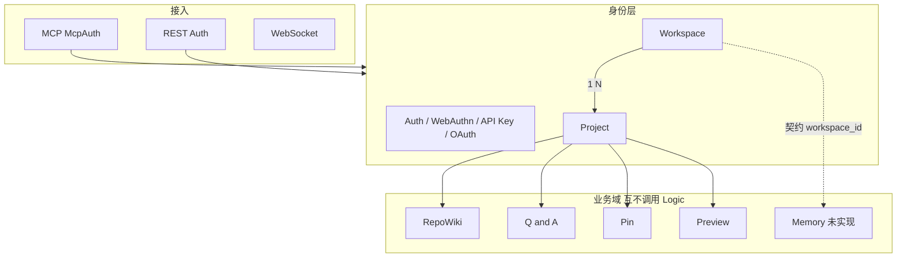
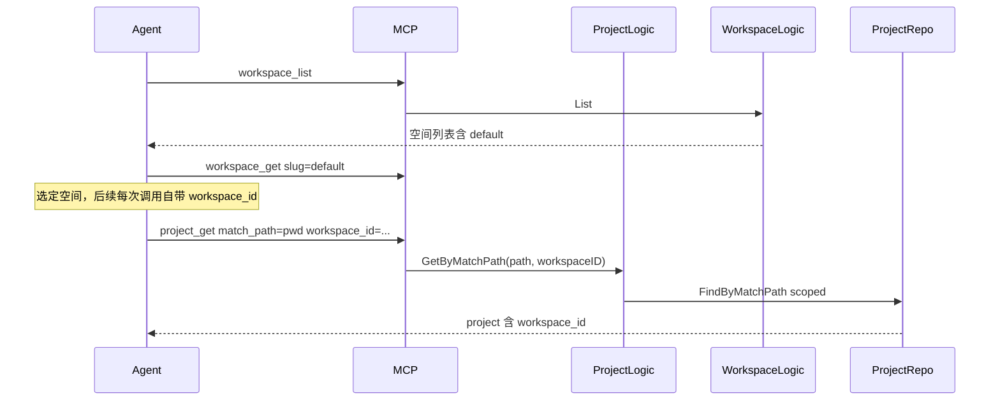
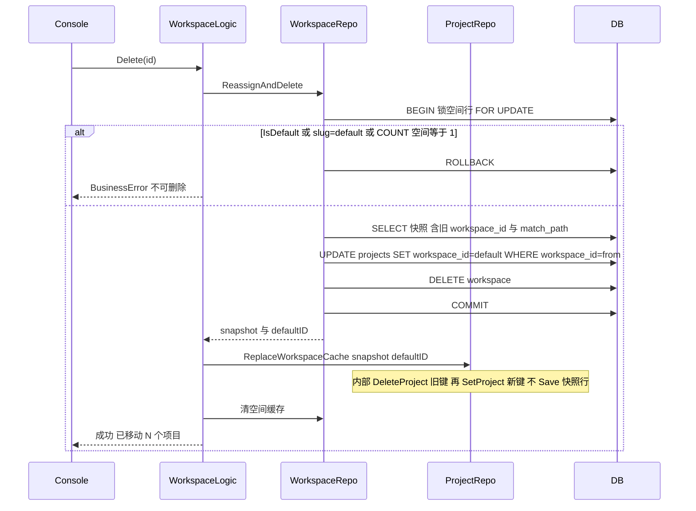

# Workspace 身份层设计

> 状态：draft · 承接 [0001](../research/0001-workspace-contents.md)

| 项 | 值 |
| --- | --- |
| 作者 | Lumina |
| 日期 | 2026-09-09 |
| 状态 | Draft |
| 范围词 | 空间 / 工作空间 / `workspace`（已登记于 `docs/scope-manage.md`） |

## Overview

Lumina 当前的身份边界是「单用户实例 + Project」。Project 同时承担代码仓库身份和「生活 / 工作」分组，无法拆开。本设计在 Project 之上增加一层 **Workspace（工作空间）**：`Workspace 1 — N Project`。Project 仍是一个 git/代码身份（`Name` 全局唯一、`MatchPath` 路径解析）；Workspace 只做分组与控制台/MCP 的选择边界。

首版（v1）落地：Workspace 实体与默认空间、`Project.workspace_id`、控制台切换器、MCP `workspace_list` / `workspace_get`，以及项目 MCP 解析时的空间过滤。Pin 的 `from` / `to` 必须属于同一空间，且 `from_project_id` 必填。不引入成员表、空间级标签、通用设置袋；不把 Workspace 做成与 Q&A / Pin / RepoWiki / Preview 平级、互相调用的第六业务域。

## Background & Motivation

仓库里没有 Workspace 实体。`internal/constant/gene_number.go` 基因号止于 `GeneOAuthClient=47`。`internal/entity/project.go` 的 `Name` 带全局 `uniqueIndex`。QaSession、PreviewSession、RepoWikiConfig、Pin 都挂 `project_id`（Pin 为 `from_project_id` / `to_project_id`），认证与 `site.*` Info 键、LLM Provider 名称唯一索引都是实例级。

「工作区」一词在代码里另有三处含义，都不是租户层：

| 说法 | 实际对象 | 出处 |
| --- | --- | --- |
| pnpm workspace | monorepo 包布局 | `pnpm-workspace.yaml` |
| 预览工作区 | `PreviewSession` 沙盒 | `entity/preview_session.go`、`mcp/preview_tools.go` |
| Agent 当前工作区 | `pwd` 绝对路径 | `resources/ai-plugin/skills/_shared/project-resolver.md` |

调研见 [0001](../research/0001-workspace-contents.md)。产品意向已在 Q&A 会话 `414082952174052352`（2026-09-09）锁定：单用户把自己的生活 / 工作拆开管，不是多用户，不照搬 Kaneo 成员模型。

痛点：同一实例里两套路径前缀可能重叠；Pin 没有组织边界；控制台项目列表无法按生活/工作切开；Agent 的 `match_path` 会串空间。

## Goals & Non-Goals

### Goals（v1）

- 新增 Workspace 实体：名称、slug、描述、图标、`IsDefault`。
- `Project.workspace_id` 必填；存量项目挂到默认空间。
- 实例初始化与启动 prepare 都保证恰好有一条默认空间：展示名初始为「默认空间」，可改名，不可删除。
- 用户可创建更多空间，完整 CRUD；删除非默认空间时把其项目移到默认空间。
- 控制台按当前空间过滤项目列表，侧栏可切换空间。
- MCP 只读：`workspace_list`、`workspace_get`。项目 MCP 在不以 `project_id` 查询时必须带空间过滤。
- Pin 写入时两端都必填，且 `workspace_id` 相同。
- 词表：Preview 文案「预览工作区」改为「预览会话」；技能里的 cwd「工作区」改为「项目路径」。`pnpm-workspace` 不改。

### Non-Goals（v1 明确不做）

- 成员表、ACL、多用户。认证保持实例级（Info owner、WebAuthn 固定用户、Token 无 per-user 索引）。
- 空间级标签、通用 settings bag。
- 把 `Project.Name` 改成空间内唯一（Q&A 已否决，名称仍全局唯一）。
- 给 `AliasName` 加唯一索引（别名冲突用业务错误，不改表约束）。
- MCP 写工具（`workspace_create` / `update` / `delete`）。写操作只走控制台 REST。
- 服务端 MCP session「当前空间」。Agent 每次带 `workspace_id` 或 slug。
- 拆分 Info `site.*` 键。实例 `site.name` 仍是产品/安装名。
- LLM Provider/Model 升格到空间、RepoWiki 全局 prompt 升格（后续 PR，不阻塞身份）。
- SSH Key、API Key、OAuth 客户端升格（保持实例级）。
- Wiki 实体加 `workspace_id`（隔离走 Project）。
- Memory 代码。v1 只在 RFC-0001 待定补一句契约。
- 新的指标后端。Lumina 没有 Prometheus（见 `ARCHITECTURE.md`）。
- 本仓库当前 `main.go` 只注册 PostgreSQL 驱动。迁移 SQL 按 Postgres 写。`FindByMatchPath` 已使用 `json_array_elements_text`，与此一致。

## Key Decisions

调研 [0001](../research/0001-workspace-contents.md) 的开放问题在此全部拍板，实现时不再当作未决项。

| # | 决定 | 理由 |
| --- | --- | --- |
| 1 | 默认空间 slug 固定为 `default`，实例内 `uniqueIndex`。默认空间的 slug **不可改**；展示名可改。 | slug 给 MCP/文档一个稳定句柄；展示名给控制台。删除守卫用 `IsDefault`，不依赖展示名。 |
| 2 | MCP v1 **不**暴露 workspace 写工具。控制台 REST 负责创建/更新/删除。MCP 仅 `workspace_list`、`workspace_get`。 | 与 RepoWiki「MCP 只读、写走管理端」同一模式（ADR-0005）。空间增删是管理动作，不是 Agent 编排动作。 |
| 3 | Agent「当前空间」**无状态**。凡是现在靠 `match_path` / `name` 解析项目、且未传 `project_id` 的 MCP 工具，必须带 `workspace_id` 或 workspace slug 作为必填过滤。不在服务端存 MCP session 当前空间。同步改 `resources/ai-plugin/skills/_shared/project-resolver.md`。 | 避免多设备/多 Agent 串空间；MCP 连接没有可靠的会话级租户状态。`project_id` 全局可查，响应里带上 `workspace_id`。 |
| 4 | LLM 升格（后续 PR）时 `LlmProvider.Name` 唯一索引改为 `(workspace_id, name)`。身份 PR **不改**该索引。 | 用户排序：实体 → 控制台 → MCP →（跳过名称唯一性）→ 配置升格。 |
| 5 | v1 控制台选中空间后，chrome 用 Workspace 的 name/icon/description。**不**拆 Info `site.*`。`site.name` 仍是安装/产品名（落地页、OAuth、Wiki Reader 品牌）。 | 标识字段已在实体上；Info 主键是键名，加空间维度要改表形，排在配置升格之后且 v1 不需要。 |
| 6 | Memory 实现时卡片 **必填** `workspace_id`；来源项目 **不必填**。Workspace v1 只改 RFC-0001 待定那一行，不写 Memory 代码。 | 生活空间的决策不得被工作空间检索到；记忆挂空间，不挂仓库。 |
| 7 | `GeneWorkspace = 48`，**只**写在 `internal/constant/gene_number.go`。`constant/workspace.go` 只放 slug/name 常量。 | 下一个空位；基因号禁止双处定义。 |
| 8 | 控制台当前空间存在 `localStorage` 键 `lumina.currentWorkspaceId`。API 仍在 query/body 里显式传 `workspace_id`。localStorage 只服务 UI，且只在 `window` 可用之后读写。 | 无账号级设置表；Cookie 会把 UI 状态绑到 HTTP。TanStack Start 布局有服务端 `beforeLoad`，渲染期读 `localStorage` 会抛。 |
| 9 | 删除守卫用列 `IsDefault bool`，同时拒绝 `slug == "default"`。Update API 不得把 `IsDefault` 改为 true/false，不得修改默认空间的 slug。`GetDefault` 固定 `ORDER BY created_at ASC`。 | 改展示名不能丢掉「不可删除」。无序 `First()` 在重复 `true` 时不稳定。 |
| 10 | 实例内至少一条空间。禁止删光。默认空间创建后不可删除，因此正常路径不会出现零空间。 | 项目 `workspace_id` 应用层必填的前提。 |
| 11 | `Project.Name` 保持全局 `uniqueIndex`。`AliasName` 不加唯一索引。别名解析：已知 `workspace_id` 时只在该空间内找；未知且命中多行时 `BusinessError`「别名不唯一，请使用项目 ID」。MCP `to_project_name` 仍只解析 **雪花 ID 或别名**，不解析 `Project.Name`（与现网 `ResolveProject` 一致）。 | 名称全局唯一已锁定。别名现状就不是唯一的，两空间都可以叫 `blog`；`First()` 会把 Pin 送到错误项目。 |
| 12 | v1 **不允许**项目在空间之间任意移动。`workspace_id` 只在创建时写入。唯一搬迁路径是删除非默认空间时整批移到默认空间。 | 避免 ProjectLogic 去查 Pin 表；也避免「移动后历史 Pin 变成跨空间」。 |
| 13 | Pin：`from_project_id` 与 `to` **都必填**（选更小的 API 改动：收紧已有字段，不给 `pin_push` 加 `workspace_id`）。`PinLogic.Push` 先解析 `from`，再在 `from.WorkspaceID` 内解析 `to`，然后比较两端 `workspace_id`。无来源 Pin 拒绝写入。PinLogic **不**调用 WorkspaceLogic，只读 `ProjectRepo`（沿用 ADR-0003）。该校验放进 **PR1**（当时只有默认空间，比较恒为真，但第二个空间出现前守卫已在二进制里）。 | 「只允许空间内」与「from 为空则跳过比较」不能并存：`project_id` 全局可查，无来源 Push 就是跨空间写入。 |
| 14 | 数据库不建 ON DELETE CASCADE。Logic 先搬项目再删空间。不强制 GORM 外键。应用层把 `workspace_id == 0` 视为非法。 | 与 QaSession/Pin/Preview 的关联风格一致。 |
| 15 | 默认空间 **不**另写 Info 键。它是 `workspaces` 表里 `is_default = true` 的一行。 | 用行比用键更直接，也能改名。 |
| 16 | `ProjectLogic.Create`：请求未带合法 `workspace_id` 时（PR1，DTO 尚未必填）写入默认空间 ID，**禁止插入 0**。PR2 起 REST `binding:"required"`，零值直接 `ParameterError`「缺少所属空间」，不再默默落到默认空间。`SET NOT NULL` 只在 PR2、且 Create 已保证非 0 之后执行。 | PR1 单独部署时 MCP `project_create` 仍不传空间字段；若此时列已 NOT NULL 而 Create 写 0，行会变成无主。 |
| 17 | `ProjectRepo.List` / `FindByMatchPath`：`workspaceID.IsZero()` 表示 **不按空间过滤**（与现网行为相同）。MCP 在 PR2 才对 `name` / `match_path` / `project_list` 要求非零空间并传入。PR1 改签名时 MCP 传零，避免 `project_get(match_path)` 查不到刚回填的行。 | 过滤 SQL 与「MCP 强制带空间」必须同一 PR 才打开；否则 PR1 会把路径解析打黑。 |
| 18 | 删除空间：先提交 **DB 事务**（锁空间行、UPDATE 项目、DELETE 空间），**再**调用 `ProjectRepo.ReplaceWorkspaceCache` 刷新 Redis。Logic **不得**直接碰 `repository/cache` 或对快照 `Save`。Redis 不进 SQL 事务。 | `ProjectCache` 在 `ProjectRepo` 内未导出。Logic 调缓存是分层违规。COMMIT 后再 `Save` 快照会把旧 `workspace_id` 写回。 |
| 19 | MCP 解析空间只走 `WorkspaceLogic.GetByID` / `GetBySlug`（或 `ProjectLogic` 内封装的同一 Logic 调用）。MCP 与 Handler **不得**碰 `WorkspaceRepo`。 | ADR-0002：MCP 经 Logic。现网 `project_tools.go` 只调 `projectLogic`。 |

## Proposed Design

### 在架构中的位置

Workspace 是身份层，贴在 Project 旁边，**不是** RepoWiki / Memory / Q&A / Pin / Preview 的第六业务域。



约束：

- `WorkspaceLogic` 不得 import 或调用 `QaLogic` / `PinLogic` / `RepoWikiLogic` / `PreviewLogic`。
- `PinLogic` 继续持有 `*repository.ProjectRepo`（见 `internal/logic/pin.go` 的 `pinRepo`），比较两个 `entity.Project.WorkspaceID`。
- `ProjectLogic` 可持有 `*repository.WorkspaceRepo`，创建时校验空间存在或回落到默认空间。这是身份层仓储复用，不是跨域编排。
- `WorkspaceLogic` 可持有 `*repository.ProjectRepo`，删除空间时批量改 `workspace_id`。
- MCP 工具只注入 Logic：`SetWorkspaceLogic`、`SetProjectLogic`。项目工具若需要 slug→ID，调用 `WorkspaceLogic.GetBySlug`，或由 `ProjectLogic.ResolveWorkspace(idOrSlug)` 内部完成，避免一个 handler 编排两个域的业务。推荐后者：`ProjectLogic` 增加 `ResolveWorkspace`，MCP `project_*` 仍只碰 `projectLogic`。

分层仍是 `route → handler → logic → repository`。Handler 不碰 DB。Logic 不持有 `db`/`rdb` 字段；构造时用 `xCtxUtil.MustGetDB` / `MustGetRDB`，与 `NewProjectLogic` 相同。

### 数据流：Agent 解析项目



没有「当前空间」缓存在 Redis 或 MCP session。

### 数据流：删除非默认空间

Redis 不在 DB 事务内。搬家后的缓存必须用 **新** `workspace_id` 写路径键。



进程在 COMMIT 之后、刷缓存之前崩溃：DB 已正确，缓存最多 TTL 30 分钟内陈旧。下一次启动 `prepareProject` 的 `SCAN lum:project:*` 会清掉。不把 Redis 写入 SQL 事务：回滚的 UPDATE 若已写 Redis，会把项目指到默认空间而 DB 仍在源空间。

## Data Model Changes

### Workspace 实体

新文件 `internal/entity/workspace.go`。嵌入 `xModels.BaseEntity`（ID、创建时间、更新时间），实现 `GetGene()`。

```go
// Workspace 工作空间表，Project 之上的组织边界（单用户拆分生活/工作）
type Workspace struct {
    xModels.BaseEntity
    Name        string `gorm:"type:varchar(128);not null;comment:空间名称" json:"name"`                    // 空间名称
    Slug        string `gorm:"type:varchar(64);not null;uniqueIndex;comment:空间标识" json:"slug"`           // 空间标识
    Description string `gorm:"type:text;comment:空间描述" json:"description"`                               // 空间描述
    Icon        string `gorm:"type:varchar(64);not null;default:'';comment:空间图标" json:"icon"`            // 空间图标
    IsDefault   bool   `gorm:"not null;default:false;index;comment:是否为默认空间" json:"is_default"`        // 是否为默认空间
}

func (w *Workspace) GetGene() xSnowflake.Gene {
    return bConst.GeneWorkspace
}
```

字段约定：

| 字段 | 规则 |
| --- | --- |
| `Name` | 必填，1–128 字。实例内不强制唯一。默认空间初始「默认空间」，可改。 |
| `Slug` | 必填，实例唯一。正则 **`^[a-z]([a-z0-9-]*[a-z0-9])?$`**，最长 63（落入 `varchar(64)`）。禁止首尾连字符。默认空间 `default`，Update 时拒绝修改该行的 slug。其它空间可改 slug，冲突返回「空间标识已存在」。校验在 **Logic** 层执行，gin `binding` 只做 `required,max=63`。 |
| `Description` | 可选，text。 |
| `Icon` | 短字符串，最长 64。存 lucide 图标名（kebab-case，如 `briefcase`）或单个 emoji。Logic **拒绝**包含 `://` 或 `/` 的值（防 URL/路径）。空则控制台回退 `LayoutGrid`。前端用小允许列表映射，未知值回退。 |
| `IsDefault` | 仅 seed/prepare 可写 `true`。Create/Update API 忽略客户端传入的该字段。同一实例只允许一行 `true`。GORM 标签只有普通 `index`。prepare 用 Postgres 部分唯一索引补齐：`CREATE UNIQUE INDEX IF NOT EXISTS workspaces_one_default ON workspaces (is_default) WHERE is_default = true`。`GetDefault` / 修复查询一律 `WHERE is_default = true ORDER BY created_at ASC`。 |

常量放 `internal/constant/workspace.go`（不要写进 Info 键，**不要**重复基因号）：

```go
const (
    DefaultWorkspaceSlug = "default"
    DefaultWorkspaceName = "默认空间"
    WorkspaceSlugPattern = `^[a-z]([a-z0-9-]*[a-z0-9])?$` // 最长 63
)
```

`internal/constant/gene_number.go` 追加：

```go
GeneWorkspace xSnowflake.Gene = 48 // 工作空间基因
```

`ARCHITECTURE.md` 实体基因范围改为 `GeneProject=32` 至 `GeneWorkspace=48`。

### Project.workspace_id

`internal/entity/project.go` 增加。PR1 的 GORM 标签 **不含** `not null`（已有行加列必须可空）：

```go
WorkspaceID xSnowflake.SnowflakeID `gorm:"type:bigint;index;comment:所属空间ID" json:"workspace_id"` // 所属空间ID
```

PR2 在 prepare 对 Postgres 执行 `ALTER TABLE projects ALTER COLUMN workspace_id SET NOT NULL` 成功后，可以把标签改成 `type:bigint;not null;index;comment:所属空间ID`（已是 NOT NULL 时 AutoMigrate 为 no-op）。应用层从 PR1 起就把 0 当非法。

- 类型与其它 `project_id` 列一致：`xSnowflake.SnowflakeID` / `bigint`。
- 普通索引，不必唯一（一空间多项目）。
- **不**做 GORM `constraint:OnDelete:CASCADE`。
- v1 Update 项目 **不接受** 改 `workspace_id`（见 Key Decision 12）。
- 不使用 `default:0`。

### 两步迁移（跨 PR1 / PR2）

本仓库 `main.go` 只 `import` PostgreSQL 插件。expand → backfill 在 PR1；`SET NOT NULL` 在 PR2。不要在 Create 仍可能写 0 时加 NOT NULL。

**Step A — AutoMigrate（PR1，`main.go`）**

`WithAutoMigrate` 顺序：`Workspace` **必须排在 `Project` 之前**：

```go
&entity.Info{},
&entity.Apikey{},
&entity.Workspace{}, // 先于 Project
&entity.Project{},
// ...其余不变
```

PR1 给 `projects.workspace_id` 加 **可空** `bigint` + index。

**Step B — prepare 回填（PR1 起，每次启动）**

`Prepare()` 在 `prepareInfo` 之后、`prepareProject`（清 `project:*` 缓存）之前调用 `prepareWorkspace`：

1. `EnsureDefaultWorkspace`：`WHERE is_default = true ORDER BY created_at ASC`；没有则按 `slug = default` 查并把 `is_default` 置 true；都没有则插入 `Name=默认空间, Slug=default, IsDefault=true`，ID 用 `xSnowflake.GenerateID(bConst.GeneWorkspace)`。已存在则 **不覆盖 Name**。`EnsureDefault` 失败 → **prepare 节点返回 error**，进程不接流量。
2. `UPDATE projects SET workspace_id = :id WHERE workspace_id IS NULL OR workspace_id = 0`。该 UPDATE 失败 → **prepare 节点返回 error**（`businessDataPrepare` 今日是 `return nil, nil`，PR1 改为透传 `Prepare()` 的 error）。未回填的 NULL 会被 GORM 扫成雪花 `0`；Pin 比较 `0 != 0` 为假，隔离失效。
3. 多行 `is_default = true`：`NamedINIT` Warn，保留 `created_at` 最早的一行，其余置 false。
4. `CREATE UNIQUE INDEX IF NOT EXISTS workspaces_one_default ON workspaces (is_default) WHERE is_default = true`（失败 Warn，不阻断；应用层 `GetDefault` 仍有序）。
5. **PR1 不做** `SET NOT NULL`。
6. **PR2** 在回填成功后执行 `ALTER TABLE projects ALTER COLUMN workspace_id SET NOT NULL`。ALTER 失败：Warn，下次启动重试；应用层继续拒绝 0。不因 ALTER 失败而杀死进程。

`prepareProject` 现有逻辑会 `SCAN lum:project:*` 并删除。回填后必须走这一步，否则 `GetByID` 缓存里的 JSON 没有 `workspace_id`，反序列化后为 0。

**Step C — 初始化路径**

启动顺序已经是 AutoMigrate → … → Prepare → 才监听 HTTP。未初始化实例在首次请求前就有默认空间行。`AuthLogic.Initialize` 在 `InitializeIfNotInitialized` **提交成功之后**再调 `WorkspaceRepo.EnsureDefault`：失败只打 `NamedLOGC` Warn，**仍返回初始化成功**。此时 `auth.is-initial=false` 已提交，再把 HTTP 打成失败会让重试撞上 `RepeatOperation`，而默认行要等到下次启动的 prepare。Prepare 才是硬保证。

`AuthLogic` 构造时增加 `*repository.WorkspaceRepo`，**不**调用 `WorkspaceLogic`。不要把 EnsureDefault 塞进已提交的 Info 事务之后再回滚认证。

### 删除规则

| 动作 | 结果 |
| --- | --- |
| 删除 `IsDefault == true` 或 `Slug == default` | `BusinessError`：「默认空间不可删除」 |
| 删除后将导致零条空间 | `BusinessError`：「至少保留一个空间」 |
| 删除其它空间 | 见上方算法：DB 事务提交后再刷缓存 |
| 删除项目 | 现有行为；不级联空间 |
| 删除默认空间下的全部项目 | 允许；空间仍在 |

没有「未分组」项目。

`WorkspaceRepo.ReassignAndDelete` 在同一 `*gorm.DB` 事务内完成：返回搬家前的项目快照 `[]*entity.Project`（仍带旧 `WorkspaceID` 与 `MatchPath`）以及 `defaultID`。COMMIT 之后 `WorkspaceLogic` **只**调用 `ProjectRepo` 的导出方法，不 import `repository/cache`，不对快照做 `Update`/`Save`（那会把旧 `workspace_id` 写回刚提交的批量 UPDATE）。

```go
// ProjectRepo 导出。内部使用未导出的 ProjectCache。
// 对每个快照：先按旧 WorkspaceID DeleteProject（清 project:ws:{old}:match_path:...），
// 再把内存里的 WorkspaceID 改为 defaultID 后 SetProject。
// 禁止把快照写回 projects 表。
func (r *ProjectRepo) ReplaceWorkspaceCache(ctx context.Context, snapshot []*entity.Project, defaultID xSnowflake.SnowflakeID) *xError.Error
```

`WorkspaceLogic.Delete`：

```text
snapshot, defaultID, xErr := workspaceRepo.ReassignAndDelete(ctx, id)
projectRepo.ReplaceWorkspaceCache(ctx, snapshot, defaultID)
workspaceRepo 清空间 ID/slug 缓存
```

## API / Interface Changes

### REST：`/api/v1/workspace`

新文件 `internal/app/route/route_workspace.go`，在 `route.go` 的 `apiRouter` 上与 `projectRouter` 并列注册。组挂 `middleware.Auth`。本路由组在 **PR2** 落地（PR1 没有第二条空间的写入入口）。

| 方法 | 路径 | Handler | 说明 |
| --- | --- | --- | --- |
| POST | `/api/v1/workspace` | CreateWorkspace | 创建。不可把 `is_default` 设为 true |
| GET | `/api/v1/workspace` | ListWorkspaces | 分页，`page`/`size`，`xModels.PageRequest` 规范化 |
| GET | `/api/v1/workspace/:id` | GetWorkspace | 雪花 ID |
| PUT | `/api/v1/workspace/:id` | UpdateWorkspace | 改 name/description/icon；非默认行可改 slug |
| DELETE | `/api/v1/workspace/:id` | DeleteWorkspace | 非默认；项目迁到默认空间 |

DTO 包 `api/workspace/`，按操作拆文件。

**`create.go`**

```go
type CreateWorkspaceRequest struct {
    Name        string `json:"name" label:"空间名称" binding:"required,max=128"`
    Slug        string `json:"slug" label:"空间标识" binding:"required,max=63"`
    Description string `json:"description" label:"空间描述"`
    Icon        string `json:"icon" label:"空间图标" binding:"max=64"`
}
```

`WorkspaceLogic.Create`：正则校验 slug；slug 为 `default` 且已有默认行 → 「空间标识已存在」；icon 含 `://` 或 `/` → 「空间图标不合法」；忽略任何 `is_default`。

**`update.go`**

```go
type UpdateWorkspaceRequest struct {
    Name        string `json:"name" label:"空间名称" binding:"required,max=128"`
    Slug        string `json:"slug" label:"空间标识" binding:"required,max=63"`
    Description string `json:"description" label:"空间描述"`
    Icon        string `json:"icon" label:"空间图标" binding:"max=64"`
}
```

默认空间：`req.Slug != existing.Slug` → 「默认空间标识不可修改」。`IsDefault` 不在请求体。

**`detail.go` / `list.go`**

```go
type WorkspaceResponse struct {
    ID          xSnowflake.SnowflakeID `json:"id"`
    Name        string                 `json:"name"`
    Slug        string                 `json:"slug"`
    Description string                 `json:"description"`
    Icon        string                 `json:"icon"`
    IsDefault   bool                   `json:"is_default"`
    CreatedAt   string                 `json:"created_at"` // RFC3339
    UpdatedAt   string                 `json:"updated_at"`
}

type DeleteWorkspaceResponse struct {
    MovedProjectCount int64 `json:"moved_project_count"`
}

type WorkspaceListResponse struct {
    Items []WorkspaceResponse `json:"items"`
    Total int64               `json:"total"`
}
```

规模：单用户、数十个空间。分页默认 `size=50`。列表按 `is_default DESC, created_at ASC`。

Handler 成功：`xResult.SuccessHasData`。失败：`ctx.Error`。`NewHandler` 的 `service` 增加 `workspaceLogic *logic.WorkspaceLogic`。

### REST：Project 增量（PR2 对外必填；PR1 Logic 已能填默认）

`api/project/create.go`（PR2）：

```go
WorkspaceID xSnowflake.SnowflakeID `json:"workspace_id" label:"所属空间ID" binding:"required"`
```

`api/project/update.go`：**不**加 `workspace_id`。

`api/project/detail.go` 的 `ProjectResponse` 增加 `WorkspaceID`（PR1 即可返回，便于缓存 JSON 形状稳定）。

`GET /api/v1/project` 增加 `WorkspaceID xSnowflake.SnowflakeID \`form:"workspace_id"\``。零值 = 不过滤（看板、`useProjectNameMap`）。控制台项目页传当前空间。

`ProjectLogic.Create`：

```text
if req.WorkspaceID.IsZero() {
    // PR1：MCP/旧调用方未带空间。写入 GetDefault().ID。
    // PR2 起 REST 有 binding required，不应走到这里；若仍为零 → ParameterError「缺少所属空间」
} else {
    WorkspaceRepo.GetByID；不存在 → NotFound「空间不存在」
}
禁止把 0 写入 projects.workspace_id
```

PR2 把「为零则填默认」删掉，改为直接报错，以免第二个空间存在后，漏传的创建全部掉进默认空间。

`ProjectLogic.List(ctx, page, size, workspaceID)`：`workspaceID.IsZero()` 时不加 `WHERE workspace_id`。

### REST：Pin / Q&A / Preview 控制台列表（PR2）

零值语义统一：`workspace_id == 0` 表示不按空间过滤。控制台列表 hook 始终传入当前空间。过滤形状统一为：

```sql
project_id IN (SELECT id FROM projects WHERE workspace_id = ?)
```

Pin 用 `to_project_id IN (SELECT …)`。与原有筛选 AND。不经 WorkspaceLogic。

#### Pin

- 路径：已有 `GET /api/v1/pin`（`internal/app/route/route_pin.go`）。
- DTO：`api/pin/list.go` 的 `PinListRequest` 增加 `WorkspaceID xSnowflake.SnowflakeID \`form:"workspace_id"\``。
- Repo：`PinRepo.List` 在 `workspaceID != 0` 时追加 `to_project_id IN (SELECT id FROM projects WHERE workspace_id = ?)`，并与现有 `to_project_id` / `from_project_id` / `status` / `category` / `priority` AND。
- 写入 DTO：`api/pin/create.go` 的 `FromProjectID` 改为 `binding:"required"`。Logic 对 `IsZero()` 再挡一层「缺少来源项目」。

#### Q&A

- 路径：已有 `GET /api/v1/qa/sessions`（**不是** `/qa/session`）。
- DTO：`api/qa/session.go` 的 `ListSessionRequest` 增加 `WorkspaceID xSnowflake.SnowflakeID \`form:"workspace_id"\``。
- Repo：`QaSessionRepo.List` 增加参数 `workspaceID`；非零时 `project_id IN (SELECT id FROM projects WHERE workspace_id = ?)`，与 `status` / `type` / `hash` AND。

#### Preview

- 路径：已有管理端 `GET /api/v1/preview/sessions`。
- DTO：`api/preview/list.go` 的 `PreviewSessionListRequest` 增加 `WorkspaceID xSnowflake.SnowflakeID \`form:"workspace_id"\``。
- Repo：`PreviewSessionRepo.List(ctx, projectID, workspaceID, page, size)`。
  - 仅 `workspaceID`：`project_id IN (SELECT id FROM projects WHERE workspace_id = ?)`。
  - 仅 `projectID`：保持现网按项目过滤。
  - 两者都有：该 `project_id` 必须属于该空间，否则返回空列表（不报错）。SQL：`project_id = ? AND project_id IN (SELECT id FROM projects WHERE workspace_id = ?)`。

看板 `GET /dashboard/overview` v1 **不**按空间切。

### Pin 写入（PR1 即落地）

`PinLogic.ResolveProject` 扩展为：

```go
func (l *PinLogic) ResolveProject(ctx context.Context, nameOrID string, workspaceID xSnowflake.SnowflakeID) (*entity.Project, *xError.Error)
```

行为：

1. 输入能解析为雪花 ID：`GetByID`（全局）。若 `workspaceID` 非零且 `project.WorkspaceID != workspaceID` → NotFound「项目不存在」。
2. 否则当别名：`workspaceID` 非零则 `FindByAliasName(ctx, alias, workspaceID)`（SQL 加 `workspace_id = ?`）。为零则 `COUNT` 同名别名；`>1` → `BusinessError`「别名不唯一，请使用项目 ID」；`=1` 返回该行；`=0` → NotFound。
3. **不**按 `Project.Name` 解析（现网如此，文档写明，避免 Agent 把名称当别名）。

`Push`（`fromProject` 留在外层作用域）：

```go
if req.FromProjectID.IsZero() {
    return nil, xError.NewError(ctx, xError.ParameterError, "缺少来源项目", false, nil)
}
fromProject, xErr := l.ResolveProject(ctx, req.FromProjectID.String(), 0)
// ...
toProject, xErr := l.ResolveProject(ctx, req.ToProjectID.String(), fromProject.WorkspaceID)
if fromProject.WorkspaceID != toProject.WorkspaceID {
    return nil, xError.NewError(ctx, xError.BusinessError, "不能跨空间推送 Pin", false, nil)
}
```

REST 的 `ToProjectID` 已是雪花 ID，第 2 步的空间过滤对 ID 路径生效（跨空间 ID 会 NotFound 或被比较挡住）。MCP 的 `handlePinPush` **不得**沿用现网「先解析 to、再可选解析 from」的顺序，见下一节。Consume / Peek / List 不二次校验历史行。

现网 MCP `from_project_id` 可选。PR1 将其列入 `required`，Logic 拒绝零值。这是收紧已有字段，不加 `workspace_id`。

控制台与 REST 必须同一 PR 收紧 from，否则 `go:embed` 的旧对话框会把合法空 from 打成 400。见 PR1 前端条目。

### MCP 工具

注册：`internal/mcp/server.go` 增加 `RegisterWorkspaceTools`；`startup_mcp.go` 增加 `mcp.SetWorkspaceLogic`。项目工具继续只 `SetProjectLogic`；空间 slug 由 `ProjectLogic.ResolveWorkspace` 转 ID。

工具数：25 → 27（QA 10 + Project 3 + Pin 5 + RepoWiki 2 + Preview 5 + Workspace 2）。

返回值与现网一致：**纯文本**，不是 JSON。实现 `formatWorkspaceDetail` / 列表模板，对标 `formatProjectDetail`。

#### `formatWorkspaceDetail`

```text
空间详情：

ID: %s
名称: %s
标识: %s
默认空间: 是|否
图标: %s
描述: %s
创建时间: %s
更新时间: %s
```

#### `workspace_list`

输入 schema：

```json
{
  "type": "object",
  "properties": {
    "page": { "type": "integer", "description": "页码，从 1 开始，默认 1" },
    "size": { "type": "integer", "description": "每页数量，默认 50，最大 100" }
  }
}
```

输出模板：

```text
空间列表（共 %d 个，第 %d/%d 页）：

1. [%s] %s（slug: %s）[默认]
2. [%s] %s（slug: %s）
```

无记录时追加「（暂无空间）」——正常不应出现。

描述要点：用 `match_path` / `name` 解析项目之前先列出并选定空间；不要假设只有一个空间。

#### `workspace_get`

```json
{
  "type": "object",
  "properties": {
    "workspace_id": { "type": "string", "description": "空间雪花 ID" },
    "slug": { "type": "string", "description": "空间标识，默认空间为 default" }
  }
}
```

优先级：`workspace_id` > `slug`。都空 → 「请指定 workspace_id 或 slug」。调用 `WorkspaceLogic.GetByID` / `GetBySlug`。成功则 `formatWorkspaceDetail`。

无 create/update/delete 工具。

#### Project MCP 增量（PR2 与第二条空间同一 PR）

属性：

```json
"workspace_id": { "type": "string", "description": "空间雪花 ID。与 workspace_slug 二选一；用 name 或 match_path 或 project_list 时必填。" },
"workspace_slug": { "type": "string", "description": "空间 slug，如 default。与 workspace_id 二选一。" }
```

MCP handler 调用 `projectLogic.ResolveWorkspace(workspace_id, workspace_slug)`，**不**直接访问 Repo。

**`project_create`**

- handler：缺 `workspace_id` 且缺 `workspace_slug` → 「缺少必填参数: workspace_id 或 workspace_slug」。
- 写入 `CreateProjectRequest.WorkspaceID`。PR2 起 Logic 不再把零值填成默认空间。

**`project_get`**

- 优先级仍是 `project_id > name > match_path`。
- **`project_id` 有值**：全局 `GetByID`，不要求空间参数。`formatProjectDetail` 增加 `空间 ID: %s`。
- **`name` 或 `match_path`**：空间参数必填。`GetByName` 命中后若 `project.WorkspaceID != 请求空间` → 「项目不存在」。`GetByMatchPath(path, workspaceID)` 只在该空间内匹配。

**`project_list`**

- 空间参数必填。
- `match_path` 过滤只在该空间项目上做现有双向前缀匹配。
- 分页在空间范围内。

PR1 的 `GetByMatchPath(ctx, path, workspaceID)` 已改签名；PR1 的 MCP 仍传 **零**（不过滤）。PR2 才改为必填并传入。

#### Pin MCP（PR1）

文件：`internal/mcp/pin_tools.go`。现网 `handlePinPush` 先 `ResolveProject(toProjectName)`（无空间），再可选解析 from，再把已解析的雪花 ID 交给 `Push`。PR1 **必须重写该 handler**，不能只改 JSON Schema `required`。否则 `ResolveProject` 增加 `workspaceID` 后，自然移植仍是 `ResolveProject(to, 0)` 发生在 from 之前：两空间同别名会在 handler 层 COUNT>1 误报；别名只在错误空间唯一时会绑错 ID。

`pin_push` 的 `required` 改为 `["title", "content", "priority", "to_project_name", "from_project_id"]`。描述改为：`to_project_name` 是目标项目的 **雪花 ID 或别名**，不是 `Project.Name`。

`handlePinPush` 顺序（PR1 唯一允许的实现）：

1. `from_project_id` 为空 → 文本错误「缺少必填参数: from_project_id」（schema 与 handler 双检）。
2. `fromProject, err := pinLogic.ResolveProject(ctx, fromProjectIDStr, 0)`。
3. `toProject, err := pinLogic.ResolveProject(ctx, toProjectName, fromProject.WorkspaceID)`。
4. 组装 `CreatePinRequest{FromProjectID: fromProject.ID, ToProjectID: toProject.ID, ...}` 再调 `pinLogic.Push`。`Push` 仍做 from 非零与同空间比较（防御 handler 漏改）。

不要在 handler 里先无空间解析 to 再把 ID 传给 `Push` 指望 Logic 重解析：现网 `Push` 的 `ToProjectID` 已是雪花，Logic 按 ID 走全局 `GetByID`，别名空间过滤必须发生在 handler 第 3 步（或改为 `Push` 接收原始字符串并自己保证顺序；二选一，本设计固定为 handler 按上面 1–4 步，`Push` 仍收雪花 ID）。

`handlePinConsume` / `handlePinList` 继续 `ResolveProject(name, 0)`。COUNT>1 时 Agent 改用项目 ID。它们不是跨空间写入路径。

Q&A / Preview / RepoWiki MCP 已要求 `project_id`，v1 **不加** `workspace_id`。

`internal/mcp/server.go` Instructions 第 1 步（PR2 或文档 PR 同步，与 schema 同发）：

1. 需要项目上下文时，先 `workspace_list`（或已有 `workspace_id`）选定空间，再用 `project_get`（优先 `match_path` + `workspace_id`）或 `project_list` 解析 `project_id`；仅在确认尚未注册且任务确实需要时 `project_create`（必须带空间）。

`web/src/lib/mcp-connect.ts`：`MCP_TOOL_MODULES` 最前插入：

```ts
{
  id: 'workspace',
  name: 'Workspace',
  summary: '先选定工作空间，再在该空间内解析项目。单用户用来拆开生活与工作。',
  tools: [
    { name: 'workspace_list', summary: '列出全部空间，默认空间 slug 为 default' },
    { name: 'workspace_get', summary: '按 ID 或 slug 查看空间' },
  ],
}
```

`MCP_WORKFLOW_STEPS[0]`：

```ts
{
  step: 1,
  title: '先选定空间，再找到当前项目',
  body: 'Agent 先列出空间并选定一个，再按项目路径在该空间内查找。第一次接入的代码库，确认没有重复记录后再创建。',
  tools: ['workspace_list', 'workspace_get', 'project_get', 'project_list', 'project_create'],
}
```

`AGENTS.md`、`internal/AGENTS.md`：工具数 25→27；基因 `32–47` 改为 `32–48`。写入 **PR2**（MCP 工具真正注册时）或文档 PR，与二进制同时可见。

### 技能文档（PR3，可与 PR2 同发）

`resources/ai-plugin/skills/_shared/project-resolver.md`：

- 「工作区绝对路径」→「项目路径」（`pwd`）。
- 四步流前面加第 0 步：`workspace_list` / `workspace_get`。
- `project_get` / `project_list` / `project_create` 的示例 JSON 带上 `workspace_id`。
- Preview 用语改为「预览会话」。

`lumina-preview/SKILL.md`、`lumina-pin/SKILL.md` 中 cwd「工作区」改为「项目路径」。

### 缓存

`internal/constant/cache.go` 增加：

```go
CacheWorkspaceByID   RedisKey = "workspace:id:%d"   // %d = snowflake ID
CacheWorkspaceBySlug RedisKey = "workspace:slug:%s" // %s = slug
```

TTL 30 分钟，Cache-Aside，结构照 `repository/cache/project.go`。不做 list 缓存。

项目缓存键：

| 键 | 现状 | v1 |
| --- | --- | --- |
| `project:id:%d` | ID → JSON | 不变；JSON 多 `workspace_id`。升级时 `prepareProject` 整前缀删除 |
| `project:name:%s` | Name → ID | 不变（名称全局唯一） |
| `project:alias:%s` | Alias → ID | 不变（别名冲突走 DB COUNT，不依赖此键做唯一） |
| `project:match_path:%s` | 路径 → ID | **改为** `project:ws:%d:match_path:%s`。旧键靠 `prepareProject` 的 `project:*` SCAN 清掉 |

`FindByMatchPath` 今日直接 SQL、不读 Redis（仅 `GetByID` 读缓存；`GetIDByMatchPath` 未使用）。PR1 SQL：`workspaceID.IsZero()` 时 **不加** `workspace_id` 条件；非零时 `AND workspace_id = ?`。`SetProject` / `DeleteProject` 按新键写路径索引（`WorkspaceID` 为 0 的键不应出现；Create 已禁止写 0）。

失效：

| 事件 | 动作 |
| --- | --- |
| 更新空间 name/icon/description | `SetWorkspace`（刷 ID + slug） |
| 更新空间 slug | 删旧 slug 键，写新键 |
| 删除空间 | COMMIT 之后：`ProjectRepo.ReplaceWorkspaceCache`；再清空间 ID/slug 缓存。不对快照 `Save` |
| 更新/删除项目 | 现有 `SetProject` / `DeleteProject` |

### Logic / Repository 方法清单

`WorkspaceLogic`（`internal/logic/workspace.go`）：`Create`、`GetByID`、`GetBySlug`、`List`、`Update`、`Delete`（`ReassignAndDelete` 提交后调用 `ProjectRepo.ReplaceWorkspaceCache`，不 import `repository/cache`，不对快照 `Save`）、slug/icon 校验。日志 `NamedLOGC` + `"WorkspaceLogic"`。不向 MCP 以外暴露 Repo。

`WorkspaceRepo`：`Create`、`GetByID`、`GetBySlug`、`GetDefault`（`ORDER BY created_at ASC`）、`List`、`Update`、`Delete`、`EnsureDefault`、`ReassignAndDelete(ctx, fromID) (snapshot []*entity.Project, defaultID, error)`。日志 `NamedREPO`。

`ProjectRepo` 增量：

- `List(ctx, page, size, workspaceID)` — 零值不过滤。
- `FindByMatchPath(ctx, path, workspaceID)` — 零值不过滤。
- `FindByAliasName(ctx, alias, workspaceID)` — 零值全表；调用方负责 COUNT>1 时的业务错误。可拆 `CountByAliasName`。
- `ReplaceWorkspaceCache(ctx, snapshot []*entity.Project, defaultID)` — 删空间后刷项目缓存；内部才碰 `ProjectCache`。

`ProjectLogic.GetByMatchPath(ctx, path, workspaceID)`。`ProjectLogic.Create` 按 KD 16 填默认或拒绝零值。`ProjectLogic.ResolveWorkspace(id, slug)` 供 MCP。

`PinLogic.ResolveProject(ctx, nameOrID, workspaceID)` 见上。

### 控制台 UI

不新做一套设计语言。沿用 `web/src/routes/console.tsx` 的 `SidebarProvider` + `AppSidebar` + `ConsoleBreadcrumb`，组件来自 `@lumina/components`。

**PR1（Pin 对话框与 REST 同时收紧 from）：**

`web/src/components/pin/create-dialog.tsx` 现网标签为「来源项目（可选）」，提交只校验 `toProjectId`，payload 为 `from_project_id: fromProjectId || undefined`。`web/src/lib/models/request/pin.ts` 的 `from_project_id?: string`。PR1 单独部署时 REST 已 `binding:"required"`，旧对话框经 `go:embed` 会把今日合法的空 from 打成 HTTP 400。因此 PR1 必须同时改前端：

- 标签「来源项目 *」，placeholder 去掉「可选」。
- `handleSubmit`：`if (!fromProjectId) return`，与 title/content/priority/to 并列。
- 提交按钮在 `!fromProjectId` 时 disabled。
- `CreatePinRequest.from_project_id: string`（必填，去掉 `?`）。

PR1 **不**给 `useProjectList` 加 `workspace_id`（尚无切换器）。

**PR2（切换器与列表按空间过滤）：**

**切换器位置：** `web/src/components/app-sidebar.tsx` 的 `SidebarHeader`。品牌行「微明 / Lumina Console」保留；其下增加一条 `SidebarMenuButton size="lg"`，左侧空间图标，主标题为当前空间 `Name`，副标题为 slug。点击打开已有的 `DropdownMenu`。

下拉内容：

1. 空间列表（`is_default` 在前）。当前项勾选。
2. 分隔线。
3. 「管理空间」→ `/console/workspace`。
4. 「新建空间」→ `CreateDialog`。

**`useCurrentWorkspace` 客户端合同：**

- 只在 `typeof window !== 'undefined'` 之后，或 `useEffect` 内，读写 `localStorage['lumina.currentWorkspaceId']`。SSR / `beforeLoad` 不得读。
- 键缺失、非法、或不在 `useWorkspaceList` 结果中：落到 `is_default` 行并写回。
- 切换：`setItem`；`invalidateQueries`：`['project','list']`、`['pin']`、`['qa','sessions']`、`['preview','sessions']`。**不要** `['qa']` 整树（会碰到实例级 `['qa','config']`）。
- 工作空间 CRUD 成功：额外 `invalidateQueries({ queryKey: ['workspace'] })`。
- 当前路由为 `/console/project/$projectId`（或 Wiki 子路由）且该项目 `workspace_id` 不是新空间：`navigate({ to: '/console/project' })`。

**列表 hook 必须带当前空间：**

- `useProjectList({ workspace_id: current.id, ... })`。Pin 创建 combobox（PR1 已要求 from）在 PR2 把 `useProjectList()` 改为传入当前空间；`useProjectNameMap` **显式**不传，保持实例级名称映射。
- Pin / Q&A / Preview 列表同样传 `workspace_id`。
- 创建项目对话框写入当前 `workspace_id`，不做空间下拉。

管理页 `web/src/routes/console/workspace.tsx`：`PageHeader` + `DataTable` + dialog。删除文案：「删除空间「{name}」后，其中的项目将移至默认空间，空间本身不可恢复。」默认行隐藏删除按钮。

`navGroups` 不强制加「空间」一级入口。

### 默认空间保证（汇总）

1. prepare 每次启动 `EnsureDefault`；失败则启动失败。
2. `AuthLogic.Initialize` 在认证事务提交后尽力 `EnsureDefault`，失败 Warn 不回滚认证。
3. Delete 拒绝默认行与最后一行。
4. Create 不能产生第二个 `is_default`。
5. 存量项目 backfill 到默认行；UPDATE 失败则启动失败。
6. Create 项目禁止写入 `workspace_id = 0`。
7. 零空间在应用层不可达。

### Memory 契约（v1 只改 RFC 一句）

PR1 改 `docs/engineering/rfc/0001-memory-decision-memory.md` 待定「来源项目是否必填」为：

> 已决定（Workspace）：卡片必填 `workspace_id`；来源项目可选，不是隔离键。查询默认只返回该空间的 `active` 卡片。

不实现 Memory 实体或 API。

### 配置升格（非 v1，PR5）

- `LlmProvider` / `LlmModel` 增加 `workspace_id`，唯一索引 `(workspace_id, name)`。
- RepoWiki：系统模板 → **空间级 prompt** → 项目 `CustomPrompt` → 单次 `ExtraPrompt`。
- 控制台外观：v1 已用实体 name/icon；不必再拆 `site.*`。

SSH / API Key / OAuth 仍实例级。

## Alternatives Considered

### 1. VS Code 多根工作区（编辑器窗口）

把 Workspace 做成「一次打开的一组文件夹 / 一份 settings」。否决。Q&A 已选租户层 `Workspace 1 — N Project`。Lumina 的 Project 已经是仓库身份；再做多根窗口会和 `MatchPath`、pnpm workspace、Preview 会话第四次撞名。

### 2. 实例即唯一隐藏空间

不暴露 CRUD，只插一行隐藏默认空间满足 `workspace_id NOT NULL`。否决。用户要自己建空间区分生活/工作，默认行可改名、不可删除，其它行可删（项目迁回默认）。

### 3. `Project.Name` 改为空间内唯一

唯一索引 `(workspace_id, name)`，MCP `project_get(name=)` 可以不带空间。否决。Q&A 明确保持全局唯一，空间只分组。代价：两个空间不能注册同名项目。接受。`match_path` 仍必须带空间，因为路径前缀会跨空间重叠。

### 4. MCP 会话级「当前空间」

第一次调用 `workspace_select`，服务端把选择存进 Redis，后续 `project_get(match_path)` 隐式过滤。否决。MCP Streamable HTTP 没有与「单用户控制台当前空间」对齐的稳定会话；多 Agent 并行会写坏状态。每个工具显式带 ID，调试也直观。

### 5. Kaneo 式成员 + 标签 + settings bag

否决。认证是单用户；v1 内容清单不含成员与标签。

### 6. 无来源 Pin 另带 `workspace_id`

给 `pin_push` 增加可选 `workspace_id`，`from` 仍可空。否决。比「把已有 `from_project_id` 改为必填」更大；无来源约束也失去审计上的来源项目。选更小改动：from 必填。

### 7. `AliasName` 非空唯一索引

能消掉别名冲突，但是产品变更（两空间不能再用同一别名）。v1 用「多行则报错、请用项目 ID」+「有 from 时在 from 的空间内解析」。

## Security & Privacy Considerations

| 威胁 | 处理 |
| --- | --- |
| 未认证改空间 | REST 挂 `middleware.Auth`。MCP 挂 `McpAuth`。 |
| 跨空间 Pin | PR1 即：from 必填 + 同空间比较。第二条空间在 PR2 才出现。 |
| 无来源 Pin 打进任意 `to` | from 必填，关闭该洞。 |
| 别名 `First()` 打到错误项目 | 多行报错；有 from 时按空间过滤。 |
| `match_path` 串空间 | PR2 MCP 强制带空间；SQL 带 `workspace_id`。PR1 仍为全实例（只有默认空间）。 |
| 删除空间误删项目 | 禁止 CASCADE；Logic 先搬家。默认空间不可删。 |
| 伪造 `is_default` | API 忽略该字段；部分唯一索引 + EnsureDefault。 |
| Icon SSRF | Logic 拒绝 `://` 与 `/`。 |
| 多租户越权 | 无成员、无 ACL。能登录即能看见全部空间。这是产品范围。 |
| localStorage 篡改 | 只改 UI 过滤；写接口仍校验空间存在。 |
| 回填失败仍对外服务 | prepare UPDATE 失败则启动失败，避免 `workspace_id=0` 把 Pin 比较变成空操作。 |
| 初始化窗口抢建空间 | 空间 REST 在 Auth 之后；prepare 在监听前插入默认行。 |

## Observability

不引入 Prometheus。日志：

| 层 | logger |
| --- | --- |
| Logic | `xLog.WithName(xLog.NamedLOGC, "WorkspaceLogic")` |
| Repo | `xLog.WithName(xLog.NamedREPO, "WorkspaceRepo")` |
| Handler | `NamedCONT` + `"WorkspaceHandler"` |
| prepare | `NamedINIT` |
| MCP 注册 | `NamedINIT` |

Info：EnsureDefault 创建/命中、backfill 行数、Delete 移动项目数、Pin 拒绝跨空间（Warn，含 from/to 项目 ID，不含正文）、别名不唯一。

| 失败 | 处理 |
| --- | --- |
| `EnsureDefault` 在 prepare 中失败 | prepare 节点返回 error，进程不监听 |
| backfill `UPDATE` 失败 | 同上 |
| `SET NOT NULL` 失败（仅 PR2） | Warn，下轮重试，应用层拒绝 0 |
| Initialize 之后 EnsureDefault 失败 | Warn，HTTP 仍成功 |
| 部分唯一索引创建失败 | Warn |

## Rollout Plan

没有 feature flag。隔离能力必须在「用户能创建第二个空间」的同一二进制里。

1. 升级前备份。迁移单向。GORM `Save` 整行写入，回滚旧二进制可能把未知列打成 0。
2. **PR1 可单独部署：** 可空列、默认行、回填、Create 填默认、Pin from 必填 + 同空间比较、`FindByMatchPath` 零值不过滤。此时没有 `POST /workspace`，无法建第二空间。MCP `project_*` schema 不变。
3. **PR2 是可发布的隔离单元：** Workspace REST、控制台切换器、项目创建必填 `workspace_id`、列表过滤、MCP `workspace_list/get` 与项目工具空间参数、Postgres `SET NOT NULL`。禁止只合并切换器而不含 MCP 项目参数与 Pin 守卫（Pin 守卫已在 PR1）。
4. **PR3** 技能、Instructions 文案、`mcp-connect.ts` 若未进 PR2、AGENTS 计数。可与 PR2 同发。
5. 控制台：无 localStorage 时切到默认空间（mount 之后）。旧 Agent 在 PR2 后对不带空间的 `project_get(match_path)` 得到参数错误，而不是串项目。

回滚：expand 之后不要靠回滚二进制；恢复备份。

规模：单实例、数十空间、数十项目。无分片。

## Risks

| 风险 | 严重度 | 缓解 |
| --- | --- | --- |
| 第二条空间早于 Pin/MCP 守卫 | 高 | Pin 守卫在 PR1；MCP 项目空间参数与 `POST /workspace` 同在 PR2 |
| Create 写 0 且列已 NOT NULL | 高 | PR1 Create 填默认；SET NOT NULL 推迟到 PR2 |
| 删除空间后 `SetProject` 写回旧路径键 | 高 | 快照先 Delete（旧 WS）再改 ID 后 Set；Redis 在 COMMIT 后 |
| 回填失败仍服务，Pin 比较 0==0 | 高 | UPDATE 失败则启动失败 |
| 别名跨空间 `First()` | 中 | COUNT>1 报错；有 from 则空间内解析 |
| 旧 Agent 不带 workspace_id | 中 | PR2 返回参数错误；技能同步 |
| GORM Save 回滚旧二进制打零 | 中 | 禁止靠回滚二进制；备份恢复 |
| Initialize 后 EnsureDefault 失败 | 低 | Warn；下次 prepare 补齐 |
| 默认空间被改 slug | 低 | Update 拒绝；删除看 `IsDefault` |

## Open Questions

无。

## References

- [调研 0001 Workspace 租户层与首版内容](../research/0001-workspace-contents.md)（仓库路径 `docs/engineering/research/0001-workspace-contents.md`）
- [ADR-0002 运行时架构与基础设施边界](../adr/0002-architecture-runtime-boundaries.md)
- [ADR-0003 Project 项目标识与解析](../adr/0003-project-identity-resolution.md)
- [ADR-0004 Pin 跨项目约束消费](../adr/0004-pin-constraint-delivery.md)
- [ADR-0005 RepoWiki 生成与发布](../adr/0005-repowiki-generation-delivery.md)
- [RFC-0001 Memory](../rfc/0001-memory-decision-memory.md)
- `ARCHITECTURE.md` 身份与基因范围
- `docs/scope-manage.md` 词表：空间 / 工作空间 / `workspace`
- Q&A 会话 `414082952174052352`（2026-09-09）
- 代码：`internal/entity/project.go`、`pin.go`、`qa_session.go`、`preview_session.go`、`info.go`、`llm_provider.go`
- `internal/logic/project.go`、`auth.go`（`Initialize`）、`pin.go`（`ResolveProject` / `Push`）
- `internal/repository/project.go`、`internal/repository/cache/project.go`、`internal/constant/cache.go`
- `internal/mcp/project_tools.go`、`server.go`、`internal/app/startup/startup_mcp.go`
- `internal/handler/handler.go`、`internal/app/route/route_project.go`、`route_qa.go`、`route_preview.go`、`main.go` `WithAutoMigrate`
- `internal/app/startup/prepare/`、`startup_prepare.go`（`businessDataPrepare` 今日忽略 prepare 错误）
- `api/pin/list.go`、`api/qa/session.go`、`api/preview/list.go`
- 控制台：`web/src/routes/console.tsx`、`web/src/components/app-sidebar.tsx`、`web/src/components/pin/create-dialog.tsx`、`web/src/hooks/useProject.ts`、`useQaAdmin.ts`、`usePreviewAdmin.ts`
- 技能：`resources/ai-plugin/skills/_shared/project-resolver.md`

---

## PR Plan

PR 必须能单独合并而不破坏现网 MCP，且 **用户可创建第二条空间的 PR 必须已经包含项目 MCP 空间参数**。Pin 同空间校验放在更早的 PR1，这样即使 PR2 被拆开发布，比较逻辑已在二进制中。

### PR1 — 实体、回填、Create 填默认、Pin 守卫

**标题：** `feat(workspace): entity, default space backfill, pin same-workspace`

**依赖：** 无

**必须包含：**

- `GeneWorkspace = 48`（仅 `gene_number.go`）
- `internal/constant/workspace.go`（slug/name/正则常量，无基因号）
- Workspace 实体；`Project.workspace_id` **可空** index
- `main.go`：`Workspace` 先于 `Project` AutoMigrate
- `WorkspaceRepo.EnsureDefault` / `GetDefault`（`ORDER BY created_at ASC`）
- prepare：默认行、backfill UPDATE（失败则 `businessDataPrepare` 返回 error）、部分唯一索引（失败 Warn）、**不做 SET NOT NULL**
- `prepareProject` 仍清 `project:*`，放在 backfill 之后
- 缓存键：`workspace:*`；`project:ws:%d:match_path:%s`
- `ProjectLogic.Create`：零 `workspace_id` 时写入默认空间 ID，禁止落 0
- `ProjectRepo.List` / `FindByMatchPath`：零 = 不过滤；MCP `GetByMatchPath` 传零
- `PinLogic.Push`：`from` 必填；`ResolveProject` 别名 COUNT；同空间比较
- `internal/mcp/pin_tools.go`：`handlePinPush` **重写顺序**（先 from `ResolveProject(..., 0)`，再 to `ResolveProject(..., from.WorkspaceID)`，再 `Push`）；schema `from_project_id` 列入 required。不改 project 工具 schema。`handlePinConsume` / `handlePinList` 仍 `workspaceID=0`
- REST Pin：`api/pin/create.go` `FromProjectID` `binding:"required"`
- 控制台 Pin：`web/src/components/pin/create-dialog.tsx` 来源必填；`web/src/lib/models/request/pin.ts` `from_project_id: string`
- `ProjectRepo.ReplaceWorkspaceCache`（删空间缓存走 Repo，不进 Logic）
- RFC-0001 待定补 Memory 契约一句
- `AuthLogic.Initialize`：EnsureDefault 失败 Warn，认证成功仍返回成功
- 测试：EnsureDefault 幂等、Create 不写 0、Pin 缺 from、别名冲突、跨空间 Push（可构造两个 workspace_id 不同的 Project 假对象）

**禁止：** `POST /workspace`；项目 MCP 要求空间参数；`SET NOT NULL`。

### PR2 — 第二条空间 + 全部剩余隔离 + SET NOT NULL

**标题：** `feat(workspace): REST CRUD, console switcher, scoped MCP project tools`

**依赖：** PR1

**必须包含（同一二进制）：**

- Workspace REST + DTO + Handler + 路由 + `NewHandler` 注入
- `Project` Create DTO `workspace_id` required；Logic **不再**把零值填默认
- Project / Pin / QA / Preview 列表 `form:"workspace_id"` 与子查询过滤
- 控制台切换器、`useCurrentWorkspace`（mount 后读 localStorage）、项目/Pin/QA/Preview 列表与 Pin 创建 combobox 的 `useProjectList({ workspace_id })`（from 必填已在 PR1）
- MCP `workspace_list` / `workspace_get`（文本模板）
- MCP `project_create` / `get` / `list` 的空间参数；`ResolveWorkspace` 走 Logic
- `InitMCPServer` Instructions 第 1 步；`mcp-connect.ts` 模块与工作流（若希望文档与二进制同发，放这里）
- Postgres `ALTER COLUMN workspace_id SET NOT NULL`（失败 Warn）
- `make swag`
- `ARCHITECTURE.md` 基因范围

**禁止：** 在不含 MCP 项目空间参数的情况下合并本 PR。

### PR3 — 技能与仓库文档

**标题：** `docs(workspace): project-resolver, skill copy, AGENTS tool count`

**依赖：** PR2（若 PR2 已含 `mcp-connect.ts` / Instructions，本 PR 只剩技能与 AGENTS）

**包含：**

- `resources/ai-plugin/skills/_shared/project-resolver.md`
- `lumina-preview` / `lumina-pin` SKILL 中 cwd 用词
- `AGENTS.md`、`internal/AGENTS.md`：25→27 工具，基因 48
- 若 PR2 未改 `mcp-connect.ts` / server Instructions，在此补上

隔离逻辑不得第一次出现在本 PR。

### PR4 — 用语清理

**标题：** `chore: rename preview 工作区 to 预览会话 and cwd 工作区 to 项目路径`

**依赖：** 无（可与 PR3 合并：`project-resolver.md` 重叠）

**包含：** `preview_session.go` 注释、`preview_tools.go`、`preview_logic.go`、`preview_session` repo 注释、`dashboard.tsx`「预览工作区」、技能与 AGENTS 里 Preview 口语。

**禁止：** 改 `pnpm-workspace.yaml`。

### PR5 —（后续，可选）LLM / RepoWiki prompt 升格

**标题：** `feat(workspace): lift LLM providers and RepoWiki prompt to workspace`

**依赖：** PR1–PR2 已在生产稳定

身份 PR 禁止改 `LlmProvider.Name` 全局唯一索引。SSH / API Key / OAuth / 成员表不在范围。
