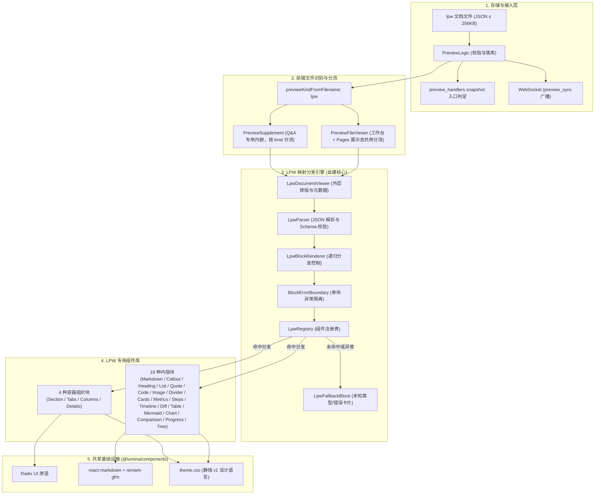
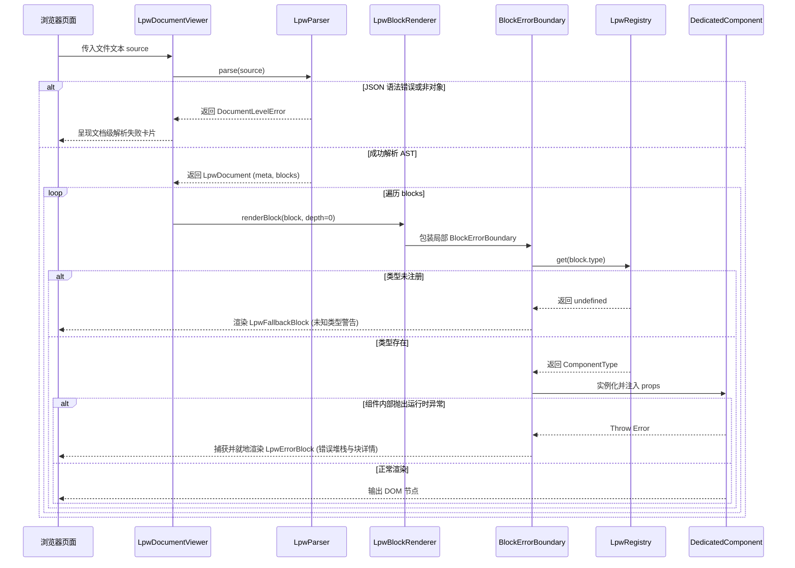
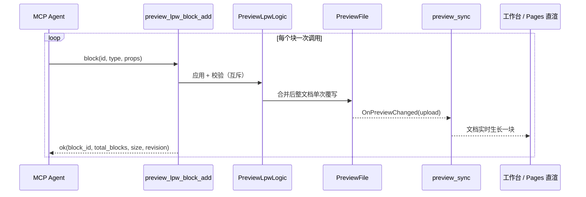
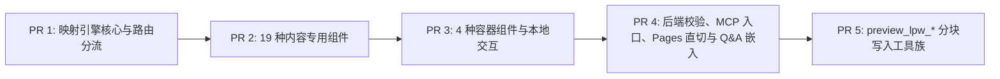

# LPW 预览文档渲染架构与专用组件设计

> 状态：draft · 承接 [调研 0002](../research/0002-preview-lpw-community.md) · [调研 0003](../research/0003-preview-mapping-stack.md) · 定稿 [ADR-0008](../adr/0008-preview-lpw-document-contract.md)

| 项 | 值 |
| --- | --- |
| 作者 | Lumina |
| 日期 | 2026-09-14（2026-09-20 修订：同步 master 后确立 React 直渲优先） |
| 状态 | Draft |
| 范围词 | 预览 / 文件预览 / `preview`（已登记于 `docs/scope-manage.md`） |

## Overview

Lumina Preview 当前支持 HTML、Markdown、SVG 与纯文本代码预览。对于复杂技术方案、排版文档与多维指标评审，纯 Markdown 表现力不足（缺乏分栏、指标卡片、Diff 对比与步骤条），而自由 HTML 存在 AI 生成成本高、排版难以统一、脚本安全风险大的问题。

本设计基于 [ADR-0008](../adr/0008-preview-lpw-document-contract.md) 与 [调研 0003](../research/0003-preview-mapping-stack.md) 的结论，定义 `.lpw`（Lumina Preview 文档）文件的端到端渲染架构。核心方案为：**自建极简类型映射分发引擎（`LpwRegistry` + `LpwBlockRenderer` + `BlockErrorBoundary`）**，结合版本化 JSON Schema 约束，驱动专用 React 组件库进行长文排版与本地安全交互。方案具备零外部框架依赖、天然对齐 React 19、块级错误严格可见（绝不静默吞块）的特征，并将 `json-render` 保留为未来跨端/流式场景的演进候选。

**运行环境首选 React 直渲管线（ADR-0008 第 8 条）**：LPW 与 Markdown 同级，经前端统一文件分发在 React 组件树内渲染，不转 HTML、不进沙盒 iframe；Preview 工作台与 Pages 展示态复用同一实现。master 合入的 Pages 架构（[ADR-0007](../adr/0007-preview-pages-separation.md)）已把 `.md` 直渲验证为可行路径，LPW 沿用该管线接入。

## Background & Motivation

在合并后实现（基线 `789812a`，2026-09-20 同步 master `ec7f904`，合并提交 `7ce1551`）中，Preview/Pages 存在以下既有约束与痛点：
1. **类型分流缺失**：`web/src/lib/preview-file.ts` 将 `.lpw` 误判为普通 `code` 文件，回退至 CodeMirror 代码高亮，无法渲染结构化文档；
2. **Q&A iframe 单通道**：`web/src/components/interact/primitives/preview-frame.tsx` 的 `PreviewSupplement` 解析文件详情后统一构造 `/preview/:session_hash/:filename?lumina_frame=1` 交给 iframe，若直接传入 `.lpw` 将导致浏览器下载或展示裸 JSON；
3. **MCP 入口感知盲区**：入口判定现位于 `internal/mcp/preview_handlers.go` 的 snapshot 构建与 `previewWriteWorkflow`，仅以 HTML 入口（`PreviewMimeHTML`）为可评审语义（`awaiting_html_entry` / `reviewable_unverified`），`.lpw` 无法独立作为会话的主展示入口；Pages 版本的 `EntryFilename` 同样默认 HTML；
4. **错误边界缺失**：调研 0003 证实社区库 `json-render` 内置的 `ElementErrorBoundary` 在捕获异常后直接返回 `null`，不满足 ADR-0008 要求的「渲染失败必须可见、可定位、绝不丢块」原则。

本设计旨在补齐上述技术缺口，给出可直接编码落地的完整工程实现方案。

## Goals & Non-Goals

### Goals

- **文件与入口闭环**：后端识别 `.lpw` 扩展名与专用 MIME，MCP snapshot 入口判定（`preview_handlers.go`）将 `.lpw` 纳为合法首屏入口；
- **版本化文档 Schema**：制定 LPW v1 规范，支持声明式元数据（`version`, `meta`）与顺序文档块（`blocks`）；
- **自建映射分发引擎**：在 `web/src/components/preview/lpw/` 下实现解析器、注册表、块级分发器与错误边界；
- **全量专用组件库（首期 23 种）**：交付 19 种内容块（Markdown、Callout、Heading、List、Quote、Code、Image、Divider、Cards、Metrics、Steps、Timeline、Diff、Table、Mermaid、Chart、Comparison、Progress、Tree），以及 Section、Tabs、Columns、Details 4 种容器块；
- **图表能力（ECharts）**：`mermaid` 块复用既有 Mermaid 渲染链路覆盖流程图/时序图等示意图；`chart` 块以纯数据驱动 7 种数据图（line / bar / area / pie / donut / scatter / radar），引擎为 ECharts 按需注册 + 懒加载，主题色固定走静烛 token 序列；
- **严格错误可见性**：单个块渲染崩溃时，就地展示包含块 ID、类型与错误原因的内嵌诊断卡片，不阻断整篇文档；
- **多端渲染一致性**：Preview 工作台（`/preview/:session_hash/:filename`，登录态）、Pages 展示态（`/pages/:project_name/:slug/:filename`，`.lpw` 随晋升进入不可变快照并纳入页面直切区）、Q&A 交互引用均经同一 React 直渲管线接入 LPW 渲染器；
- **分块写入与渐进构建**：`preview_lpw_*` 工具族支持 add / edit / remove / sort 单块操作，模型可逐块构建长文档，每次写入即时校验并经 `preview_sync` 实时上屏，替代一次性全量生成大 JSON。

### Non-Goals

- **非任意 React/JSX 序列化**：禁止文件传递自定义 React 组件源码或执行动态脚本；
- **无动态绑定与远程数据源**：禁止引入 `$state` 表达式计算、双向数据绑定或动态拉取外部 API；
- **无业务提交与表单回传**：交互严格限于本地（标签切换、表格排序、折叠展开、代码复制），不产生业务回调；
- **不上调文件体积上限**：沿用单文件 `256 * 1024` 字节（256 KiB）限制；
- **首版不引入 json-render**：按照调研 0003 结论保留为候选，v1 纯自建；
- **非流式 token 级渲染协议**：渐进构建由「块级写入 + `preview_sync` 广播 + React 直渲」承担，不引入 A2UI / SpecStream 类增量流式消息协议；
- **不做任意图表 option 透传**：chart 块只接受纯数据（number / 点对 / 类目），不开放 ECharts 的 option 对象、格式化函数或脚本；图表外观由组件与主题 token 决定；
- **不嵌外部 iframe / 视频 / 音频**：外部富媒体嵌入带来跨站与隐私面，v1 不提供；示意图与数据图分别由 mermaid / chart 承担；
- **不做多 Agent 并发编辑协同**：单会话假定单一写入者，跨调用竞争用 revision 回显与重试兜底，不建协同锁协议。

## Key Decisions

| # | 决定 | 理由 |
| --- | --- | --- |
| 1 | **文档数据模型采用顺序块数组 `blocks: LpwBlock[]`**，禁止使用平铺 ID 字典。 | 文档本质上是从上到下的阅读流，数组模型天然契约匹配，无额外转换开销。 |
| 2 | **映射分发层自建（`LpwRegistry` + `LpwBlockRenderer`）**，不引入外部框架。 | 核心逻辑仅约百行原生 TypeScript，零外部 npm 依赖，完全受控且适配 React 19.2。 |
| 3 | **块级错误边界独立包裹每个 Block**，遇到 Throw 必须就地渲染可见错误卡片。 | 严格落实 ADR-0008 第 6 条，避免整页白屏，杜绝 `json-render` 返回 `null` 的丢块漏洞。 |
| 4 | **容器块（Section/Tabs/Columns）递归深度硬上限设为 3**。 | 防范恶意或异常构造的深层递归导致浏览器调用栈溢出（Stack Overflow）。 |
| 5 | **专用组件样式与底层原语 100% 消费 `@lumina/components`**。 | 保证全站视觉语言严格符合「静烛 v1」（全平直角、`--sea-ink`、`--lagoon` 色盘）。 |
| 6 | **Q&A 预览引用根据文件类型动态分流**：HTML/SVG 走 iframe，LPW 走 React 原生渲染。 | 解决 Q&A 内嵌展示 LPW 时的格式错位问题。 |
| 7 | **单文件大小维持 256 KiB**，块数量软上限 500。 | 契合既有 Preview 基础设施配额，单文档足够承载中长篇方案。 |
| 8 | **React 直渲优先**：`.lpw` 与 Markdown 同级进入 `PreviewFileViewer` 的 React 直渲分支，禁止「转 HTML 进 iframe」作为主交付路径。 | 落实 ADR-0008 第 8 条；直渲管线已被 `.md` 验证，直接复用 `@lumina/components` 主题与排版，并保留组件级状态、错误边界与可测试性。 |
| 9 | **MCP 写入以块为最小单位**：`preview_lpw_*` 工具族单调用操作单个块子树；文件级 `preview_file_upload` 保留为整体覆写与修复通道。 | 长文档一次性生成大 JSON 精度随长度劣化、单点错误需整篇重写；分块写入让校验错误局部化、重试成本降为单块，并借 `preview_sync` 实现文档渐进生长。 |
| 10 | **图表双轨**：示意图走 `mermaid`（复用 `@lumina/components` 既有链路，零新依赖）；数据图走 `chart`，引擎为 **ECharts 按需注册 + 懒加载**——`echarts/core` 只注册所需图表/组件/渲染器，首个 chart 块挂载时动态 `import()`。 | ECharts 对雷达/散点/大规模数据与后续图型扩展（heatmap、箱线）能力更全；按需注册把包体压到所用图表集合，懒加载使其不进首屏 bundle。图表块仍只收纯数据，option 组装全部在组件内完成，文件永远接触不到引擎 option。 |
| 11 | **专用组件样式强制 Tailwind CSS utility 类为默认实现**：React 宿主与未来可能的 Vue 宿主共用同一 token + utility 体系；禁止组件级 CSS 文件与 CSS-in-JS，动态值（列宽 / 图高 / 进度条）经 `style` 属性注入。 | LPW 组件的视觉契约必须可跨框架复制——utility 类 + `theme.css` CSS 变量在 React/Vue 下行为一致；样式实现绑定框架（CSS-in-JS）会封死 Vue 宿主路线。当前 `web` 已是 Tailwind 4 + 微明 token，零迁移成本。 |

## System Architecture & Data Flow

### 整体渲染架构拓扑



### 渲染时序与错误隔离



## Document Specification & JSON Schema (v1)

### TypeScript 类型契约（`web/src/components/preview/lpw/types.ts`）

```typescript
export interface LpwMeta {
  title: string
  description?: string
  author?: string
  version?: string
  tags?: string[]
}

export interface LpwBlock<TProps = Record<string, unknown>> {
  id: string
  type: string
  props: TProps
  children?: LpwBlock[] // 仅容器类型允许出现
}

export interface LpwDocument {
  version: '1.0'
  meta?: LpwMeta
  blocks: LpwBlock[]
}

// ── 内容块 props ──────────────────────────────────────────────
export interface LpwMarkdownProps {
  content: string
}

export interface LpwCalloutProps {
  level?: 'info' | 'success' | 'warning' | 'error'
  title?: string
  content: string
}

export interface LpwMetricItem {
  label: string
  value: string | number
  unit?: string
  trend?: 'up' | 'down'
  change?: string
  desc?: string
}
export interface LpwMetricsProps {
  items: LpwMetricItem[]
}

export interface LpwStepItem {
  title: string
  desc?: string
  status?: 'wait' | 'process' | 'finish' | 'error'
}
export interface LpwStepsProps {
  current?: number
  items: LpwStepItem[]
}

export interface LpwTimelineItem {
  time: string
  title: string
  content?: string
  tag?: string
}
export interface LpwTimelineProps {
  items: LpwTimelineItem[]
}

export interface LpwDiffProps {
  filename?: string
  language?: string
  oldCode: string
  newCode: string
  splitView?: boolean
}

export interface LpwTableColumn {
  key: string
  title: string
  width?: string
  align?: 'left' | 'center' | 'right'
}
export type LpwCellValue = string | number | boolean | null
export interface LpwTableProps {
  columns: LpwTableColumn[]
  data: Array<Record<string, LpwCellValue>>
  sortable?: boolean
}

// ── 容器块 props ──────────────────────────────────────────────
export interface LpwSectionProps {
  title: string
  collapsible?: boolean
  defaultOpen?: boolean
}
export interface LpwTabItem {
  key: string
  label: string
}
export interface LpwTabsProps {
  items: LpwTabItem[]
  defaultKey?: string
}
export interface LpwColumnsProps {
  ratio?: '1:1' | '1:2' | '2:1' | '1:1:1'
}

// ── 扩充内容块 props ──────────────────────────────────────────
export interface LpwHeadingProps {
  level?: 1 | 2 | 3
  content: string
}

export interface LpwListItem {
  content: string
  checked?: boolean // 仅 style='check' 生效
}
export interface LpwListProps {
  style?: 'ordered' | 'unordered' | 'check'
  items: LpwListItem[]
}

export interface LpwQuoteProps {
  content: string
  author?: string
  source?: string
}

export interface LpwCodeProps {
  language?: string
  filename?: string
  content: string
  showLineNumbers?: boolean
  highlightLines?: number[] // 1 起始行号
}

export interface LpwImageProps {
  src: string // 同会话文件名（相对解析）或 https?:// 外链
  alt: string
  caption?: string
  width?: string
}

export interface LpwCardItem {
  title: string
  description?: string
  href?: string
}
export interface LpwCardsProps {
  items: LpwCardItem[]
}

export interface LpwMermaidProps {
  content: string
  caption?: string
}

export type LpwChartType = 'line' | 'bar' | 'area' | 'pie' | 'donut' | 'scatter' | 'radar'
export interface LpwChartSeries {
  name: string
  data: Array<number | [number, number]> // scatter 用点对，其余用 number
}
export interface LpwChartProps {
  chartType: LpwChartType
  title?: string
  categories?: string[] // scatter 不允许出现
  series: LpwChartSeries[]
  xLabel?: string
  yLabel?: string
  stacked?: boolean // 仅 bar / area
  legend?: boolean
  height?: number // 160–640，默认 280
}

// ── 扩充容器块 props ──────────────────────────────────────────
export interface LpwDetailsProps {
  summary: string
  defaultOpen?: boolean
}

// ── 第二批内容块 props ────────────────────────────────────────
export interface LpwComparisonCell {
  text: string
  verdict?: 'good' | 'warn' | 'bad'
}
export interface LpwComparisonProps {
  title?: string
  plans: Array<{ name: string; recommended?: boolean }>
  rows: Array<{ dimension: string; values: LpwComparisonCell[] }>
}

export interface LpwProgressItem {
  label: string
  value: number // 0–100
  status?: 'wait' | 'process' | 'finish' | 'error'
}
export interface LpwProgressProps {
  title?: string
  items: LpwProgressItem[]
}

export interface LpwTreeNode {
  label: string
  note?: string
  children?: LpwTreeNode[]
}
export interface LpwTreeProps {
  title?: string
  nodes: LpwTreeNode[]
}
```

### 字段约束总表

| 路径 | 类型 | 必填 | 默认 | 约束 |
| --- | --- | --- | --- | --- |
| `meta.title` | string | ✓（meta 存在时） | — | 1–200 |
| `meta.description` / `author` / `version` | string | — | — | ≤ 1000 / 100 / 32 |
| `meta.tags` | string[] | — | `[]` | ≤ 10 项，每项 ≤ 32 |
| `blocks[].id` | string | ✓ | — | `^[a-z0-9][a-z0-9-]{0,63}$`，全文档唯一 |
| `markdown.content` | string | ✓ | — | 1–16384 |
| `callout.level` | enum | — | `info` | info / success / warning / error |
| `callout.title` | string | — | — | ≤ 200 |
| `callout.content` | string | ✓ | — | 1–4096 |
| `metrics.items` | array | ✓ | — | 1–12 项 |
| `metrics.items[].label / unit / change / desc` | string | label ✓ | — | ≤ 64 / 16 / 32 / 128 |
| `metrics.items[].value` | string \| number | ✓ | — | — |
| `metrics.items[].trend` | enum | — | — | up / down |
| `steps.items` | array | ✓ | — | 1–20 项；title ≤ 100，desc ≤ 512 |
| `steps.current` | integer | — | 不高亮 | ≥ 0，且 < items.length（logic 校验） |
| `timeline.items` | array | ✓ | — | 1–50 项；time ≤ 32，title ≤ 100，content ≤ 1024，tag ≤ 32 |
| `diff.oldCode` / `newCode` | string | ✓ | — | 各 ≤ 32768 |
| `diff.filename` / `language` | string | — | — | ≤ 255 / 32 |
| `diff.splitView` | boolean | — | `true` | — |
| `table.columns` | array | ✓ | — | 1–20 列；key `^[a-zA-Z0-9_]{1,64}$`，title ≤ 100 |
| `table.columns[].width` | string | — | 自动 | ≤ 16，`^(auto\|[0-9]{1,4}(px\|%)?)$` |
| `table.columns[].align` | enum | — | `left` | left / center / right |
| `table.data` | array | ✓ | — | 0–500 行；单元格 string ≤ 1024 或 number / boolean / null |
| `table.sortable` | boolean | — | `false` | — |
| `section.title` | string | ✓ | — | 1–200 |
| `section.collapsible` / `defaultOpen` | boolean | — | `false` / `true` | — |
| `tabs.items` | array | ✓ | — | 1–10 项；key `^[a-z0-9][a-z0-9-]{0,31}$`，label ≤ 50 |
| `tabs.defaultKey` | string | — | `items[0].key` | 必须命中某个 item.key |
| `columns.ratio` | enum | — | `1:1` | 1:1 / 1:2 / 2:1 / 1:1:1 |
| `heading.level` | integer | — | `2` | 1 / 2 / 3 |
| `heading.content` | string | ✓ | — | 1–200，纯文本 |
| `list.style` | enum | — | `unordered` | ordered / unordered / check |
| `list.items` | array | ✓ | — | 1–50 项；content ≤ 512（行内 markdown-lite），checked 仅 check 样式 |
| `quote.content` / `author` / `source` | string | content ✓ | — | 1–2048 / 100 / 200 |
| `code.language` / `filename` | string | — | 自动推断 | ≤ 32 / 255 |
| `code.content` | string | ✓ | — | 1–32768 |
| `code.showLineNumbers` | boolean | — | `false` | — |
| `code.highlightLines` | number[] | — | `[]` | ≤ 128 项，值 ≥ 1 |
| `image.src` | string | ✓ | — | ≤ 512；外链须 `https?://`，否则按同会话文件名（logic 校验） |
| `image.alt` / `caption` / `width` | string | alt ✓ | — | alt 1–200；caption ≤ 200；width ≤ 16 同 table 列宽 |
| `cards.items` | array | ✓ | — | 1–12 项；title ≤ 100，description ≤ 256，href ≤ 512（logic 校验协议） |
| `mermaid.content` | string | ✓ | — | 1–8192 |
| `mermaid.caption` | string | — | — | ≤ 200 |
| `chart.chartType` | enum | ✓ | — | line / bar / area / pie / donut / scatter / radar |
| `chart.title` / `xLabel` / `yLabel` | string | — | — | 各 ≤ 100 |
| `chart.categories` | string[] | — | — | ≤ 100 项，每项 ≤ 32；scatter 禁止出现 |
| `chart.series` | array | ✓ | — | 1–6 项；name ≤ 64；data ≤ 500 项 |
| `chart.stacked` | boolean | — | `false` | 仅 bar / area（logic 校验） |
| `chart.legend` | boolean | — | `true` | — |
| `chart.height` | integer | — | `280` | 160–640 |
| `details.summary` | string | ✓ | — | 1–200 |
| `details.defaultOpen` | boolean | — | `false` | — |
| `comparison.title` | string | — | — | ≤ 200 |
| `comparison.plans` | array | ✓ | — | 1–4 项；name ≤ 100，recommended 默认 false |
| `comparison.rows` | array | ✓ | — | 0–20 项；dimension ≤ 100；values 每项 text ≤ 256，verdict 枚举 |
| `progress.title` | string | — | — | ≤ 200 |
| `progress.items` | array | ✓ | — | 1–12 项；label ≤ 100，value 0–100，status 枚举同 steps |
| `tree.title` | string | — | — | ≤ 200 |
| `tree.nodes` | array | ✓ | — | 0–100 节点（含子孙，logic 校验）；label ≤ 100，note ≤ 100，深度 ≤ 4 |

### 结构约束与规则

1. **版本声明（`version`）**：根属性必须且仅支持 `"1.0"`。未知版本直接拒绝解析并呈现文档级错误；
2. **全局唯一 ID（`id`）**：每个块必须携带合法 `id`（建议形如 `block-1`、`metric-latency`），用于 React key 及目录定位；
3. **属性隔离（`props`）**：所有业务参数统一放在 `props` 对象内，不得在块顶层污染属性；
4. **容器嵌套（`children`）**：仅容器类组件（`section`、`tabs`、`columns`）允许包含 `children` 数组，叶子块出现 `children` 直接校验失败；
5. **递归深度（`depth`）**：顶层块 depth = 1，容器每层 +1，最大 3；渲染器同样强制，超限截断并渲染深度超限错误卡片；
6. **tabs 索引对齐**：`children` 数量必须等于 `items` 数量，按索引一一对应；`defaultKey` 必须命中某个 `items[].key`；
7. **columns 数量对齐**：`children` 数量必须等于 ratio 的列数（`1:1:1` 为 3，其余为 2）；
8. **资源上限**：全文档块数（含子孙）≤ 500；序列化字节 ≤ 256 KiB；
9. **chart 数据对齐**：line / bar / area / radar 要求每个 `series.data` 长度等于 `categories` 长度且项为 number；pie / donut 要求 `series` 恰好 1 个且与 `categories` 对齐；scatter 要求 `series.data` 每项为二元点对且禁止出现 `categories`；`stacked` 仅在 bar / area 合法；
10. **image / cards 链接安全**：`image.src` 与 `cards.items[].href` 含 `://` 时必须以 `https://` 或 `http://` 开头，否则按同会话文件名校验合法字符（禁止 `javascript:`、`data:` 等协议）；
11. **容器类型集合**：允许携带 `children` 的类型固定为 `section`、`tabs`、`columns`、`details` 四种；
12. **comparison 对齐**：每行 `values` 长度必须等于 `plans` 数量；
13. **tree 规模**：`tree.nodes` 节点总数（含子孙）≤ 100、深度 ≤ 4（节点层从 1 计）。

规则 5–13 属跨字段/递归约束，JSON Schema 表达成本高且报错路径差，由后端 logic 走查强制（见 §PreviewLpwLogic）。

### `resources/lpw/schema/v1.json`（唯一维护源，前后端同源消费）

```json
{
  "$schema": "https://json-schema.org/draft/2020-12/schema",
  "$id": "https://lumina.local/lpw/v1.json",
  "title": "Lumina Preview Document v1",
  "type": "object",
  "additionalProperties": false,
  "required": ["version", "blocks"],
  "properties": {
    "version": { "const": "1.0" },
    "meta": { "$ref": "#/$defs/meta" },
    "blocks": { "type": "array", "maxItems": 500, "items": { "$ref": "#/$defs/block" } }
  },
  "$defs": {
    "meta": {
      "type": "object", "additionalProperties": false, "required": ["title"],
      "properties": {
        "title": { "type": "string", "minLength": 1, "maxLength": 200 },
        "description": { "type": "string", "maxLength": 1000 },
        "author": { "type": "string", "maxLength": 100 },
        "version": { "type": "string", "maxLength": 32 },
        "tags": { "type": "array", "maxItems": 10, "items": { "type": "string", "maxLength": 32 } }
      }
    },
    "blockId": { "type": "string", "pattern": "^[a-z0-9][a-z0-9-]{0,63}$" },
    "block": {
      "oneOf": [
        { "$ref": "#/$defs/markdownBlock" },
        { "$ref": "#/$defs/calloutBlock" },
        { "$ref": "#/$defs/metricsBlock" },
        { "$ref": "#/$defs/stepsBlock" },
        { "$ref": "#/$defs/timelineBlock" },
        { "$ref": "#/$defs/diffBlock" },
        { "$ref": "#/$defs/tableBlock" },
        { "$ref": "#/$defs/headingBlock" },
        { "$ref": "#/$defs/listBlock" },
        { "$ref": "#/$defs/quoteBlock" },
        { "$ref": "#/$defs/codeBlock" },
        { "$ref": "#/$defs/imageBlock" },
        { "$ref": "#/$defs/dividerBlock" },
        { "$ref": "#/$defs/cardsBlock" },
        { "$ref": "#/$defs/mermaidBlock" },
        { "$ref": "#/$defs/chartBlock" },
        { "$ref": "#/$defs/comparisonBlock" },
        { "$ref": "#/$defs/progressBlock" },
        { "$ref": "#/$defs/treeBlock" },
        { "$ref": "#/$defs/sectionBlock" },
        { "$ref": "#/$defs/tabsBlock" },
        { "$ref": "#/$defs/columnsBlock" },
        { "$ref": "#/$defs/detailsBlock" }
      ]
    },
    "markdownBlock": {
      "type": "object", "additionalProperties": false, "required": ["id", "type", "props"],
      "properties": {
        "id": { "$ref": "#/$defs/blockId" },
        "type": { "const": "markdown" },
        "props": {
          "type": "object", "additionalProperties": false, "required": ["content"],
          "properties": { "content": { "type": "string", "minLength": 1, "maxLength": 16384 } }
        }
      }
    },
    "calloutBlock": {
      "type": "object", "additionalProperties": false, "required": ["id", "type", "props"],
      "properties": {
        "id": { "$ref": "#/$defs/blockId" },
        "type": { "const": "callout" },
        "props": {
          "type": "object", "additionalProperties": false, "required": ["content"],
          "properties": {
            "level": { "enum": ["info", "success", "warning", "error"], "default": "info" },
            "title": { "type": "string", "maxLength": 200 },
            "content": { "type": "string", "minLength": 1, "maxLength": 4096 }
          }
        }
      }
    },
    "metricsBlock": {
      "type": "object", "additionalProperties": false, "required": ["id", "type", "props"],
      "properties": {
        "id": { "$ref": "#/$defs/blockId" },
        "type": { "const": "metrics" },
        "props": {
          "type": "object", "additionalProperties": false, "required": ["items"],
          "properties": {
            "items": {
              "type": "array", "minItems": 1, "maxItems": 12,
              "items": {
                "type": "object", "additionalProperties": false, "required": ["label", "value"],
                "properties": {
                  "label": { "type": "string", "minLength": 1, "maxLength": 64 },
                  "value": { "type": ["string", "number"] },
                  "unit": { "type": "string", "maxLength": 16 },
                  "trend": { "enum": ["up", "down"] },
                  "change": { "type": "string", "maxLength": 32 },
                  "desc": { "type": "string", "maxLength": 128 }
                }
              }
            }
          }
        }
      }
    },
    "stepsBlock": {
      "type": "object", "additionalProperties": false, "required": ["id", "type", "props"],
      "properties": {
        "id": { "$ref": "#/$defs/blockId" },
        "type": { "const": "steps" },
        "props": {
          "type": "object", "additionalProperties": false, "required": ["items"],
          "properties": {
            "current": { "type": "integer", "minimum": 0 },
            "items": {
              "type": "array", "minItems": 1, "maxItems": 20,
              "items": {
                "type": "object", "additionalProperties": false, "required": ["title"],
                "properties": {
                  "title": { "type": "string", "minLength": 1, "maxLength": 100 },
                  "desc": { "type": "string", "maxLength": 512 },
                  "status": { "enum": ["wait", "process", "finish", "error"] }
                }
              }
            }
          }
        }
      }
    },
    "timelineBlock": {
      "type": "object", "additionalProperties": false, "required": ["id", "type", "props"],
      "properties": {
        "id": { "$ref": "#/$defs/blockId" },
        "type": { "const": "timeline" },
        "props": {
          "type": "object", "additionalProperties": false, "required": ["items"],
          "properties": {
            "items": {
              "type": "array", "minItems": 1, "maxItems": 50,
              "items": {
                "type": "object", "additionalProperties": false, "required": ["time", "title"],
                "properties": {
                  "time": { "type": "string", "minLength": 1, "maxLength": 32 },
                  "title": { "type": "string", "minLength": 1, "maxLength": 100 },
                  "content": { "type": "string", "maxLength": 1024 },
                  "tag": { "type": "string", "maxLength": 32 }
                }
              }
            }
          }
        }
      }
    },
    "diffBlock": {
      "type": "object", "additionalProperties": false, "required": ["id", "type", "props"],
      "properties": {
        "id": { "$ref": "#/$defs/blockId" },
        "type": { "const": "diff" },
        "props": {
          "type": "object", "additionalProperties": false, "required": ["oldCode", "newCode"],
          "properties": {
            "filename": { "type": "string", "maxLength": 255 },
            "language": { "type": "string", "maxLength": 32 },
            "oldCode": { "type": "string", "maxLength": 32768 },
            "newCode": { "type": "string", "maxLength": 32768 },
            "splitView": { "type": "boolean", "default": true }
          }
        }
      }
    },
    "tableBlock": {
      "type": "object", "additionalProperties": false, "required": ["id", "type", "props"],
      "properties": {
        "id": { "$ref": "#/$defs/blockId" },
        "type": { "const": "table" },
        "props": {
          "type": "object", "additionalProperties": false, "required": ["columns", "data"],
          "properties": {
            "columns": {
              "type": "array", "minItems": 1, "maxItems": 20,
              "items": {
                "type": "object", "additionalProperties": false, "required": ["key", "title"],
                "properties": {
                  "key": { "type": "string", "pattern": "^[a-zA-Z0-9_]{1,64}$" },
                  "title": { "type": "string", "minLength": 1, "maxLength": 100 },
                  "width": { "type": "string", "maxLength": 16, "pattern": "^(auto|[0-9]{1,4}(px|%)?)$" },
                  "align": { "enum": ["left", "center", "right"], "default": "left" }
                }
              }
            },
            "data": {
              "type": "array", "maxItems": 500,
              "items": {
                "type": "object",
                "additionalProperties": { "type": ["string", "number", "boolean", "null"], "maxLength": 1024 }
              }
            },
            "sortable": { "type": "boolean", "default": false }
          }
        }
      }
    },
    "sectionBlock": {
      "type": "object", "additionalProperties": false, "required": ["id", "type", "props"],
      "properties": {
        "id": { "$ref": "#/$defs/blockId" },
        "type": { "const": "section" },
        "props": {
          "type": "object", "additionalProperties": false, "required": ["title"],
          "properties": {
            "title": { "type": "string", "minLength": 1, "maxLength": 200 },
            "collapsible": { "type": "boolean", "default": false },
            "defaultOpen": { "type": "boolean", "default": true }
          }
        },
        "children": { "type": "array", "items": { "$ref": "#/$defs/block" } }
      }
    },
    "tabsBlock": {
      "type": "object", "additionalProperties": false, "required": ["id", "type", "props"],
      "properties": {
        "id": { "$ref": "#/$defs/blockId" },
        "type": { "const": "tabs" },
        "props": {
          "type": "object", "additionalProperties": false, "required": ["items"],
          "properties": {
            "items": {
              "type": "array", "minItems": 1, "maxItems": 10,
              "items": {
                "type": "object", "additionalProperties": false, "required": ["key", "label"],
                "properties": {
                  "key": { "type": "string", "pattern": "^[a-z0-9][a-z0-9-]{0,31}$" },
                  "label": { "type": "string", "minLength": 1, "maxLength": 50 }
                }
              }
            },
            "defaultKey": { "type": "string", "maxLength": 32 }
          }
        },
        "children": { "type": "array", "items": { "$ref": "#/$defs/block" } }
      }
    },
    "columnsBlock": {
      "type": "object", "additionalProperties": false, "required": ["id", "type", "props"],
      "properties": {
        "id": { "$ref": "#/$defs/blockId" },
        "type": { "const": "columns" },
        "props": {
          "type": "object", "additionalProperties": false,
          "properties": {
            "ratio": { "enum": ["1:1", "1:2", "2:1", "1:1:1"], "default": "1:1" }
          }
        },
        "children": { "type": "array", "items": { "$ref": "#/$defs/block" } }
      }
    },
    "headingBlock": {
      "type": "object", "additionalProperties": false, "required": ["id", "type", "props"],
      "properties": {
        "id": { "$ref": "#/$defs/blockId" },
        "type": { "const": "heading" },
        "props": {
          "type": "object", "additionalProperties": false, "required": ["content"],
          "properties": {
            "level": { "enum": [1, 2, 3], "default": 2 },
            "content": { "type": "string", "minLength": 1, "maxLength": 200 }
          }
        }
      }
    },
    "listBlock": {
      "type": "object", "additionalProperties": false, "required": ["id", "type", "props"],
      "properties": {
        "id": { "$ref": "#/$defs/blockId" },
        "type": { "const": "list" },
        "props": {
          "type": "object", "additionalProperties": false, "required": ["items"],
          "properties": {
            "style": { "enum": ["ordered", "unordered", "check"], "default": "unordered" },
            "items": {
              "type": "array", "minItems": 1, "maxItems": 50,
              "items": {
                "type": "object", "additionalProperties": false, "required": ["content"],
                "properties": {
                  "content": { "type": "string", "minLength": 1, "maxLength": 512 },
                  "checked": { "type": "boolean" }
                }
              }
            }
          }
        }
      }
    },
    "quoteBlock": {
      "type": "object", "additionalProperties": false, "required": ["id", "type", "props"],
      "properties": {
        "id": { "$ref": "#/$defs/blockId" },
        "type": { "const": "quote" },
        "props": {
          "type": "object", "additionalProperties": false, "required": ["content"],
          "properties": {
            "content": { "type": "string", "minLength": 1, "maxLength": 2048 },
            "author": { "type": "string", "maxLength": 100 },
            "source": { "type": "string", "maxLength": 200 }
          }
        }
      }
    },
    "codeBlock": {
      "type": "object", "additionalProperties": false, "required": ["id", "type", "props"],
      "properties": {
        "id": { "$ref": "#/$defs/blockId" },
        "type": { "const": "code" },
        "props": {
          "type": "object", "additionalProperties": false, "required": ["content"],
          "properties": {
            "language": { "type": "string", "maxLength": 32 },
            "filename": { "type": "string", "maxLength": 255 },
            "content": { "type": "string", "minLength": 1, "maxLength": 32768 },
            "showLineNumbers": { "type": "boolean", "default": false },
            "highlightLines": { "type": "array", "maxItems": 128, "items": { "type": "integer", "minimum": 1 } }
          }
        }
      }
    },
    "imageBlock": {
      "type": "object", "additionalProperties": false, "required": ["id", "type", "props"],
      "properties": {
        "id": { "$ref": "#/$defs/blockId" },
        "type": { "const": "image" },
        "props": {
          "type": "object", "additionalProperties": false, "required": ["src", "alt"],
          "properties": {
            "src": { "type": "string", "minLength": 1, "maxLength": 512 },
            "alt": { "type": "string", "minLength": 1, "maxLength": 200 },
            "caption": { "type": "string", "maxLength": 200 },
            "width": { "type": "string", "maxLength": 16, "pattern": "^(auto|[0-9]{1,4}(px|%)?)$" }
          }
        }
      }
    },
    "dividerBlock": {
      "type": "object", "additionalProperties": false, "required": ["id", "type", "props"],
      "properties": {
        "id": { "$ref": "#/$defs/blockId" },
        "type": { "const": "divider" },
        "props": { "type": "object", "additionalProperties": false, "properties": {} }
      }
    },
    "cardsBlock": {
      "type": "object", "additionalProperties": false, "required": ["id", "type", "props"],
      "properties": {
        "id": { "$ref": "#/$defs/blockId" },
        "type": { "const": "cards" },
        "props": {
          "type": "object", "additionalProperties": false, "required": ["items"],
          "properties": {
            "items": {
              "type": "array", "minItems": 1, "maxItems": 12,
              "items": {
                "type": "object", "additionalProperties": false, "required": ["title"],
                "properties": {
                  "title": { "type": "string", "minLength": 1, "maxLength": 100 },
                  "description": { "type": "string", "maxLength": 256 },
                  "href": { "type": "string", "maxLength": 512 }
                }
              }
            }
          }
        }
      }
    },
    "mermaidBlock": {
      "type": "object", "additionalProperties": false, "required": ["id", "type", "props"],
      "properties": {
        "id": { "$ref": "#/$defs/blockId" },
        "type": { "const": "mermaid" },
        "props": {
          "type": "object", "additionalProperties": false, "required": ["content"],
          "properties": {
            "content": { "type": "string", "minLength": 1, "maxLength": 8192 },
            "caption": { "type": "string", "maxLength": 200 }
          }
        }
      }
    },
    "chartBlock": {
      "type": "object", "additionalProperties": false, "required": ["id", "type", "props"],
      "properties": {
        "id": { "$ref": "#/$defs/blockId" },
        "type": { "const": "chart" },
        "props": {
          "type": "object", "additionalProperties": false, "required": ["chartType", "series"],
          "properties": {
            "chartType": { "enum": ["line", "bar", "area", "pie", "donut", "scatter", "radar"] },
            "title": { "type": "string", "maxLength": 100 },
            "xLabel": { "type": "string", "maxLength": 100 },
            "yLabel": { "type": "string", "maxLength": 100 },
            "categories": {
              "type": "array", "maxItems": 100,
              "items": { "type": "string", "minLength": 1, "maxLength": 32 }
            },
            "series": {
              "type": "array", "minItems": 1, "maxItems": 6,
              "items": {
                "type": "object", "additionalProperties": false, "required": ["name", "data"],
                "properties": {
                  "name": { "type": "string", "minLength": 1, "maxLength": 64 },
                  "data": {
                    "type": "array", "minItems": 1, "maxItems": 500,
                    "items": {
                      "oneOf": [
                        { "type": "number" },
                        { "type": "array", "minItems": 2, "maxItems": 2, "items": { "type": "number" } }
                      ]
                    }
                  }
                }
              }
            },
            "stacked": { "type": "boolean", "default": false },
            "legend": { "type": "boolean", "default": true },
            "height": { "type": "integer", "minimum": 160, "maximum": 640, "default": 280 }
          }
        }
      }
    },
    "comparisonBlock": {
      "type": "object", "additionalProperties": false, "required": ["id", "type", "props"],
      "properties": {
        "id": { "$ref": "#/$defs/blockId" },
        "type": { "const": "comparison" },
        "props": {
          "type": "object", "additionalProperties": false, "required": ["plans", "rows"],
          "properties": {
            "title": { "type": "string", "maxLength": 200 },
            "plans": {
              "type": "array", "minItems": 1, "maxItems": 4,
              "items": {
                "type": "object", "additionalProperties": false, "required": ["name"],
                "properties": {
                  "name": { "type": "string", "minLength": 1, "maxLength": 100 },
                  "recommended": { "type": "boolean", "default": false }
                }
              }
            },
            "rows": {
              "type": "array", "maxItems": 20,
              "items": {
                "type": "object", "additionalProperties": false, "required": ["dimension", "values"],
                "properties": {
                  "dimension": { "type": "string", "minLength": 1, "maxLength": 100 },
                  "values": {
                    "type": "array", "minItems": 1, "maxItems": 4,
                    "items": {
                      "type": "object", "additionalProperties": false, "required": ["text"],
                      "properties": {
                        "text": { "type": "string", "minLength": 1, "maxLength": 256 },
                        "verdict": { "enum": ["good", "warn", "bad"] }
                      }
                    }
                  }
                }
              }
            }
          }
        }
      }
    },
    "progressBlock": {
      "type": "object", "additionalProperties": false, "required": ["id", "type", "props"],
      "properties": {
        "id": { "$ref": "#/$defs/blockId" },
        "type": { "const": "progress" },
        "props": {
          "type": "object", "additionalProperties": false, "required": ["items"],
          "properties": {
            "title": { "type": "string", "maxLength": 200 },
            "items": {
              "type": "array", "minItems": 1, "maxItems": 12,
              "items": {
                "type": "object", "additionalProperties": false, "required": ["label", "value"],
                "properties": {
                  "label": { "type": "string", "minLength": 1, "maxLength": 100 },
                  "value": { "type": "number", "minimum": 0, "maximum": 100 },
                  "status": { "enum": ["wait", "process", "finish", "error"] }
                }
              }
            }
          }
        }
      }
    },
    "treeBlock": {
      "type": "object", "additionalProperties": false, "required": ["id", "type", "props"],
      "properties": {
        "id": { "$ref": "#/$defs/blockId" },
        "type": { "const": "tree" },
        "props": {
          "type": "object", "additionalProperties": false, "required": ["nodes"],
          "properties": {
            "title": { "type": "string", "maxLength": 200 },
            "nodes": { "type": "array", "items": { "$ref": "#/$defs/treeNode" } }
          }
        }
      }
    },
    "treeNode": {
      "type": "object", "additionalProperties": false, "required": ["label"],
      "properties": {
        "label": { "type": "string", "minLength": 1, "maxLength": 100 },
        "note": { "type": "string", "maxLength": 100 },
        "children": { "type": "array", "items": { "$ref": "#/$defs/treeNode" } }
      }
    },
    "detailsBlock": {
      "type": "object", "additionalProperties": false, "required": ["id", "type", "props"],
      "properties": {
        "id": { "$ref": "#/$defs/blockId" },
        "type": { "const": "details" },
        "props": {
          "type": "object", "additionalProperties": false, "required": ["summary"],
          "properties": {
            "summary": { "type": "string", "minLength": 1, "maxLength": 200 },
            "defaultOpen": { "type": "boolean", "default": false }
          }
        },
        "children": { "type": "array", "items": { "$ref": "#/$defs/block" } }
      }
    }
  }
}
```

Schema 说明：

- `additionalProperties: false` 从文档根一路收紧到每个 props——落实 ADR-0008 第 4 条「无通用样式逃生口」；
- 叶子块不声明 `children`，在收紧模式下出现即失败；容器块显式声明并递归引用 `block`；
- `default` 仅为注解（2020-12 中不参与断言），组件实现负责应用默认值；
- `block.oneOf` 以 `type.const` 为天然判别式，恰好命中一个分支。

## Backend & MCP Changes

### 1. 常量与 MIME 定义

在 `internal/constant/preview.go` 新增：

```go
const (
    PreviewMimeLPW = "application/vnd.lumina.preview+json; charset=utf-8" // LPW 预览文档
)
```

### 2. 后端 MIME 推断与上传校验

在 `internal/logic/preview_logic.go` 的 `inferMimeType` 中扩展 `.lpw`：

```go
func inferMimeType(filename string) string {
    switch strings.ToLower(filepath.Ext(filename)) {
    case ".lpw":
        return bConst.PreviewMimeLPW
    // ... 其余不变
    }
}
```

在 `UploadPreviewFile` 中，针对 `.lpw` 扩展名增加基本 JSON 语法合规性检查（非标准 JSON 直接拒绝落库，防脏数据注入）。

### 3. MCP 入口判定增强

入口判定已随 master 迁移至 `internal/mcp/preview_handlers.go` 的 snapshot 构建（`snapshot.entry` / `entryFilename`），并由 `previewWriteWorkflow` 产出 `awaiting_html_entry` / `reviewable_unverified` 状态。扩展方式：

```go
// buildPreviewSessionSnapshot 内的入口选择（示意）：
// 1. 优先寻找 index.lpw 或首个 .lpw 文件
// 2. 回退寻找 HTML 入口（PreviewMimeHTML）
// 3. 均无 → snapshot.entry 为空，保持 awaiting_html_entry
```

配套调整：`previewWriteWorkflow` 的状态文案与指引需把「HTML 入口」泛化为「可评审入口」；Pages 侧 `pages_promote` 生成的 `PageVersion.EntryFilename` 同样允许 `.lpw`。`internal/mcp/preview_schemas.go` 中 `entry_file` 字段描述一并更新，禁止残留「仅 HTML」语义。

### 4. LPW Schema 内嵌与加载服务

```text
resources/lpw/
└── schema/
    └── v1.json        # 上文完整 Schema，唯一维护源
```

```go
// resources/embed.go 追加
//go:embed lpw/schema/v1.json
var lpwSchemaFS embed.FS

// LpwSchemaFiles key 为格式版本号，供加载服务消费
var LpwSchemaFiles = map[string][]byte{
    "1.0": mustReadFile(lpwSchemaFS, "lpw/schema/v1.json"),
}
```

`internal/service/lpw_schema.go`（加载器，模式对齐 `prompt_loader.go`）：

```go
type LpwSchemaLoader struct {
    compiled map[string]*jsonschema.Schema // 版本号 → 编译产物，New 时编译一次
}

func NewLpwSchemaLoader() (*LpwSchemaLoader, error)

// Validate 对整个文档字节串做断言；失败时返回首个失败位置的 JSON 路径与原因
func (l *LpwSchemaLoader) Validate(doc []byte, version string) (failPath string, reason string, ok bool)

func (l *LpwSchemaLoader) Supports(version string) bool
```

校验器复用仓库既有依赖 `github.com/google/jsonschema-go/jsonschema`（`internal/mcp/preview_tools_test.go` 已在用，支持 draft 2020-12 编译与断言），不新增校验库。

### 5. `PreviewLpwLogic` 块操作引擎（`internal/logic/preview_lpw_logic.go`）

```go
type PreviewLpwLogic struct {
    log          xLog.Logger
    previewLogic *PreviewLogic
    schema       *service.LpwSchemaLoader
    locks        sync.Map // key: "<sessionID>:<filename>" → *sync.Mutex
}

// 内存模型；序列化固定 2 空格缩进，保证 AI 逐块 diff 可读
type lpwDocument struct {
    Version string     `json:"version"`
    Meta    *lpwMeta   `json:"meta,omitempty"`
    Blocks  []lpwBlock `json:"blocks"`
}
type lpwBlock struct {
    ID       string         `json:"id"`
    Type     string         `json:"type"`
    Props    map[string]any `json:"props"`
    Children []lpwBlock     `json:"children,omitempty"`
}

type LpwWriteResult struct {
    BlockID     string
    TotalBlocks int
    FileSize    int
    Revision    time.Time
    File        *apiPreview.PreviewFileResponse
}
type LpwOutline struct {
    Version    string
    BlockCount int
    TotalSize  int
    Revision   string
    Items      []LpwOutlineItem // { id, type, depth, children, props_bytes }
}
```

七个公开方法（签名中 `revision` 为可选乐观锁，传上次响应的值）：

```go
func (l *PreviewLpwLogic) InitDocument(ctx context.Context, sessionID xSnowflake.SnowflakeID, filename string, meta map[string]any, blocks []lpwBlock, revision string) (*LpwWriteResult, *xError.Error)
func (l *PreviewLpwLogic) AddBlock(ctx context.Context, sessionID xSnowflake.SnowflakeID, filename string, block lpwBlock, parentID string, position *int, revision string) (*LpwWriteResult, *xError.Error)
func (l *PreviewLpwLogic) EditBlock(ctx context.Context, sessionID xSnowflake.SnowflakeID, filename, blockID string, propsPatch map[string]any, replacement *lpwBlock, revision string) (*LpwWriteResult, *xError.Error)
func (l *PreviewLpwLogic) RemoveBlocks(ctx context.Context, sessionID xSnowflake.SnowflakeID, filename string, blockIDs []string, revision string) (*LpwWriteResult, *xError.Error)
func (l *PreviewLpwLogic) SortBlocks(ctx context.Context, sessionID xSnowflake.SnowflakeID, filename, parentID string, order []string, revision string) (*LpwWriteResult, *xError.Error)
func (l *PreviewLpwLogic) SetMeta(ctx context.Context, sessionID xSnowflake.SnowflakeID, filename string, metaPatch map[string]any, revision string) (*LpwWriteResult, *xError.Error)
func (l *PreviewLpwLogic) Outline(ctx context.Context, sessionID xSnowflake.SnowflakeID, filename string) (*LpwOutline, *xError.Error)
```

统一写入流水线 `withDocument`（全部变更方法共用，缺一不可）：

```text
lock(sessionID:filename)                  // 进程内互斥，defer unlock
  ↓ 读取文件内容 + updated_at              // 经 previewLogic 文件读取
  ↓ revision 预检                          // 入参非空且 ≠ updated_at → 冲突错误（附当前值）
  ↓ 扩展名检查 + JSON 解析 → lpwDocument    // 失败 → 指路 init / preview_file_upload
  ↓ mutate(doc)                            // 树操作 + 结构规则（preview_lpw_tree.go）
  ↓ serialize（2 空格缩进）
  ↓ schema.Validate(serialized, "1.0")     // 整文档 Schema 断言
  ↓ validateContainerRules(doc)            // tabs/columns 对齐、深度 ≤ 3、id 唯一、块数 ≤ 500
  ↓ len(serialized) ≤ PreviewFileMaxSize
  ↓ previewLogic.UploadFile(...)           // 单次落库，继承 OnPreviewChanged 广播
  ↓ 回读 updated_at 作为新 revision，组装 LpwWriteResult
```

树操作为纯函数，集中在 `internal/logic/preview_lpw_tree.go`（无 IO，直接单测）：

| 函数 | 职责 |
| --- | --- |
| `findBlockList(doc, id)` | DFS 定位块所在兄弟切片与下标，返回父链深度 |
| `collectBlockIDs(doc)` | 全文档 id 集合与总块数（含子孙），查重 |
| `subtreeDepth(block)` | 子树最大深度 |
| `insertBlock(doc, parentID, position, block)` | parentID 为空挂顶层；校验 parent ∈ {section, tabs, columns, details} 且合并后深度 ≤ 3 |
| `removeBlocks(doc, ids)` | 先整体定位全部 id（任一不存在即失败），再一次移除 |
| `reorderSiblings(doc, parentID, order)` | 校验 order 为该父容器子块 id 的完整排列（集合相等且无重复）后重排 |
| `patchProps / replaceBlock` | 浅合并 / 整节点替换（含子树） |

### 6. 错误码映射（统一 `xError.ParameterError`，消息必须可行动）

| 条件 | 消息要点 |
| --- | --- |
| revision 不匹配 | `revision 冲突：期望 <入参>，当前 <实际>；先 preview_lpw_outline 重读再重试` |
| JSON 损坏 / 非 `.lpw` | `目标文件不是有效 LPW 文档；用 preview_lpw_init 重置或 preview_file_upload 整体修复` |
| id 重复 / 不存在 | 附现有 id 列表（超过 50 个截断） |
| Schema 断言失败 | `块 <id> props 校验失败：<JSON 路径>：<原因>` |
| tabs / columns 对齐失败 | `tabs 需要 <n> 个 children（items 数），实际 <m>` |
| 超上限 | 明示超限项（块数 / 字节 / 深度）与当前值 |

REST 面：v1 不提供块级 REST 端点。块级写入只经 MCP（Agent 通道），控制台管理端沿用既有整文件编辑——避免两套写入语义分叉。

## Chunked Writing MCP Tool Family (`preview_lpw_*`)

### 动机：放弃一次性全量写入

长文档要求模型在单次工具调用里输出整份 JSON：输出 token 越长结构错误率越高、一处参数错误需要整篇重写、接近 256 KiB 上限的大 JSON 模型也难以自查。分块写入把单次调用负载限制在一个块子树——错误局部化到块、单块重试成本极低、每次写入即时返回该块的校验结果。

### 工具清单

| 工具 | 输入（关键字段） | 语义 |
| --- | --- | --- |
| `preview_lpw_init` | `session_id`, `filename`（默认 `index.lpw`）, `meta`, `blocks?` | 创建文档骨架（`version` + `meta`，空或初始 blocks）；同名 `.lpw` 已存在时整体重置 |
| `preview_lpw_block_add` | `session_id`, `filename`, `block`（含 `id`/`type`/`props`/`children?`）, `parent_id?`, `position?` | 插入单个块子树；`parent_id` 缺省为顶层，`position` 缺省为父容器末尾 |
| `preview_lpw_block_edit` | `session_id`, `filename`, `block_id`, 二选一：`props`（patch）/ `block`（replace） | patch 对现有块浅合并 props、不触碰 children；replace 整节点替换（含子树） |
| `preview_lpw_block_remove` | `session_id`, `filename`, `block_ids: string[]` | 删除一个或多个块及其子树；任一 id 不存在则整体拒绝 |
| `preview_lpw_block_sort` | `session_id`, `filename`, `parent_id?`, `order: string[]` | 重排同一父容器下的兄弟块；`order` 必须是该父容器当前子块 id 的完整排列 |
| `preview_lpw_meta_set` | `session_id`, `filename`, `meta`（patch） | 浅合并更新文档 meta（title / description / tags 等） |
| `preview_lpw_outline` | `session_id`, `filename` | 返回紧凑块索引（id / type / 深度 / 子块数 / props 体积），不含 props 全文 |

设计取舍：`block_add` 刻意只接受**单个块**。批量接口会诱使模型重新拼大 JSON，与精度目标相悖；需要连续多块时由调用方多次调用，每次独立校验与广播。跨容器移动显式拆为 `remove` + `add`（同 id 复用），不提供隐式 move 语义。

### 块定位与子树语义

- 块 `id` 全局唯一（文档规范第 2 条），工具按 id 寻址任意深度的块，不限于顶层；
- `add` 的挂载目标 `parent_id` 必须是已注册容器类型，且合并后深度 ≤ 3，否则拒绝；
- `remove` / `replace` 连同子树一起生效；`props` patch 不触碰 children；
- `sort` 只在同一父容器内重排；`order` 缺一个、多一个或含外来 id 都拒绝。

### 原子性、并发与校验分层

- 每次工具调用在内存中完成「读取当前文档 → 应用操作 → 校验合并结果 → 单次落库」，任一步失败不写库。天然满足 ADR-0008 第 6 条「上传失败不得覆盖已有有效文件」；块工具落库复用 `UploadFile` 路径，`preview_sync` 广播、大小上限、MIME 语义全部继承；
- logic 层按 `(session_id, filename)` 加进程内互斥锁串行化读改写；响应回显 `revision`（取文件 `updated_at`）。检测到并发交错（revision 不匹配）时返回冲突错误，指引先 `preview_lpw_outline` 重读再重试。多实例部署的分布式锁不在 v1 范围；
- 校验分层：`init` 校验文档骨架（version / meta / blocks 形状）；块操作先按该块 `type` 的参数 Schema 校验**整个块子树**（错误定位到块内 JSON 路径），再检查合并后资源上限（块数 ≤ 500、总字节 ≤ 256 KiB、深度 ≤ 3）；
- LPW Schema 唯一维护源为版本化 JSON Schema 文件（v1 落在 `resources/lpw/`，`go:embed` 内嵌），后端校验与前端渲染消费同一份，保证两端判断一致（对齐 ADR-0008 后果条款）；
- Pages 快照不可变：块工具只作用于 Preview 会话文件；已晋升内容需修改时先 Fork 回会话。

### 渐进构建：块级写入 × preview_sync × React 直渲



### 推荐工作流（精度模式指引）

1. `preview_lpw_init` 建骨架：meta 先行，`blocks` 留空；
2. 按阅读顺序逐块 `preview_lpw_block_add`，单块建议 `content` ≤ 4 KiB、children 深度 ≤ 2；
3. 长文写作中途用 `preview_lpw_outline` 重新定向（只看索引，节省上下文）；
4. 修正用 `block_edit`（patch 优先），删除用 `block_remove`，重排用 `block_sort`；
5. 收尾照旧 `preview_file_list` 终核，再交付 `preview_url` 或挂 Q&A。

`.agents/skills/lumina-preview` 技能文档随本工具族的 PR 更新该指引。

### 示例：逐块追加与重排

`preview_lpw_block_add` 请求（顶层追加一个 metrics 块）：

```json
{
  "session_id": "123",
  "filename": "index.lpw",
  "block": {
    "id": "metric-latency",
    "type": "metrics",
    "props": {
      "items": [
        { "label": "P99 延迟", "value": "42ms", "trend": "down" },
        { "label": "吞吐", "value": "12k QPS", "trend": "up" }
      ]
    }
  }
}
```

响应（节选，复用 `previewSessionSnapshot` 结构）：

```json
{
  "status": "success",
  "block_id": "metric-latency",
  "total_blocks": 7,
  "file_size": 9216,
  "revision": "2026-09-20T10:00:00Z",
  "workflow": { "state": "reviewable_unverified", "next_tool": "preview_lpw_block_add" }
}
```

`preview_lpw_block_sort` 请求（顶层把结论段提到指标段之前）：

```json
{
  "session_id": "123",
  "filename": "index.lpw",
  "order": ["intro", "conclusion", "metric-latency", "risks"]
}
```

### 错误语义（对齐 ADR-0008 第 6 条）

| 场景 | 行为 |
| --- | --- |
| 目标文件不是 `.lpw` / JSON 损坏 | 拒绝并指路：`preview_lpw_init` 重置，或 `preview_file_upload` 整体修复 |
| `block_id` / `parent_id` 不存在、新增 id 与现有重复 | 拒绝，附现有 id 摘要 |
| 类型未注册 / props 违反该类型 Schema | 拒绝，错误定位到块内 JSON 路径 |
| 合并后超块数 / 字节 / 深度上限 | 整体拒绝，不部分应用 |
| `order` 非当前子块完整排列 | 拒绝，附当前顺序 |
| revision 冲突 | 返回冲突错误 + 当前 revision，指引重读 outline 后重试 |

### 工具注册与 Input Schema

文件落点：`internal/mcp/preview_lpw_tools.go`（定义与注册，模式对齐 `preview_tools.go`）+ `internal/mcp/preview_lpw_handlers.go`（handler 实现）。在 `internal/mcp/server.go` 的 `InitMCPServer` 中调用 `RegisterPreviewLpwTools(server)`；`PreviewLpwLogic` 实例经 `internal/app/startup/startup_mcp.go` 注入（对齐 Preview / Pages 工具做法）。

块内部结构由 v1 Schema 约束，工具 inputSchema 只收 `type: object` 外壳（`block` / `props` / `meta` 不在工具层重复定义字段）——避免两处 schema 重复漂移，深校验统一发生在 logic 层的整文档断言。

```json
{
  "preview_lpw_init": {
    "type": "object", "required": ["session_id"], "additionalProperties": false,
    "properties": {
      "session_id": { "type": "string" },
      "filename": { "type": "string", "default": "index.lpw" },
      "meta": { "type": "object" },
      "blocks": { "type": "array", "items": { "type": "object" } },
      "revision": { "type": "string", "description": "可选乐观锁：上次响应返回的 revision" }
    }
  },
  "preview_lpw_block_add": {
    "type": "object", "required": ["session_id", "block"], "additionalProperties": false,
    "properties": {
      "session_id": { "type": "string" },
      "filename": { "type": "string", "default": "index.lpw" },
      "block": { "type": "object", "required": ["id", "type", "props"] },
      "parent_id": { "type": "string", "description": "缺省挂顶层" },
      "position": { "type": "integer", "minimum": 0, "description": "缺省追加到父容器末尾" },
      "revision": { "type": "string" }
    }
  },
  "preview_lpw_block_edit": {
    "type": "object", "required": ["session_id", "block_id"], "additionalProperties": false,
    "properties": {
      "session_id": { "type": "string" },
      "filename": { "type": "string", "default": "index.lpw" },
      "block_id": { "type": "string" },
      "props": { "type": "object", "description": "patch 模式：浅合并进现有 props" },
      "block": { "type": "object", "description": "replace 模式：整节点替换（与 props 二选一）" },
      "revision": { "type": "string" }
    }
  },
  "preview_lpw_block_remove": {
    "type": "object", "required": ["session_id", "block_ids"], "additionalProperties": false,
    "properties": {
      "session_id": { "type": "string" },
      "filename": { "type": "string", "default": "index.lpw" },
      "block_ids": { "type": "array", "minItems": 1, "items": { "type": "string" } },
      "revision": { "type": "string" }
    }
  },
  "preview_lpw_block_sort": {
    "type": "object", "required": ["session_id", "order"], "additionalProperties": false,
    "properties": {
      "session_id": { "type": "string" },
      "filename": { "type": "string", "default": "index.lpw" },
      "parent_id": { "type": "string", "description": "缺省为顶层" },
      "order": { "type": "array", "minItems": 1, "items": { "type": "string" } },
      "revision": { "type": "string" }
    }
  },
  "preview_lpw_meta_set": {
    "type": "object", "required": ["session_id", "meta"], "additionalProperties": false,
    "properties": {
      "session_id": { "type": "string" },
      "filename": { "type": "string", "default": "index.lpw" },
      "meta": { "type": "object" },
      "revision": { "type": "string" }
    }
  },
  "preview_lpw_outline": {
    "type": "object", "required": ["session_id"], "additionalProperties": false,
    "properties": {
      "session_id": { "type": "string" },
      "filename": { "type": "string", "default": "index.lpw" }
    }
  }
}
```

`preview_lpw_init` 的重置语义：目标已存在且 revision 匹配（或未传 revision）时整体覆盖；这是唯一允许清空 blocks 的块级工具。

### 响应包络

写操作（init / add / edit / remove / sort / meta_set）统一返回，复用 `previewSessionSnapshot`：

| 字段 | 说明 |
| --- | --- |
| `status` / `message` | 结果与下一步指引 |
| `session` / `file` / `entry_file` / `preview_url` / `qa_supplement` | 与 `preview_file_upload` 完全同构 |
| `block_id` / `total_blocks` / `file_size` / `revision` | 块级结果与新修订号 |
| `workflow` | 沿用 `previewWriteWorkflow` 状态机输出 |

`preview_lpw_outline` 返回 `outline: { version, block_count, total_size, revision, items[] }`，`items[]` 即 `LpwOutlineItem`，按文档顺序深度优先排列。

## Frontend Mapping Engine Design

### 目录结构

```text
web/src/components/preview/lpw/
├── types.ts                  # §Document Spec 的类型契约
├── lpw-parser.ts             # 解析 + 结构自检（轻量；深校验在服务端）
├── lpw-registry.ts           # 类型注册表（含容器元数据）
├── lpw-block-renderer.tsx    # 块分发器（深度控制 + 错误边界）
├── block-error-boundary.tsx  # 单块异常隔离
├── fallback-block.tsx        # 未知类型 / 超深 / 异常占位卡片
├── document-viewer.tsx       # 文档壳：meta 头 + blocks 列表 + 文档级错误 + 空态
├── viewers.tsx               # PreviewLpwViewer（工作台/展示态）+ PreviewLpwInlineViewer（Q&A）
├── blocks/                   # 19 种内容块
│   ├── markdown-block.tsx
│   ├── callout-block.tsx
│   ├── heading-block.tsx
│   ├── list-block.tsx
│   ├── quote-block.tsx
│   ├── code-block.tsx
│   ├── image-block.tsx
│   ├── divider-block.tsx
│   ├── cards-block.tsx
│   ├── metrics-block.tsx
│   ├── steps-block.tsx
│   ├── timeline-block.tsx
│   ├── diff-block.tsx
│   ├── table-block.tsx
│   ├── mermaid-block.tsx
│   ├── chart-block.tsx
│   ├── comparison-block.tsx
│   ├── progress-block.tsx
│   └── tree-block.tsx
├── echarts-lazy.ts           # loadEcharts()：动态 import + 按需注册，模块级缓存
├── echarts-module.ts         # echarts/core 按需注册（图表/组件/渲染器集合）
├── containers/               # 4 种容器块
│   ├── section-container.tsx
│   ├── tabs-container.tsx
│   ├── columns-container.tsx
│   └── details-container.tsx
└── index.ts                  # 统一导出 + registerAll()
```

### 组件统一契约

所有注册组件收到同一组注入属性（各组件自定义 `P`，外壳一致）：

```typescript
export interface LpwBlockSlotProps<P> {
  blockId: string               // 块 id：锚点 / 错误定位
  props: P                      // 该块 props（组件内应用默认值）
  depth: number                 // 当前深度（顶层 = 1）
  childrenBlocks?: LpwBlock[]   // 仅容器类型非空
}

// 容器统一通过该助手渲染子块，保证 depth + 1 与错误边界不遗漏
export function renderChildren(blocks: LpwBlock[] | undefined, depth: number) {
  return blocks?.map((child) => (
    <LpwBlockRenderer key={child.id} block={child} depth={depth + 1} />
  ))
}
```

### `lpw-parser.ts`（终版契约）

```typescript
export interface LpwParseError { message: string; path?: string }
export interface LpwParseResult {
  document?: LpwDocument
  error?: LpwParseError
}

// 解析 + 结构自检：
// 1. JSON 语法 → 根对象
// 2. version === '1.0'
// 3. blocks 为数组，每项含 string id / string type / object props
// 4. id 全文档唯一（重复 → 定位第二个出现处）
// 字段上限与枚举由服务端 Schema 负责；未知 type 不是解析错误（渲染期走 Fallback）
export function parseLpwSource(source: string): LpwParseResult
```

### `lpw-registry.ts`（含元数据）

```typescript
export interface LpwEntry {
  Component: React.ComponentType<LpwBlockSlotProps<any>>
  container: boolean // section / tabs / columns 为 true
}

class LpwRegistryStore {
  private registry = new Map<string, LpwEntry>()
  register(type: string, container: boolean, Component: LpwEntry['Component']): void
  get(type: string): LpwEntry | undefined
  types(): string[]
}

export const lpwRegistry = new LpwRegistryStore()
```

`index.ts` 的 `registerAll()` 集中注册 10 个类型；注册表类型清单与 v1 Schema 的分支数由单测对齐（新增 Schema 分支而未注册组件时测试失败）。

### `lpw-block-renderer.tsx`（终版）

```typescript
const MAX_CONTAINER_DEPTH = 3

export function LpwBlockRenderer({
  block,
  depth = 1,
}: {
  block: LpwBlock
  depth?: number
}) {
  if (depth > MAX_CONTAINER_DEPTH) {
    return (
      <LpwFallbackBlock
        block={block}
        reason={`容器嵌套深度超过最大限制（${MAX_CONTAINER_DEPTH} 层）`}
      />
    )
  }

  const entry = lpwRegistry.get(block.type)
  if (!entry) {
    return <LpwFallbackBlock block={block} reason={`未注册的组件类型: ${block.type}`} />
  }

  return (
    <BlockErrorBoundary block={block}>
      <entry.Component
        blockId={block.id}
        props={block.props}
        depth={depth}
        childrenBlocks={block.children}
      />
    </BlockErrorBoundary>
  )
}
```

### `block-error-boundary.tsx` / `fallback-block.tsx`

错误边界实现保持既定语义：崩溃块就地渲染诊断卡片（`[type#id] + error.message`），绝不让整篇白屏。

```typescript
interface State {
  hasError: boolean
  error: Error | null
}

export class BlockErrorBoundary extends React.Component<
  { block: LpwBlock; children: React.ReactNode },
  State
> {
  state: State = { hasError: false, error: null }

  static getDerivedStateFromError(error: Error): State {
    return { hasError: true, error }
  }

  render() {
    if (this.state.hasError) {
      return (
        <div className="my-2 border border-red-500/30 bg-red-500/5 p-3 text-xs">
          <div className="flex items-center gap-1.5 font-semibold text-red-600">
            <span>块渲染失败</span>
            <span className="text-sea-ink-soft/60">
              [{this.props.block.type}#{this.props.block.id}]
            </span>
          </div>
          <p className="mt-1 font-mono text-sea-ink-soft">{this.state.error?.message}</p>
        </div>
      )
    }
    return this.props.children
  }
}
```

`LpwFallbackBlock` 渲染警示卡：块 id、类型、原因，附 `<details>` 折叠的 `props` JSON 预览——读者可以把卡片内容直接反馈给 Agent 修正。

### `document-viewer.tsx` 与两个 Viewer

```typescript
export function LpwDocumentViewer({ source }: { source: string }) {
  const { document, error } = useMemo(() => parseLpwSource(source), [source])
  // error   → 文档级错误卡（含 path / message，不留白）
  // 空 blocks → 「空文档：等待分块写入」占位（呼应渐进构建心智）
  // 正常    → meta 头（title / description / tags Badge）+ blocks.map(LpwBlockRenderer, depth=1)
}

// viewers.tsx —— 两个外壳只差布局约束
export function PreviewLpwViewer({ src, filename }: { src: string; filename: string })
// fetch(src) 取原始文本（不做 formatPreviewSource 预处理）
// loading / fetch 错误态 → 居中提示；成功 → LpwDocumentViewer
// 用于工作台与 Pages 展示态：占满父容器，滚动交给父级

export function PreviewLpwInlineViewer({ src, filename }: { src: string; filename: string })
// Q&A 内嵌：同上，外层 min-h-80、宽度撑满补充面板
```

## Dedicated Component Library (v1 Specs)

23 个类型（19 内容块 + 4 容器块）的 props 契约见 §Document Specification；本节定义渲染实现。全局约束（Key Decisions #11）：**样式强制 Tailwind CSS utility 类为默认实现**——只消费 `@lumina/components` 原语与 `theme.css` 语义 token 对应的 Tailwind 语义类（`text-sea-ink`、`border-line`、`bg-surface` 等），全平直角（无 rounded 类）；禁止组件级 CSS 文件与 CSS-in-JS；动态值（列宽 / 图高 / 进度条宽）经 `style` 属性注入；本地交互一律 `useState`，无网络副作用。React 宿主与未来 Vue 宿主共用同一套 utility 类与 token。

### `markdown`（`blocks/markdown-block.tsx`）

- 结构：`<div className={proseArticle}><Markdown>{content}</Markdown></div>`；
- 消费：`@lumina/components/markdown` 完整链路（GFM + 数学 + 代码高亮 + Mermaid），与 Wiki 正文同源；
- 边界：`content` 非空由 Schema 保证；超长内容的滚动由文档容器承担。

### `callout`

- 语义色映射：info→`lagoon`、success→`kicker`、warning→`palm`、error→`destructive`；
- 结构：`div.my-4 border-l-4 p-4` + 语义边框/浅底 + 可选 `title`（semibold）+ `content`；
- `content` 用 `markdown-lite` 渲染（行内加粗/代码可用，heading/mermaid 不放开，控制卡片内排版尺度）。

### `metrics`

- 结构：`grid gap-4 sm:grid-cols-2 lg:grid-cols-3`，每项 `border border-line bg-surface p-4`；
- 排版：label 小号弱化；value `text-2xl font-semibold text-sea-ink` + unit 小号后缀；`trend: up` → `text-kicker`、`down` → `text-palm` 的 change 徽标；desc 单行弱化；
- 边界：value 为 number 原样展示，不做格式化猜测。

### `steps`

- 结构：横向 `<ol class="flex flex-wrap gap-4">`，节点 = 圆点 + 连接线 + title / desc；
- 状态色：wait→`border-line`、process→`border-lagoon` 实心、finish→`border-kicker`、error→`border-destructive`；`current` 命中节点加描边；
- 边界：`current` 缺省不高亮任何节点；越界值由服务端拦截，前端不防御性钳制。

### `timeline`

- 结构：竖向 `<ul>`，左轴 1px `border-line` + 节点圆点；`time` 等宽小号，title 常规，content 弱化，`tag` 渲染 `Badge`；
- 边界：content / tag 缺省时省略槽位，不留空节点。

### `diff`

- 依赖：新增 `react-diff-viewer-continued`（仅 `web` 端，`components` 包不引入）；
- 结构：顶栏 = filename + language `Badge` + 并排/统一切换按钮（本地 state，初值 `splitView ?? true`）；正文 ReactDiffViewer；
- 主题：`styles` 覆写对齐直角与 `--sand` / `--sea-ink` 语义色，深浅两套 token 跟随根节点 `dark` 类；
- 边界：oldCode 与 newCode 相同渲染「无差异」提示。

### `table`

- 结构：原生 `<table class="w-full text-sm">`，thead `border-b border-line`；列 `width` 透传 `style.width`、`align` 透传 `text-left/center/right`；
- 排序：`sortable` 时表头为 `<button>` + `aria-sort`，本地三态（升 → 降 → 复原）；number 数值比较、其余按 `String()` 本地化比较、null 恒排末尾；
- 单元格：boolean → `是 / —`，null → `—`，string 长度由 Schema 上限兜底不做截断；
- 边界：`data` 为空渲染单行「暂无数据」，列头保留。

### `heading`

- 结构：按 `level`（默认 2）渲染 `h1/h2/h3`，`id={blockId}` 锚点；正文 `text-sea-ink`，层级字号对齐 `proseArticle` 的标题尺度；
- 用途：无需 section 包裹的轻量结构；文档壳的 TOC（如后续引入）同时收集 `heading` 与 `section.title`；
- 边界：`content` 为纯文本，不渲染 markdown（需要富文本时用 markdown 块的 `#` 语法）。

### `list`

- 结构：`ordered` → `<ol>` 数字序；`unordered` → `<ul>` 圆点；`check` → `<ul>` + 只读勾选框（`aria-checked`，不提供交互——状态属于文件不属于读者）；
- item `content` 用 `markdown-lite` 行内渲染（加粗/行内代码可用）；
- 边界：`checked` 在非 check 样式下由 Schema 允许但渲染忽略。

### `quote`

- 结构：`blockquote` 左侧 2px `border-lagoon` + 浅底；`content` 用 `markdown-lite` 渲染；`author` / `source` 存在时渲染 footer（`— author · source`）；
- 边界：无署名时省略 footer。

### `code`

- 结构：顶栏 = filename（等宽小字）+ language `Badge`；正文复用 web 端 CodeMirror 只读视图（与源码检查态同视觉、同依赖）；
- `showLineNumbers` 开行号槽；`highlightLines` 用 CodeMirror 行装饰渲染 `bg-sand` 行高亮；
- 边界：language 未知时按纯文本高亮；`highlightLines` 越界行号忽略（不报错，渲染期防御）。

### `image`

- 结构：`<figure>` + `` + 可选 `<figcaption>`；`width` 透传 `style.width`；
- `src` 解析：同会话文件名（如 `logo.svg`）交给浏览器相对解析——`.lpw` 的 URL 基准即 `/preview/:hash/` 或 `/pages/:project/:slug/`，天然命中同会话文件；`https?://` 外链直接使用；其余协议在 logic 层已拒绝；
- 边界：加载失败渲染占位卡（alt + 文件名），不留破图。

### `divider`

- 结构：`<hr class="my-6 border-line">`；无 props；
- 用途：章节之间的呼吸分隔，与 section 标题不叠加使用。

### `cards`

- 结构：`grid gap-4 sm:grid-cols-2 lg:grid-cols-3`；每项 `border border-line bg-surface p-4`，title semibold + description 弱化；
- `href` 存在时整卡包 `<a>`，复用 fenced `Card` 的 `sanitizeHref` 模式（拒绝 `javascript:` / `data:` / `vbscript:`，双保险：logic 已校验协议）；
- 边界：description 缺省时单行卡片。

### `mermaid`

- 结构：`content` 交给 `@lumina/components/markdown` 的 mermaid 渲染链路（与 Markdown 块内的 mermaid 代码围栏同一实现，securityLevel 沿用现有配置）；可选 caption 渲染为 figcaption；
- 边界：语法错误时 mermaid 抛错 → 被 `BlockErrorBoundary` 捕获为可见错误卡（含解析失败信息），不影响其余块。

### `chart`（ECharts 引擎）

- 依赖：新增 `echarts`（仅 `web` 端），**按需注册 + 懒加载**，导入策略对比如下：

| 方案 | 做法 | 包体影响 | 结论 |
| --- | --- | --- | --- |
| A · 全量引入 | `import * as echarts from 'echarts'` | ~1 MB min / ~330 KB gzip，进主 bundle | 否决：控制台首屏不可接受 |
| B · 按需注册 | `echarts/core` + 按图表/组件注册 | 只含所用图表集合（~300 KB min 级） | **采用**，封装单一注册入口 |
| C · 懒加载 chunk | 首个 chart 块挂载时动态 `import()` | 0 初始成本，独立异步 chunk | **叠加采用**：B 的注册模块走动态 import |

- 落地形态：`lpw/echarts-lazy.ts` 导出 `loadEcharts()`——动态 `import('./echarts-module')`，该模块内完成按需注册（Line/Bar/Pie/Scatter/Radar 图表 + Grid/Tooltip/Legend 组件 + CanvasRenderer）；返回的 Promise 模块级缓存，保证 echarts 只加载一次；加载期渲染骨架占位；
- 生命周期：挂载后 `echarts.init(dom, null, { renderer: 'canvas' })`；`ResizeObserver` 跟随容器宽度 `resize()`；卸载时 `dispose()`，防止 SPA 路由切换泄漏；
- 类型映射（纯数据 → ECharts option，组装全部在组件内）：line → `series.type: 'line'`、area → `'line' + areaStyle`、bar → `'bar'`（`stacked` → `stack`）、pie / donut → `'pie'`（donut 设 `radius: ['45%','70%']`）、scatter → `'scatter'`（点对数组直接作 data）、radar → `radar.indicator` 由 `categories` 生成；
- 视觉：`color` 数组固定静烛语义色序列（`--lagoon` / `--kicker` / `--palm` / `--sea-ink` / `--sand-deep` 循环取色）；轴标签 `xLabel` / `yLabel`；`legend` 默认开；`height ?? 280` 固定像素——SSR 首帧渲染骨架，canvas 仅客户端；
- 边界：数据为空渲染空态卡；文件永远接触不到 option 对象（安全边界不变）；不做缩放/刷选等高级交互（v1 明确不做）。

### `comparison`（对比矩阵）

- 结构：表格——首列为维度名（semibold），其余列头为 `plans[].name`；`recommended: true` 的列头追加「推荐」`Badge`，整列底色 `bg-surface` 区分；
- 单元格 `verdict` 语义色：good → `text-kicker`、warn → `text-palm`、bad → `text-destructive`、缺省常规文本；`text` 纯文本；
- 边界：每行 `values` 长度 = `plans` 数量（服务端强制）；`rows` 为空渲染空态行；
- 定位：方案选型、技术对比、版本对照——AI 写评审文档的高频形态，替代手工拼 table。

### `progress`

- 结构：每项一行 = label（左侧）+ 轨道条 + 百分比数字；轨道 `bg-surface` 底、填充条按状态着色：wait → `bg-line`、process → `bg-lagoon`、finish → `bg-kicker`、error → `bg-destructive`；
- `status` 缺省时的展示推断（不改数据）：`value = 100` 按 finish、`0 < value < 100` 按 process、`value = 0` 按 wait；
- 边界：`value` 的 0–100 边界由 Schema 保证；条宽 = `style.width`（动态值不走 utility 类）。

### `tree`

- 结构：递归 `<ul>`；每节点行 = 角线（`border-l` / `border-b` 组合）+ `label`（等宽字体，契合路径心智）+ `note` 弱化后缀；v1 静态全展开，不做折叠交互；
- 递归渲染子组件 `TreeNode`（自引用组件，深度受 Schema/服务端 ≤ 4 约束）；
- 边界：节点总数 ≤ 100（服务端强制）；`children` 为空的节点即叶子。

### `section`（容器）

- 结构：`<section id={blockId}>` + `h2` 标题 + 内容区；
- 折叠：`collapsible` 时标题为 `<button aria-expanded>`，初值 `defaultOpen ?? true`；折叠只隐藏内容，标题常驻；
- 子块：`renderChildren(childrenBlocks, depth)`。

### `tabs`（容器）

- 结构：`role=tablist` 按钮组 + 面板；激活 key 本地 state，初值 `defaultKey ?? items[0].key`；
- 对齐：children 与 items 按索引一一对应（服务端已强制等长）；防御：缺失槽位渲染「该页签缺少内容块」占位而非空白；
- 仅渲染激活面板（v1 用条件渲染，不做 keep-alive）。

### `columns`（容器）

- 结构：`grid gap-4 grid-cols-1 md:<ratio>`；ratio 映射：`1:1 → md:grid-cols-2`、`1:2 → md:grid-cols-[1fr_2fr]`、`2:1 → md:grid-cols-[2fr_1fr]`、`1:1:1 → md:grid-cols-3`；移动端单列；
- 对齐：children 数 = ratio 列数（服务端强制），多余槽位不存在。

### `details`（容器）

- 结构：原生 `<details open={defaultOpen ?? false}><summary>{summary}</summary>` + 内容区，零 JS 免状态管理；
- 语义：与 section 的区别——section 是章节（常驻、可锚点），details 是「默认收起的补充材料」（附录、长表格、原始数据）；
- 子块：`renderChildren(childrenBlocks, depth)`，深度计入容器层级。

## Integration Points

### 1. `web/src/lib/preview-file.ts`

```typescript
export type PreviewKind = 'html' | 'markdown' | 'code' | 'svg' | 'lpw'

const LPW_EXT = new Set(['lpw'])

export function previewKindFromFilename(filename: string): PreviewKind {
  const ext = fileExtension(filename)
  if (LPW_EXT.has(ext)) return 'lpw'
  // ... 其余分支保持
}
```

### 2. `web/src/components/preview/file-viewer.tsx`

在 `PreviewFileViewer` 增加对 `'lpw'` 的拦截：

```typescript
if (kind === 'lpw') {
  return <PreviewLpwViewer src={src} filename={filename} />
}
```

`PreviewLpwViewer` 获取文本内容后交由 `LpwDocumentViewer` 驱动渲染。

### 3. `web/src/components/interact/primitives/preview-frame.tsx`

`PreviewSupplement` 现统一构造 `/preview/:session_hash/:filename?lumina_frame=1` 交给 iframe。Q&A 内嵌需在解析文件详情后按 kind 分流：

```typescript
if (previewKindFromFilename(detail.filename) === 'lpw') {
  return <PreviewLpwInlineViewer src={src} filename={detail.filename} />
}
return <PreviewFrame src={src} title={detail.filename} />
```

彻底杜绝将 `.lpw` 文件喂给 HTML iframe 的历史问题。

### 4. `web/src/components/pages/showcase-shell.tsx`

Pages 展示态与 Preview 工作台复用同一个 `PreviewFileViewer`，因此 LPW 分支天然双端生效。还需把直切区判定从 `html|htm|md` 扩展为 `html|htm|md|lpw`：

```typescript
function isRenderable(filename: string) {
  return /\.(html|htm|md|lpw)$/i.test(filename)
}
```

会话内 `.lpw` 随 `pages_promote` 全量深拷贝进入不可变快照，展示态直切区将其视为可渲染页面；源码检查仍走 CodeMirror 分支，不受影响。

## Security & Performance Boundaries

1. **XSS 防护**：
   - 绝不使用 `dangerouslySetInnerHTML`；
   - Markdown 渲染统一经由 `react-markdown` 进行 AST 安全转义，不开启未受信任的 HTML 标签解析；
2. **资源与计算上限**：
   - 单文件大小上限：256 KiB；
   - 文档块总数限制：500 块（解析阶段超出直接警告并截断）；
   - 容器嵌套层级：最大深度 3 层；
3. **本地状态无网络副作用**：
   - Tabs 切换、手风琴折叠等状态由 React `useState` 纯本地维护，不得向后端发起请求或写回文件。

## Implementation Roadmap & PR Plan

项目落地划分为 5 个连续 PR：



- **PR 1：映射引擎核心与路由分流**
  - 新增 `web/src/components/preview/lpw/` 核心：`types.ts`, `lpw-parser.ts`, `lpw-registry.ts`, `lpw-block-renderer.tsx`, `block-error-boundary.tsx`, `fallback-block.tsx`, `document-viewer.tsx`, `viewers.tsx`, `index.ts`；
  - 调整 `web/src/lib/preview-file.ts` 与 `web/src/components/preview/file-viewer.tsx` 支持 `'lpw'`；
  - 交付基础空壳与 Fallback 占位。
- **PR 2：19 种内容专用组件**
  - 实现 Markdown, Callout, Heading, List, Quote, Code, Image, Divider, Cards, Metrics, Steps, Timeline, Diff, Table, Mermaid, Chart, Comparison, Progress, Tree 组件；
  - 注册至 `lpwRegistry`，补齐单测与样例；
  - 新增依赖 `react-diff-viewer-continued` 与 `echarts`（均仅 `web` 端；echarts 走 `echarts-lazy.ts` 按需注册 + 懒加载）。
- **PR 3：4 种容器组件与本地交互**
  - 实现 Section, Tabs, Columns, Details 容器块；
  - 支持 `depth` 递归限制与本地标签/折叠状态；
  - 交付典型 LPW 长文样例。
- **PR 4：后端校验、MCP 入口、Pages 直切与 Q&A 嵌入**
  - 修改 `internal/constant/preview.go` 与 `internal/logic/preview_logic.go`；
  - 扩展 `internal/mcp/preview_handlers.go` 的 snapshot 入口判定与 `previewWriteWorkflow` 文案，同步 `preview_schemas.go` 描述与 Pages `EntryFilename` 语义；
  - 调整 `web/src/components/pages/showcase-shell.tsx` 的 `isRenderable` 纳入 `.lpw`；
  - 调整 `web/src/components/interact/primitives/preview-frame.tsx` 支持 Q&A 内嵌。
- **PR 5：`preview_lpw_*` 分块写入工具族**
  - 新增 `internal/mcp/preview_lpw_tools.go`（7 个工具定义与注册）与 `internal/logic/preview_lpw_logic.go`（块操作引擎：互斥、Schema 校验、合并、单次落库）；
  - `resources/lpw/` 内嵌 v1 Schema，后端校验与前端渲染同源消费；
  - MCP 响应复用 `previewSessionSnapshot`，附加块级结果（`block_id`、`total_blocks`、`file_size`、`revision`）；
  - `preview_schemas.go` 登记新工具 input/outputSchema；
  - 更新 `.agents/skills/lumina-preview` 技能：LPW 精度模式工作流指引。

## Verification & Testing Strategy

1. **单元测试**：
   - `lpw-parser.test.ts`：验证合法 JSON、畸形 JSON、不支持的版本（如 `2.0`）、缺少 `blocks` 等异常路径；
   - `lpw-registry.test.ts`：验证组件注册、重复注册覆盖、未注册类型查询；
   - `block-error-boundary.test.tsx`：模拟组件内部 `throw new Error()`，断言页面呈现错误卡片且文档其他块正常渲染。
2. **场景用例回归**：
   - 构造包含 23 种块的完整 `.lpw` 文档，在 Preview 工作台（`/preview/:session_hash/:filename`）与 Pages 展示态（晋升快照后的 `/pages/:project/:slug/:filename`）验证渲染一致性；
   - 在 Q&A 交互中推送包含 `.lpw` 引用的 supplement，验证原生内嵌展示正常；
   - 上传超限文档（>256KB 或深度 >3），验证错误提示明晰可见。
3. **分块写入工具族**：
   - `preview_lpw_logic_test.go`：add / patch / replace / remove / sort 正常路径；id 冲突、未知 id、未知类型、深度/块数/字节超限的原子性（失败后文件字节不变）；互斥锁下的并发读改写不丢更新；
   - MCP 注册测试：7 个工具名称、inputSchema 与 outputSchema 字段齐全；
   - 场景回归：分块构建 ≥ 30 块长文，每步核对 `preview_sync` 上屏与 `preview_lpw_outline` 一致；中途执行 remove 与 sort 后终核渲染无丢块、无孤儿 id。
4. **专用组件渲染测试**（Vitest + Testing Library，`web/` 端）：
   - 每类型渲染用例：正常 props、可选字段缺省、默认值应用（callout level、table align、tabs defaultKey、diff splitView、heading level、list style、chart height/legend）；
   - 容器契约：depth 传递、tabs 缺槽占位、columns 比例类名、details 原生开合、renderChildren 递归；
   - 图表专项：7 种 chartType 各一例；chart 数据对齐负例（长度不匹配、pie 多 series、scatter 带 categories）在 logic 层拒绝；mermaid 语法错误渲染为可见错误卡；echarts 懒加载——无 chart 块的文档不请求 echarts chunk，含 chart 块的文档首个块挂载后只加载一次；
   - 第二批块：comparison 推荐列高亮与 verdict 语义色、progress 状态缺省推断（100/中间/0）、tree 深度渲染与角线；comparison 行 values 与 plans 数量错配在 logic 层拒绝；
   - 链接与媒体：image 同会话相对解析与外链直用、cards href 协议过滤、image 加载失败占位；
   - `registerAll()` 与 v1 Schema 分支数对齐测试：Schema 新增类型而未注册组件时失败；
   - fallback / error-boundary：未注册类型、组件抛错 → 卡片可见且文档其余块正常渲染。
