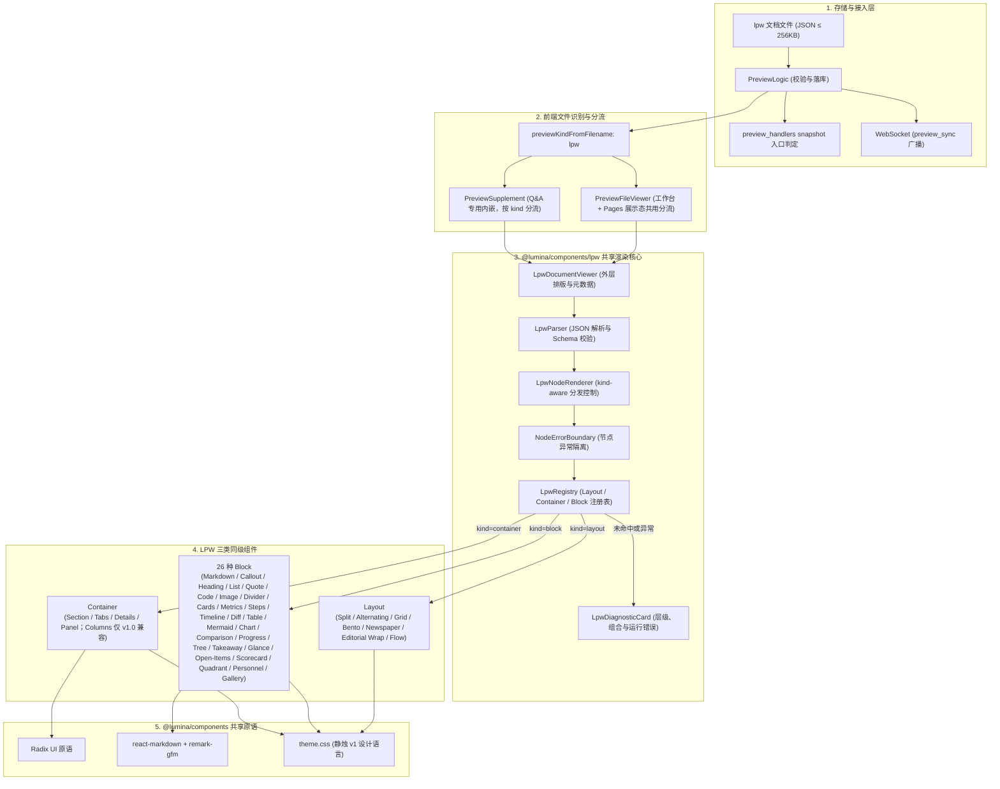
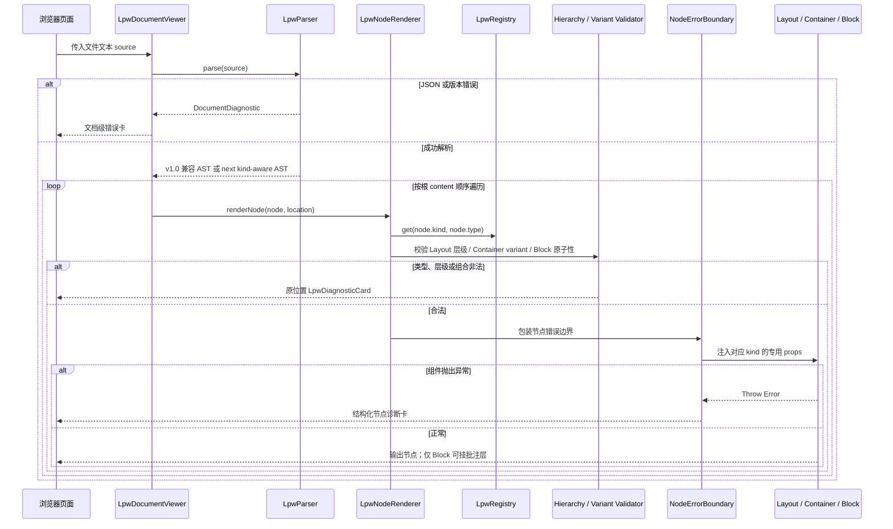

# LPW 预览文档渲染架构与专用组件设计

> 状态：draft · 承接 [调研 0002](../research/0002-preview-lpw-community.md) · [调研 0003](../research/0003-preview-mapping-stack.md) · 定稿 [ADR-0008](../adr/0008-preview-lpw-document-contract.md)

| 项 | 值 |
| --- | --- |
| 作者 | Lumina |
| 日期 | 2026-09-14（2026-09-21 修订：基于现有 v1.0 实现补充共享包下沉、文档布局、批注、诊断与 Mermaid 自适应） |
| 状态 | Draft |
| 范围词 | 预览 / 文件预览 / `preview`（已登记于 `docs/scope-manage.md`） |

## Overview

Lumina Preview 当前支持 HTML、Markdown、SVG 与纯文本代码预览。对于复杂技术方案、排版文档与多维指标评审，纯 Markdown 表现力不足（缺乏分栏、指标卡片、Diff 对比与步骤条），而自由 HTML 存在 AI 生成成本高、排版难以统一、脚本安全风险大的问题。

本设计基于 [ADR-0008](../adr/0008-preview-lpw-document-contract.md) 与 [调研 0003](../research/0003-preview-mapping-stack.md) 的结论，定义 `.lpw`（Lumina Preview 文档）文件的端到端渲染架构。现有 v1.0 已实现自建类型映射分发引擎、30 种专用组件、版本化 JSON Schema、分块写入工具族以及 Preview / Pages / Q&A 的 React 直渲接入。本次修订继续演进这条管线：核心实现下沉为 `@lumina/components/lpw`，下一格式版本引入同级的 Layout / Container / Block 三类节点、受控 Container 变体、Block 批注装饰层、结构化诊断与 Mermaid 可读视口，并修正现有排版中过量横线和标题/折叠组件视觉混淆。

**兼容基线**：`resources/lpw/schema/v1.json` 与 `version: "1.0"` 已是可写入、可快照和可发布的格式。三类节点、Container variant、Layout、Block annotation 和标题 icon 进入新的格式版本，v1.0 继续兼容读取；实现不得在同一个版本号下放宽 `additionalProperties: false` 或改变既有块语义。

## Background & Motivation

现有实现已经完成 v1.0 文件识别、后端 Schema 校验、30 种块、分块写入和三处 React 直渲入口。本轮演进处理以下已验证问题：
1. **共享边界错误**：LPW 核心位于 `web/src/components/preview/lpw/`，`web-wiki` 与其他宿主无法复用；组件内还直接依赖 ECharts 与 Diff 运行时，需要随核心一起迁入共享包并继续按需加载；
2. **结构排版能力不足**：`columns` 只能表达四种固定比例，无法声明报纸多栏、图片与正文环绕、图文交错、Bento 焦点拼版、上下分层和受控阅读顺序；
3. **视觉语义混淆**：`heading`、`section`、`details` 与文档壳重复使用横向边线，折叠入口接近章节标题，长文出现多重黑线并削弱层级；
4. **错误定位不足**：现有 `BlockErrorBoundary` 只显示 `[type#id] + error.message`，缺少父链、数组索引、组件说明、错误类别、修复提示和安全属性摘要；
5. **Mermaid 可读性不足**：当前块仅把 Markdown Mermaid 居中包裹，复杂 SVG 没有独立的适应宽度、原始比例、横向导航和全屏查看能力；
6. **评审批注缺失**：Block 契约无法记录枚举批注，也无法对指定文本字段执行受限正则匹配并显示波浪标识。

本设计在既有 v1.0 基线上补齐上述能力，实施前仍以本文和 ADR-0008 的修订内容接受为门槛。

## Goals & Non-Goals

### Goals

- **核心能力下沉**：将解析器、注册表、块渲染器、组件、布局、批注、诊断和文档壳迁入 `components/src/lpw/`，通过 `@lumina/components/lpw` 子路径导出；`web/` 仅保留文件获取与宿主接入；
- **版本化演进**：保持 v1.0 文件读取稳定，以新版本承载三类节点、Container variant、Layout、Block 批注和标题图标；后端 Schema、类型定义、MCP 节点工具与前端注册表同步升级；
- **严格三层节点模型**：根内容可放 Layout、Container、Block；Layout 只能包含 Container/Block，Container 只能包含受 variant 约束的 Block，Block 永远原子化；
- **文档布局语言**：提供左右、上下、交错、网格、Bento、报纸多栏和图文环绕等高层构图，同时定义每种模式的槽位数量、直接子节点类型、阅读顺序与移动端退化；
- **受控 Container**：Section、Panel、Details、Tabs 的每个视觉变体声明可填入的 Block 策略组、数量、顺序和重复规则；
- **受控异形排版**：支持 image Block 与 markdown Block 组成的方形媒体 + 异形正文环绕，支持多个完整矩形 Container/Block 组成的 Bento 外轮廓；
- **Block 批注**：每个 Block 可声明枚举批注与受限文本匹配器，由统一装饰层提供 Block 标识、波浪下划线、键盘可达详情与错误降级；
- **可行动诊断**：错误卡片显示稳定节点路径、错误类别、组件详情、原因、修复提示和遮盖后的属性摘要；
- **视觉语义重构**：清理无语义粗横线，用标题层级、受控 Lucide 图标、左侧强调边、留白和容器背景区分 `heading`、`section` 与 `details`；
- **Mermaid 可读视口**：复杂图保持比例并支持适应宽度、原始比例、横向滚动和全屏查看；
- **多端一致性**：Preview 工作台、Pages 展示态和 Q&A 内嵌继续通过同一 React 直渲核心展示。

### Non-Goals

- **不允许三类节点任意递归**：Layout 不含 Layout，Container 不含 Layout/Container，Block 不含任何 child；
- **不把 Container 做成万能包装器**：每个 variant 只接受登记的 Block 策略组；
- **不开放任意布局 CSS**：文件不能传 `className`、自由 `style`、CSS 选择器、绝对坐标、模板列字符串或任意 `grid-area`；
- **不把任意组件塑造成非矩形**：代码、表格、图表、交互容器等保持矩形盒；真正的正文环绕仅适用于媒体块和可流式正文块；
- **不让 `layout` 生产内容**：标题、正文、图片、图表和说明继续由子块提供；
- **不实现桌面出版系统**：不做跨页排版、孤行寡行控制、脚注自动分页、印刷出血和 CMYK；
- **不支持任意正则执行**：批注匹配器有长度、标志、字段白名单和运行预算；
- **不更改 v1.0 语义**：新增契约使用新格式版本，旧文档按原规则继续渲染；
- **不引入业务提交和远程数据源**：LPW 交互仍限于本地阅读行为。

## Key Decisions

| # | 决定 | 理由 |
| --- | --- | --- |
| 1 | **顺序文档流保持不变**：v1.0 使用 `blocks[]`；next 使用 `content: (Layout | Container | Block)[]`。 | 文档天然从上到下阅读；next 通过 kind 明确职责，同时保留顺序模型。 |
| 2 | **映射分发层自建（`LpwRegistry` + `LpwNodeRenderer`）**，不引入通用 UI 树框架。 | 三类节点、Container 变体和 Layout 规则需要精确可控的校验与错误语义。 |
| 3 | **节点级错误边界独立包裹 Layout、Container 与 Block**，遇到 Throw 必须就地显示结构化诊断。 | 避免整页白屏或失败节点静默消失。 |
| 4 | **next 固定单向层级**：Layout → Container/Block、Container → Block、Block → ∅。 | 让结构、美化整体和原子内容各守职责，消除任意递归组合。 |
| 5 | **专用组件样式与底层原语 100% 消费 `@lumina/components`**。 | 保证全站视觉语言严格符合「静烛 v1」（全平直角、`--sea-ink`、`--lagoon` 色盘）。 |
| 6 | **Q&A 预览引用根据文件类型动态分流**：HTML/SVG 走 iframe，LPW 走 React 原生渲染。 | 解决 Q&A 内嵌展示 LPW 时的格式错位问题。 |
| 7 | **单文件大小维持 256 KiB，节点总数上限 500**。 | 契合既有 Preview 配额；节点统计包含 Layout、Container 与 Block。 |
| 8 | **React 直渲优先**：`.lpw` 与 Markdown 同级进入 `PreviewFileViewer` 的 React 直渲分支，禁止「转 HTML 进 iframe」作为主交付路径。 | 落实 ADR-0008 第 8 条；直渲管线已被 `.md` 验证，直接复用 `@lumina/components` 主题与排版，并保留组件级状态、错误边界与可测试性。 |
| 9 | **v1.0 工具继续以 Block 为最小单位；next 写入以 Node 为最小单位**。 | 新格式必须创建 Layout 与 Container；Node 工具按 parent kind 限制 child kind，仍保持局部校验与原子写入。 |
| 10 | **图表双轨**：示意图走 `mermaid`（复用 `@lumina/components` 既有链路，零新依赖）；数据图走 `chart`，引擎为 **ECharts 按需注册 + 懒加载**——`echarts/core` 只注册所需图表/组件/渲染器，首个 chart 块挂载时动态 `import()`。 | ECharts 对雷达/散点/大规模数据与后续图型扩展（heatmap、箱线）能力更全；按需注册把包体压到所用图表集合，懒加载使其不进首屏 bundle。图表块仍只收纯数据，option 组装全部在组件内完成，文件永远接触不到引擎 option。 |
| 11 | **专用组件样式强制 Tailwind CSS utility 类为默认实现**：共享包统一消费主题 token；动态值仅由受控参数映射到内联 CSS 变量或计算结果。 | 共享实现必须在 Preview、Pages 与 Q&A 中一致；自由 CSS 会破坏版本契约与安全边界。 |
| 12 | **核心物理归属为 `components/src/lpw/`，导出路径为 `@lumina/components/lpw`**；宿主只保留数据获取与路由接线。 | 避免 `web`、`web-wiki` 和后续宿主复制 LPW 能力；共享包统一承载 ECharts、Diff 与 Markdown 依赖。 |
| 13 | **v1.0 保持兼容；next 引入三类节点、Container variant、Layout、annotation 与标题图标**。 | 现有 Schema 使用 `additionalProperties: false` 且已经落库/快照；同版本放宽会违反 ADR-0008 的版本承诺。 |
| 14 | **Layout 采用“模式 + 策略 + 槽位角色”模型；Container 采用“type + variant + Block group”模型**。 | 文档作者声明结构或美化语义，渲染器统一掌握合法组合、阅读顺序和响应式降级。 |
| 15 | **异形能力拆成两类**：Bento 由多个完整矩形 Container/Block 拼合；Editorial Wrap 只接受 image + markdown 两个直接 Block。 | 任意组件无法稳定成为 L 形；严格组合可保持外壳完整、可访问性和跨端一致性。 |
| 16 | **批注只属于 Block，文本匹配器只面向 Block 注册项显式暴露的字段**。 | Layout/Container 不生产正文；统一装饰层避免 26 个 Block 重复实现批注。 |
| 17 | **错误诊断携带索引路径与 ID 父链，生产态仅显示遮盖后的摘要**。 | 同时满足可定位性与输入数据最小暴露原则。 |
| 18 | **Mermaid 使用等比 SVG 视口**，提供适应宽度、原始比例、滚动和全屏，不做非等比拉伸。 | 复杂图需要可读性，同时必须保持图形几何关系。 |

## System Architecture & Data Flow

### 整体渲染架构拓扑



### 渲染时序与错误隔离



## 演进设计：共享核心、三类节点、批注与诊断

### 1. 共享包边界

LPW 的物理实现迁入 `components/src/lpw/`，并通过 `@lumina/components/lpw` 导出。共享包包含格式类型、解析器、注册表、块渲染器、文档壳、全部块、容器、批注层、错误卡片、Mermaid 视口和 ECharts 懒加载入口。

```text
components/src/lpw/
├── index.ts                    # @lumina/components/lpw 公开入口
├── types.ts                    # Layout / Container / Block 三类节点契约
├── parser.ts                   # 版本解析与 v1.0 兼容读取
├── registry.ts                 # type → category / component / capability
├── renderer.tsx                # 三类节点分发、路径与错误隔离
├── render-location.ts          # JSON Path 与 ID 父链
├── runtime-provider.tsx        # 资源基址与宿主配置
├── annotation.tsx              # Block 批注装饰与文本匹配
├── diagnostics.tsx             # 统一诊断卡片与安全属性摘要
├── document-viewer.tsx         # 文档壳
├── source-viewer.tsx           # Fetch / Abort / Retry 外壳
├── layout/                     # 纯结构层：只接 Container 或 Block
│   ├── index.ts
│   ├── layout.tsx
│   ├── contract.ts
│   ├── validation.ts
│   └── presets.ts
├── container/                  # 美化整体：按 variant 接受受控 Block 集合
│   ├── index.ts
│   ├── section.tsx
│   ├── panel.tsx
│   ├── tabs.tsx
│   └── details.tsx
└── block/                      # 完整原子内容：永远没有 children
    ├── index.ts
    ├── markdown.tsx
    ├── heading.tsx
    ├── image.tsx
    ├── mermaid.tsx
    ├── chart.tsx
    ├── diff.tsx
    └── ...
```

`layout`、`container`、`block` 在目录、类型和运行时注册表中保持同级分类。诊断、批注和 Viewer 是三类节点共用的引擎文件，不再拆成会掩盖核心层级的多组目录。

`web/` 保留 Preview / Pages / Q&A 的路由、鉴权和文件选择逻辑，通过共享入口组合：

```typescript
import {
  LpwDocumentViewer,
  LpwSourceViewer,
  type LpwRuntimeConfig,
} from '@lumina/components/lpw'
```

共享包不能导入 `web/src`。宿主差异经 `LpwRuntimeConfig` 注入：

```typescript
export interface LpwRuntimeConfig {
  assetBaseUrl?: string
  resolveAsset?: (src: string, context: { documentUrl?: string }) => string
  debug?: boolean
}
```

`assetBaseUrl` 修复 Q&A 内嵌场景的相对资源基址：图片相对 `.lpw` 文件 URL 解析，而不是相对当前 Q&A 页面路由解析。ECharts 与 `react-diff-viewer-continued` 移入共享包依赖，并继续按块动态加载；`web` 移除仅由 LPW 使用的直接依赖。

### 2. 严格三类节点模型

下一格式版本不再把所有节点都称为 Block，而是显式区分三类同级节点：

- **Layout**：纯结构编排；直接 children 只能是 Container 或 Block；禁止嵌套 Layout；
- **Container**：带完整视觉外壳与语义变体的美化整体；children 只能是该变体允许的 Block；禁止嵌套 Layout 或 Container；
- **Block**：完整原子内容；永远没有 children。

根内容流可以依次放置 Layout、Container 或 Block：

```typescript
export interface LpwDocumentNext {
  version: string
  meta?: LpwMeta
  content: LpwContentNode[]
}

export type LpwContentNode = LpwLayout | LpwContainer | LpwBlock
export type LpwLayoutChild = LpwContainer | LpwBlock

interface LpwNodeBase {
  id: string
  type: string
}

export interface LpwLayout extends LpwNodeBase {
  kind: 'layout'
  props: LpwLayoutProps
  children: LpwLayoutChild[]
}

export interface LpwContainer extends LpwNodeBase {
  kind: 'container'
  props: LpwContainerProps
  children: LpwBlock[]
}

export interface LpwBlock<TProps = Record<string, unknown>>
  extends LpwNodeBase {
  kind: 'block'
  props: TProps
  annotation?: LpwAnnotation
  // Schema 中不声明 children；出现 children 直接校验失败
}
```

这套结构消除任意递归：最大结构链固定为 `document → layout → container → block`。Layout 与 Container 的职责不会互相吞并，Block 也不会为了组合排版而获得子树能力。

v1.0 继续按旧 `blocks[]` 与递归容器契约读取。新版本使用 `content[] + kind`。v1.0 的 `section → tabs → columns → block` 等旧递归结构不自动写回新版本；需要升级时由显式迁移器展开或要求人工选择 Layout / Container 语义，避免静默改变视觉层级。

### 3. Layout 模式与子节点策略

Layout 只整理空间，不提供标题、边框、背景、折叠状态或正文。它通过 `pattern` 决定构图，通过 `strategy` 分配空间，通过 `placements` 给直接 child 指定角色。

```typescript
export type LpwLayoutPattern =
  | 'split'
  | 'alternating'
  | 'grid'
  | 'bento'
  | 'newspaper'
  | 'editorial-wrap'
  | 'flow'

export type LpwLayoutStrategy =
  | { type: 'equal' }
  | { type: 'ratio'; tracks: number[] }
  | {
      type: 'fixed-fluid'
      fixed: 'start' | 'end'
      size: 'sm' | 'md' | 'lg' | `${number}%`
    }
  | { type: 'spans'; columns: 2 | 3 | 4 }
  | { type: 'columns'; count: 2 | 3 }
  | {
      type: 'media-wrap'
      mediaPosition: 'top-start' | 'top-end'
      mediaWidth: 'quarter' | 'third' | 'two-fifths' | 'half'
      mediaShape: 'square' | 'portrait' | 'landscape'
    }

export type LpwLayoutRole =
  | 'primary'
  | 'secondary'
  | 'media'
  | 'body'
  | 'lead'
  | 'aside'
  | 'full'

export interface LpwLayoutPlacement {
  nodeId: string
  role?: LpwLayoutRole
  colSpan?: 1 | 2 | 3 | 4
  rowSpan?: 1 | 2 | 3
  orderOnMobile?: number
}

export interface LpwLayoutProps {
  pattern: LpwLayoutPattern
  direction?: 'horizontal' | 'vertical'
  strategy?: LpwLayoutStrategy
  gap?: 'sm' | 'md' | 'lg'
  align?: 'start' | 'center' | 'stretch'
  placements?: LpwLayoutPlacement[]
  alternateFrom?: 'media' | 'body'
}
```

共同约束：

- `children` 只能出现 `kind: container | block`；任何 layout child 直接拒绝；
- `placements[].nodeId` 必须命中当前 children，不能重复或指向外部节点；
- Layout 可以编排一个美化 Container，也可以直接编排原子 Block；
- `orderOnMobile` 通过真实 DOM 顺序实现，屏幕阅读器、键盘与视觉顺序一致；
- 不接受任意模板列、CSS class、style、grid-area 或绝对坐标。

#### Layout 模式表

| Pattern | 直接 children | 合法组合 | 响应式行为 |
| --- | ---: | --- | --- |
| `split` | 恰好 2 | Container / Block 均可；两个独立矩形区 | 水平左右或垂直上下；窄屏按语义顺序单列 |
| `alternating` | 2–12，偶数 | 每两个 Container / Block 成组；推荐 media + content | 桌面逐组镜像；窄屏统一语义顺序 |
| `grid` | 1–12 | Container / Block 均可 | 规则矩阵；窄屏降列 |
| `bento` | 2–12 | Container / Block 均可，仍各自为矩形 | 跨行跨列拼成异形外轮廓；窄屏单列 |
| `newspaper` | 2–4 | 受控 lead/body/media/aside；见下文 | 宽屏 2–3 栏，中屏 2 栏，窄屏单栏 |
| `editorial-wrap` | 恰好 2 | 直接 Block：一个 image + 一个 markdown | 桌面方形媒体 + L 型正文；窄屏顺序堆叠 |
| `flow` | 1–20 | Container / Block 均可 | 普通纵向流；紧凑模式可横向换行 |

#### Split：左右、上下与固定/流动双区

- `direction: horizontal` 表达左右分开；`vertical` 表达上下分开；
- `fixed-fluid` 让一侧按受控尺寸显示，另一侧用 `minmax(0, 1fr)` 占满剩余空间；
- 适用于“右侧图片或 Container 自适应，左侧文本、表格或其他组件填满余宽”；
- 两个 child 始终是独立矩形，不发生正文环绕。

#### Alternating：图文或组件交错

children 每两个组成一组。第一组依据 `alternateFrom` 排列，后续组左右镜像。每一侧可以是 Block，也可以是已经完成美化的 Container。移动端按每组定义的语义顺序输出。

#### Grid 与 Bento：方块与拼版异形

- Grid 是规则等分矩阵；
- Bento 允许每个直接 child 通过 placement 声明 `colSpan` / `rowSpan`；
- “异形”来自多个完整矩形 Container / Block 的拼接轮廓，一个子组件本身不会被裁成不规则形；
- 自动放置不能改变 DOM 阅读顺序；移动端忽略跨度并单列。

#### Newspaper：受控报纸排版

Newspaper Layout 本身无视觉边框，children 通过角色进入版面：

```text
┌──────────────────────────────────────────────────────────────┐
│ lead：Block 或 Container，通栏头条/导语                      │
├───────────────────────┬──────────────────────────────────────┤
│ body：markdown Block   │ body 连续流入第 2 栏                 │
│                       │                                      │
│                       │ media Block / aside Container        │
└───────────────────────┴──────────────────────────────────────┘
```

- `body` 必须是直接 markdown Block，只有它可以形成连续多栏正文；
- `lead` 可以是 heading/takeaway/markdown Block，也可以是符合 Newspaper lead 槽位约束的 Section/Panel Container；
- `media` 首版是 image Block；
- `aside` 可以是受控 Container，例如 `panel variant="aside"`，或 quote/callout/takeaway Block；
- Table、Code、Mermaid、Chart、Tabs 和 Details 不能进入连续栏流；可作为 `full` 直接 child 占据通栏；
- 原子插块使用 `break-inside: avoid`，不会被拆到两栏。

Newspaper 的 body 只能有一个连续 Markdown Block；通栏图表等内容作为 `role: full` 的独立 child，不伪装成正文栏内容：

```json
{
  "kind": "layout",
  "id": "release-newspaper",
  "type": "layout",
  "props": {
    "pattern": "newspaper",
    "strategy": { "type": "columns", "count": 2 },
    "placements": [
      { "nodeId": "release-title", "role": "lead" },
      { "nodeId": "release-body", "role": "body" },
      { "nodeId": "release-aside", "role": "aside" },
      { "nodeId": "release-chart", "role": "full" }
    ]
  },
  "children": [
    { "kind": "block", "id": "release-title", "type": "heading", "props": { "level": 1, "content": "版本特刊" } },
    { "kind": "block", "id": "release-body", "type": "markdown", "props": { "content": "..." } },
    {
      "kind": "container",
      "id": "release-aside",
      "type": "panel",
      "props": { "variant": "aside", "title": "编辑提示" },
      "children": [
        { "kind": "block", "id": "aside-note", "type": "callout", "props": { "content": "..." } }
      ]
    },
    { "kind": "block", "id": "release-chart", "type": "chart", "props": { "chartType": "bar", "categories": ["已完成"], "series": [{ "name": "数量", "data": [1] }] } }
  ]
}
```

#### Editorial Wrap：方形 Block + 异形 Block

这是严格的双 Block 策略：

```text
┌──────────────────────────────┬──────────────────┐
│ markdown 正文沿媒体侧边流动 │ image 方形图片   │
│                              │                  │
├──────────────────────────────┴──────────────────┤
│ 同一个 markdown 正文回到通栏，占满图片下方空间 │
└─────────────────────────────────────────────────┘
```

- children 恰好两个且都必须 `kind: block`；
- 一个是 image Block，一个是 markdown Block；
- image 使用受控画幅和宽度，markdown 使用无独立外框的嵌入式正文变体；
- Container 不参与该策略，因为 Container 自带完整视觉盒，环绕会破坏整体边界；
- Chart、Mermaid、Table、Code 和交互组件不参与环绕；
- 窄屏清除 float，按明确的媒体/正文顺序堆叠。

```json
{
  "kind": "layout",
  "id": "editorial-hero",
  "type": "layout",
  "props": {
    "pattern": "editorial-wrap",
    "strategy": {
      "type": "media-wrap",
      "mediaPosition": "top-end",
      "mediaWidth": "third",
      "mediaShape": "square"
    },
    "placements": [
      { "nodeId": "hero-image", "role": "media", "orderOnMobile": 1 },
      { "nodeId": "hero-copy", "role": "body", "orderOnMobile": 2 }
    ]
  },
  "children": [
    {
      "kind": "block",
      "id": "hero-image",
      "type": "image",
      "props": { "src": "cover.png", "alt": "LPW 排版示意" }
    },
    {
      "kind": "block",
      "id": "hero-copy",
      "type": "markdown",
      "props": { "content": "正文先沿图片左侧排布，并在图片下方回到通栏。" }
    }
  ]
}
```

### 4. Container 变体与 Block 策略组

Container 是一个完整、美化、带语义的整体。它可以提供标题、图标、边框、背景、折叠、页签或状态区域。Container 不能接受任意 Block 组合；每个 `type + variant` 在注册表中声明允许的 Block 能力组、数量与顺序。

```typescript
export type LpwBlockGroup =
  | 'text'          // markdown, heading, list, quote
  | 'media'         // image, gallery, mermaid
  | 'data'          // table, metrics, progress, chart
  | 'decision'      // comparison, scorecard, quadrant, takeaway
  | 'process'       // steps, timeline, tree, open-items
  | 'technical'     // code, diff, table, tree
  | 'notice'        // callout, takeaway, quote

export interface LpwContainerVariantContract {
  allowedGroups: LpwBlockGroup[]
  allowedTypes?: string[]
  deniedTypes?: string[]
  minItems: number
  maxItems: number
  ordering?: LpwBlockGroup[]
  repeat?: 'none' | 'same-group' | 'any-allowed'
}

export interface LpwContainerEntry {
  kind: 'container'
  displayName: string
  variants: Record<string, LpwContainerVariantContract>
}
```

首版 Container 方案：

| Container | Variant | 允许的 Block 组 / 类型 | 数量与顺序 |
| --- | --- | --- | --- |
| `section` | `article` | text + media + notice | 1–12；heading 可在前，正文/媒体随后 |
| `section` | `feature` | media + text + notice | 2–6；第一项必须 media 或 heading |
| `section` | `evidence` | technical + media + notice | 1–8；适合证据、代码、Diff、表格和截图 |
| `panel` | `summary` | takeaway + glance + metrics + progress | 1–4；不允许重复 takeaway |
| `panel` | `dashboard` | data + decision | 1–8；图表、指标、评分和表格 |
| `panel` | `aside` | notice + text | 1–4；用于报纸侧栏与提示摘要 |
| `details` | `supplement` | text + technical + media | 1–10；默认收起 |
| `details` | `raw-data` | code + diff + table + tree | 1–6；不允许 heading/image/gallery |
| `tabs` | `comparison` | comparison + table + scorecard + markdown | 每个 tab 对应一个 Block |
| `tabs` | `reference` | markdown + code + table + mermaid + chart + image | 每个 tab 对应一个 Block |
| `tabs` | `gallery` | image + gallery | 每个 tab 对应一个媒体 Block |

Container 校验规则：

- children 全部必须 `kind: block`；发现 layout/container 子节点直接失败；
- variant 必填，决定可接受的 block 类型；未知 variant 不回退成任意容器；
- 注册表先把 Block 映射到 group，再检查 allow/deny、数量、顺序和重复策略；
- 不合法组合显示 Container 诊断，指出 `container type + variant`、具体 child、允许组与推荐替代；
- Container 的视觉由自身 variant 决定，Block 不通过 className 反向改变外壳；
- Tabs 每个标签对应一个完整 Block；需要多个 Block 组成一个页签时，先选择能表达该整体的原子 Block，不能再塞入 Container 绕过层级。

Container 只开放受控变量，并按 Container type 使用不同 props；不存在所有 Container 都能使用的万能外壳属性：

```typescript
interface LpwContainerBaseProps {
  variant: string
  title?: string
  icon?: LpwIconName
  tone?: 'neutral' | 'info' | 'success' | 'warning' | 'danger'
}

export interface LpwSectionContainerProps extends LpwContainerBaseProps {
  variant: 'article' | 'feature' | 'evidence'
  collapsible?: boolean
  defaultOpen?: boolean
}

export interface LpwPanelContainerProps extends LpwContainerBaseProps {
  variant: 'summary' | 'dashboard' | 'aside'
}

export interface LpwDetailsContainerProps extends LpwContainerBaseProps {
  variant: 'supplement' | 'raw-data'
  summary: string
  defaultOpen?: boolean
}

export interface LpwTabsContainerProps extends LpwContainerBaseProps {
  variant: 'comparison' | 'reference' | 'gallery'
  items: Array<{ key: string; label: string }>
  defaultKey?: string
}

export type LpwContainerProps =
  | LpwSectionContainerProps
  | LpwPanelContainerProps
  | LpwDetailsContainerProps
  | LpwTabsContainerProps
```

`variant` 决定可填入内容，`tone` 只改变语义色，标题、图标和开合参数只改变对应外壳的合法呈现。任何视觉变量都不能扩大允许的 Block 集合。

合法示例：Layout 直接组合 Container 与 Block，Container 内只放受控 Block：

```json
{
  "kind": "layout",
  "id": "overview-layout",
  "type": "layout",
  "props": {
    "pattern": "split",
    "direction": "horizontal",
    "strategy": { "type": "ratio", "tracks": [2, 1] }
  },
  "children": [
    {
      "kind": "container",
      "id": "evidence-panel",
      "type": "section",
      "props": {
        "variant": "evidence",
        "title": "实现证据",
        "icon": "shield-check"
      },
      "children": [
        {
          "kind": "block",
          "id": "main-diff",
          "type": "diff",
          "props": { "oldCode": "...", "newCode": "..." }
        },
        {
          "kind": "block",
          "id": "evidence-note",
          "type": "callout",
          "props": { "level": "info", "content": "..." }
        }
      ]
    },
    {
      "kind": "block",
      "id": "architecture-image",
      "type": "image",
      "props": { "src": "architecture.png", "alt": "系统架构图" }
    }
  ]
}
```

非法示例及原因：

```text
Container(section) → Container(details)  // Container 不能嵌套 Container
Container(panel:summary) → code Block     // summary variant 不接受 technical group
Layout(split) → Layout(grid)              // Layout 不能嵌套 Layout
Block(markdown) → children                // Block 永远原子化
```

### 4.1 注册表分类

```typescript
export type LpwNodeKind = 'layout' | 'container' | 'block'

export interface LpwRegistryEntry {
  kind: LpwNodeKind
  Component: React.ComponentType<unknown>
  displayName: string
  blockGroups?: LpwBlockGroup[]              // 仅 Block
  annotatableFields?: string[]               // 仅 Block
  containerVariants?: Record<string, LpwContainerVariantContract> // 仅 Container
}
```

注册表的 kind 是结构校验的单一事实源。Schema 先检查 kind 和基本形状，logic 再依据 registry mirror 检查 Container 变体与 Layout 角色。前端重复相同规则用于防御显示。

### 5. Block 批注

每个新版本块支持一个可选 `annotation` 对象。一个块只承载一个批注意图，批注内部可以有多个文本目标：

```typescript
export type LpwAnnotationKind =
  | 'note'
  | 'suggestion'
  | 'todo'
  | 'issue'
  | 'approved'
  | 'question'

export interface LpwAnnotationTarget {
  field: string
  pattern: string
  flags?: 'i' | 'u' | 'iu'
}

export interface LpwAnnotation {
  kind: LpwAnnotationKind
  label?: string
  message: string
  author?: string
  targets?: LpwAnnotationTarget[]
}

export interface LpwBlock<TProps = Record<string, unknown>> {
  id: string
  kind: 'block'
  type: string
  props: TProps
  annotation?: LpwAnnotation
}
```

呈现分两层：

1. `AnnotationFrame` 包裹全部块，显示类型图标、标签和详情按钮；批注信息可通过鼠标悬停、键盘聚焦和触摸点击打开；
2. 组件通过 `AnnotatedText(field, value)` 或 `AnnotatedMarkdown(field, source)` 暴露可标记字段，匹配文本使用 `text-decoration-style: wavy` 和对应语义色。

注册表的 `annotatableFields` 决定可匹配字段。例如 markdown 暴露 `props.content`，heading 暴露 `props.content`，callout 暴露 `props.title` / `props.content`；image 只有块级批注，不对 `src` 做正文划线。目标字段未注册时显示批注错误，原块照常渲染。

正则约束：

- 后端使用 Go RE2 语义编译，禁止反向引用与环视；`pattern` 最长 128 字符，每块最多 8 个 target；
- flags 只开放 `i` / `u`；不开放调用方控制 `g`，渲染器自行处理全部命中；
- 单字段最多扫描 16 KiB，最多渲染 200 个命中，超过后截断批注标记并显示说明；
- Markdown 匹配在 AST 文本节点阶段执行，不跨代码节点、链接 URL、HTML 属性或段落边界；原始文本与复制结果保持不变；
- 直接加载到前端的非法 pattern 不执行，显示“批注匹配器无效”，正文仍可阅读。

### 6. 视觉层级

#### Heading

`heading` 新版本增加受控 `icon`，使用 Lucide 图标枚举。文件显式选择图标；缺省值按 level 固定，不根据标题关键词或语言猜测。

| Level | 尺寸与色阶 | 左侧结构 | 缺省图标 |
| --- | --- | --- | --- |
| H1 | 最大、`text-sea-ink` | 4px `lagoon` 强调边 | `bookmark` |
| H2 | 中等、`text-sea-ink/90` | 3px `palm` 强调边 | `panel-left` |
| H3 | 较小、`text-sea-ink-soft` | 2px 弱强调边 | `circle-dot` |

图标允许值首版收敛为 `bookmark`、`file-text`、`layers`、`network`、`route`、`chart`、`shield-check`、`lightbulb`、`circle-dot`。层级变化通过静态字号、色阶和图标尺寸表达；不使用持续动画制造“慢慢变小/变色”。

#### Section and Details

- `section` 是文章章节：标题常驻、可锚定，用留白和左侧细边建立层级，不使用粗黑底线；
- `details` 是补充材料：整个 summary 是可操作面，包含 `ChevronRight` 旋转指示、`EXPANDABLE` 状态文案、明确边框和浅背景；展开内容置于容器内部；
- `details` 不能复用 heading 的视觉结构，避免把交互入口误读成正文标题。

#### Divider and document shell

- `divider` 是唯一面向作者的显式章节分隔线，使用低对比渐隐线；
- 文档壳只保留一个必要的顶部识别元素，不叠加双规线、刊头虚线、header 底线、正文边框和 footer 顶线；
- 表格、Diff 与代码内部边界属于数据结构，可以保留；卡片和章节不得用重复横线装饰。

### 7. 结构化诊断

渲染路径同时维护数组路径和 ID 父链：

```typescript
export interface LpwRenderLocation {
  jsonPath: string       // /content/2/children/1/children/0
  idPath: string[]       // ['layout:overview', 'section:intro', 'chart:latency']
}
```

`renderLayoutChildren` / `renderContainerBlocks` 接收父位置并生成子位置；`NodeErrorBoundary`、Fallback 与组合校验错误统一输出 `LpwDiagnostic`：

```typescript
export type LpwDiagnosticCode =
  | 'UNKNOWN_BLOCK'
  | 'INVALID_LAYOUT_SLOT'
  | 'DEPTH_LIMIT'
  | 'RENDER_EXCEPTION'
  | 'ANNOTATION_PATTERN'
  | 'RESOURCE_LIMIT'

export interface LpwDiagnostic {
  code: LpwDiagnosticCode
  location: LpwRenderLocation
  blockId: string
  blockType: string
  componentName?: string
  reason: string
  suggestion?: string
  propsSummary?: unknown
}
```

错误卡片按顺序显示：错误名称、位置、块身份、组件说明、原因、修复提示、折叠属性摘要。属性摘要序列化上限 2 KiB；键名匹配 `token|secret|password|authorization|cookie|key` 时遮盖；字符串字段最多显示 240 字符；生产环境隐藏 stack 和 React component stack。复制按钮复制同一份安全诊断 JSON。

### 8. Mermaid 响应式视口

`MermaidBlock` 继续复用共享 Markdown Mermaid 渲染，但外层由 `MermaidViewport` 管理：

- 捕获输出 SVG，要求存在 `viewBox`；缺失时根据 SVG 固有宽高补出等比 `viewBox`；
- `fit` 模式：`width: 100%`、`height: auto`、`max-width: none`，保持 viewBox 比例；
- `actual` 模式：按 SVG 固有尺寸展示，外层 `overflow: auto`；
- 提供“适应宽度”“原始比例”“全屏查看”三个操作，具备 `aria-label`、键盘焦点和状态反馈；
- 全屏使用共享 Dialog，关闭后焦点回到触发按钮；
- 图过宽时出现横向滚动，不通过 `scaleX/scaleY` 非等比拉伸；
- `ResizeObserver` 只更新视口，不重新解析 Mermaid source；`prefers-reduced-motion` 下关闭缩放过渡。

## Document Specification & JSON Schema (v1 baseline and next version)

### TypeScript 类型契约（v1.0 基线；迁移后位于 `components/src/lpw/types.ts`）

```typescript
export interface LpwMeta {
  title: string
  description?: string
  author?: string
  version?: string
  tags?: string[]
}

export interface LpwBlock<TProps = Record<string, unknown>> {
  id: string
  type: string
  props: TProps
  children?: LpwBlock[] // 仅容器类型允许出现
}

export interface LpwDocument {
  version: '1.0'
  meta?: LpwMeta
  blocks: LpwBlock[]
}

// ── 内容块 props ──────────────────────────────────────────────
export interface LpwMarkdownProps {
  content: string
}

export interface LpwCalloutProps {
  level?: 'info' | 'success' | 'warning' | 'error'
  title?: string
  content: string
}

export interface LpwMetricItem {
  label: string
  value: string | number
  unit?: string
  trend?: 'up' | 'down'
  change?: string
  desc?: string
}
export interface LpwMetricsProps {
  items: LpwMetricItem[]
}

export interface LpwStepItem {
  title: string
  desc?: string
  status?: 'wait' | 'process' | 'finish' | 'error'
}
export interface LpwStepsProps {
  current?: number
  items: LpwStepItem[]
}

export interface LpwTimelineItem {
  time: string
  title: string
  content?: string
  tag?: string
}
export interface LpwTimelineProps {
  items: LpwTimelineItem[]
}

export interface LpwDiffProps {
  filename?: string
  language?: string
  oldCode: string
  newCode: string
  splitView?: boolean
}

export interface LpwTableColumn {
  key: string
  title: string
  width?: string
  align?: 'left' | 'center' | 'right'
}
export type LpwCellValue = string | number | boolean | null
export interface LpwTableProps {
  columns: LpwTableColumn[]
  data: Array<Record<string, LpwCellValue>>
  sortable?: boolean
}

// ── 容器块 props ──────────────────────────────────────────────
export interface LpwSectionProps {
  title: string
  collapsible?: boolean
  defaultOpen?: boolean
}
export interface LpwTabItem {
  key: string
  label: string
}
export interface LpwTabsProps {
  items: LpwTabItem[]
  defaultKey?: string
}
export interface LpwColumnsProps {
  ratio?: '1:1' | '1:2' | '2:1' | '1:1:1'
}

// ── 扩充内容块 props ──────────────────────────────────────────
export interface LpwHeadingProps {
  level?: 1 | 2 | 3
  content: string
}

export interface LpwListItem {
  content: string
  checked?: boolean // 仅 style='check' 生效
}
export interface LpwListProps {
  style?: 'ordered' | 'unordered' | 'check'
  items: LpwListItem[]
}

export interface LpwQuoteProps {
  content: string
  author?: string
  source?: string
}

export interface LpwCodeProps {
  language?: string
  filename?: string
  content: string
  showLineNumbers?: boolean
  highlightLines?: number[] // 1 起始行号
}

export interface LpwImageProps {
  src: string // 同会话文件名（相对解析）或 https?:// 外链
  alt: string
  caption?: string
  width?: string
}

export interface LpwCardItem {
  title: string
  description?: string
  href?: string
}
export interface LpwCardsProps {
  items: LpwCardItem[]
}

export interface LpwMermaidProps {
  content: string
  caption?: string
}

export type LpwChartType = 'line' | 'bar' | 'area' | 'pie' | 'donut' | 'scatter' | 'radar'
export interface LpwChartSeries {
  name: string
  data: Array<number | [number, number]> // scatter 用点对，其余用 number
}
export interface LpwChartProps {
  chartType: LpwChartType
  title?: string
  categories?: string[] // scatter 不允许出现
  series: LpwChartSeries[]
  xLabel?: string
  yLabel?: string
  stacked?: boolean // 仅 bar / area
  legend?: boolean
  height?: number // 160–640，默认 280
}

// ── 扩充容器块 props ──────────────────────────────────────────
export interface LpwDetailsProps {
  summary: string
  defaultOpen?: boolean
}

// ── 第二批内容块 props ────────────────────────────────────────
export interface LpwComparisonCell {
  text: string
  verdict?: 'good' | 'warn' | 'bad'
}
export interface LpwComparisonProps {
  title?: string
  plans: Array<{ name: string; recommended?: boolean }>
  rows: Array<{ dimension: string; values: LpwComparisonCell[] }>
}

export interface LpwProgressItem {
  label: string
  value: number // 0–100
  status?: 'wait' | 'process' | 'finish' | 'error'
}
export interface LpwProgressProps {
  title?: string
  items: LpwProgressItem[]
}

export interface LpwTreeNode {
  label: string
  note?: string
  children?: LpwTreeNode[]
}
export interface LpwTreeProps {
  title?: string
  nodes: LpwTreeNode[]
}

// ── 第三批内容块 props（复刻 /report 模块） ───────────────────
export interface LpwTakeawayProps {
  title?: string // 默认「核心判断」
  content: string
}

export interface LpwGlanceItem {
  label: string
  text: string
}
export interface LpwGlanceProps {
  items: LpwGlanceItem[] // 建议 3 格：做成 / 卡住 / 下一步
}

export interface LpwOpenItem {
  title: string
  detail?: string
  owner?: string
  due?: string
}
export interface LpwOpenItemsProps {
  title?: string // 默认「未决事项」
  items: LpwOpenItem[]
}

export interface LpwScorecardProps {
  title?: string
  criteria: Array<{ name: string; weight: number }> // weight 1–100，Σ=100（logic 校验）
  plans: Array<{ name: string; scores: number[]; recommended?: boolean }> // 每项 1–5
}

export interface LpwQuadrantItem {
  label: string
  x: 'low' | 'high'
  y: 'low' | 'high'
  note?: string
}
export interface LpwQuadrantProps {
  title?: string
  xLabel?: string
  yLabel?: string
  xLow?: string
  xHigh?: string
  yLow?: string
  yHigh?: string
  items: LpwQuadrantItem[]
}

export interface LpwPersonnelItem {
  name: string
  role: string
  duties?: string
}
export interface LpwPersonnelProps {
  title?: string
  items: LpwPersonnelItem[]
}

export interface LpwGalleryImage {
  src: string
  alt: string
  caption?: string
}
export interface LpwGalleryProps {
  images: LpwGalleryImage[]
}
```

### 字段约束总表

| 路径 | 类型 | 必填 | 默认 | 约束 |
| --- | --- | --- | --- | --- |
| `meta.title` | string | ✓（meta 存在时） | — | 1–200 |
| `meta.description` / `author` / `version` | string | — | — | ≤ 1000 / 100 / 32 |
| `meta.tags` | string[] | — | `[]` | ≤ 10 项，每项 ≤ 32 |
| `blocks[].id` | string | ✓ | — | `^[a-z0-9][a-z0-9-]{0,63}$`，全文档唯一 |
| `markdown.content` | string | ✓ | — | 1–16384 |
| `callout.level` | enum | — | `info` | info / success / warning / error |
| `callout.title` | string | — | — | ≤ 200 |
| `callout.content` | string | ✓ | — | 1–4096 |
| `metrics.items` | array | ✓ | — | 1–12 项 |
| `metrics.items[].label / unit / change / desc` | string | label ✓ | — | ≤ 64 / 16 / 32 / 128 |
| `metrics.items[].value` | string \| number | ✓ | — | — |
| `metrics.items[].trend` | enum | — | — | up / down |
| `steps.items` | array | ✓ | — | 1–20 项；title ≤ 100，desc ≤ 512 |
| `steps.current` | integer | — | 不高亮 | ≥ 0，且 < items.length（logic 校验） |
| `timeline.items` | array | ✓ | — | 1–50 项；time ≤ 32，title ≤ 100，content ≤ 1024，tag ≤ 32 |
| `diff.oldCode` / `newCode` | string | ✓ | — | 各 ≤ 32768 |
| `diff.filename` / `language` | string | — | — | ≤ 255 / 32 |
| `diff.splitView` | boolean | — | `true` | — |
| `table.columns` | array | ✓ | — | 1–20 列；key `^[a-zA-Z0-9_]{1,64}$`，title ≤ 100 |
| `table.columns[].width` | string | — | 自动 | ≤ 16，`^(auto\|[0-9]{1,4}(px\|%)?)$` |
| `table.columns[].align` | enum | — | `left` | left / center / right |
| `table.data` | array | ✓ | — | 0–500 行；单元格 string ≤ 1024 或 number / boolean / null |
| `table.sortable` | boolean | — | `false` | — |
| `section.title` | string | ✓ | — | 1–200 |
| `section.collapsible` / `defaultOpen` | boolean | — | `false` / `true` | — |
| `tabs.items` | array | ✓ | — | 1–10 项；key `^[a-z0-9][a-z0-9-]{0,31}$`，label ≤ 50 |
| `tabs.defaultKey` | string | — | `items[0].key` | 必须命中某个 item.key |
| `columns.ratio` | enum | — | `1:1` | 1:1 / 1:2 / 2:1 / 1:1:1 |
| `heading.level` | integer | — | `2` | 1 / 2 / 3 |
| `heading.content` | string | ✓ | — | 1–200，纯文本 |
| `list.style` | enum | — | `unordered` | ordered / unordered / check |
| `list.items` | array | ✓ | — | 1–50 项；content ≤ 512（行内 markdown-lite），checked 仅 check 样式 |
| `quote.content` / `author` / `source` | string | content ✓ | — | 1–2048 / 100 / 200 |
| `code.language` / `filename` | string | — | 自动推断 | ≤ 32 / 255 |
| `code.content` | string | ✓ | — | 1–32768 |
| `code.showLineNumbers` | boolean | — | `false` | — |
| `code.highlightLines` | number[] | — | `[]` | ≤ 128 项，值 ≥ 1 |
| `image.src` | string | ✓ | — | ≤ 512；外链须 `https?://`，否则按同会话文件名（logic 校验） |
| `image.alt` / `caption` / `width` | string | alt ✓ | — | alt 1–200；caption ≤ 200；width ≤ 16 同 table 列宽 |
| `cards.items` | array | ✓ | — | 1–12 项；title ≤ 100，description ≤ 256，href ≤ 512（logic 校验协议） |
| `mermaid.content` | string | ✓ | — | 1–8192 |
| `mermaid.caption` | string | — | — | ≤ 200 |
| `chart.chartType` | enum | ✓ | — | line / bar / area / pie / donut / scatter / radar |
| `chart.title` / `xLabel` / `yLabel` | string | — | — | 各 ≤ 100 |
| `chart.categories` | string[] | — | — | ≤ 100 项，每项 ≤ 32；scatter 禁止出现 |
| `chart.series` | array | ✓ | — | 1–6 项；name ≤ 64；data ≤ 500 项 |
| `chart.stacked` | boolean | — | `false` | 仅 bar / area（logic 校验） |
| `chart.legend` | boolean | — | `true` | — |
| `chart.height` | integer | — | `280` | 160–640 |
| `details.summary` | string | ✓ | — | 1–200 |
| `details.defaultOpen` | boolean | — | `false` | — |
| `comparison.title` | string | — | — | ≤ 200 |
| `comparison.plans` | array | ✓ | — | 1–4 项；name ≤ 100，recommended 默认 false |
| `comparison.rows` | array | ✓ | — | 0–20 项；dimension ≤ 100；values 每项 text ≤ 256，verdict 枚举 |
| `progress.title` | string | — | — | ≤ 200 |
| `progress.items` | array | ✓ | — | 1–12 项；label ≤ 100，value 0–100，status 枚举同 steps |
| `tree.title` | string | — | — | ≤ 200 |
| `tree.nodes` | array | ✓ | — | 0–100 节点（含子孙，logic 校验）；label ≤ 100，note ≤ 100，深度 ≤ 4 |
| `takeaway.title` / `content` | string | content ✓ | `核心判断` / — | title ≤ 100；content 1–500 |
| `glance.items` | array | ✓ | — | 1–4 项；label ≤ 20，text ≤ 200 |
| `open-items.title` | string | — | `未决事项` | ≤ 100 |
| `open-items.items` | array | ✓ | — | 1–12 项；title ≤ 100，detail ≤ 500，owner ≤ 50，due ≤ 32 |
| `scorecard.criteria` | array | ✓ | — | 1–8 项；name ≤ 100，weight 整数 1–100 且 Σ=100（logic） |
| `scorecard.plans` | array | ✓ | — | 2–4 项；name ≤ 100，scores 每项 1–5 且长度 = criteria（logic），recommended 默认 false |
| `quadrant.xLabel` / `yLabel` | string | — | — | ≤ 20（轴名） |
| `quadrant.xLow/xHigh/yLow/yHigh` | string | — | 低 / 高 | ≤ 16（象限标签） |
| `quadrant.items` | array | ✓ | — | 1–16 项；label ≤ 50，note ≤ 100，x/y 枚举 low/high |
| `personnel.items` | array | ✓ | — | 1–8 项；name ≤ 50，role ≤ 50，duties ≤ 200 |
| `gallery.images` | array | ✓ | — | 1–6 项；src ≤ 512（安全规则同 image），alt ≤ 200，caption ≤ 200 |

### 结构约束与规则

1. **版本声明（`version`）**：根属性必须且仅支持 `"1.0"`。未知版本直接拒绝解析并呈现文档级错误；
2. **全局唯一 ID（`id`）**：每个块必须携带合法 `id`（建议形如 `block-1`、`metric-latency`），用于 React key 及目录定位；
3. **属性隔离（`props`）**：所有业务参数统一放在 `props` 对象内，不得在块顶层污染属性；
4. **v1.0 容器嵌套（`children`）**：仅 `section`、`tabs`、`columns`、`details` 允许包含 `children` 数组，叶子块出现 `children` 直接校验失败；
5. **递归深度（`depth`）**：顶层块 depth = 1，容器每层 +1，最大 3；渲染器同样强制，超限截断并渲染深度超限错误卡片；
6. **tabs 索引对齐**：`children` 数量必须等于 `items` 数量，按索引一一对应；`defaultKey` 必须命中某个 `items[].key`；
7. **columns 数量对齐**：`children` 数量必须等于 ratio 的列数（`1:1:1` 为 3，其余为 2）；
8. **资源上限**：全文档块数（含子孙）≤ 500；序列化字节 ≤ 256 KiB；
9. **chart 数据对齐**：line / bar / area / radar 要求每个 `series.data` 长度等于 `categories` 长度且项为 number；pie / donut 要求 `series` 恰好 1 个且与 `categories` 对齐；scatter 要求 `series.data` 每项为二元点对且禁止出现 `categories`；`stacked` 仅在 bar / area 合法；
10. **image / cards / gallery 链接安全**：`image.src`、`cards.items[].href` 与 `gallery.images[].src` 含 `://` 时必须以 `https://` 或 `http://` 开头，否则按同会话文件名校验合法字符（禁止 `javascript:`、`data:` 等协议）；
11. **v1.0 容器兼容**：`section`、`tabs`、`columns`、`details` 继续按旧 Schema 读取；next 使用独立 kind 与严格层级，不沿用 v1.0 `containerTypes` 递归集合；
12. **comparison 对齐**：每行 `values` 长度必须等于 `plans` 数量；
13. **tree 规模**：`tree.nodes` 节点总数（含子孙）≤ 100、深度 ≤ 4（节点层从 1 计）；
14. **scorecard 对齐**：每个 `plans[].scores` 长度必须等于 `criteria` 数量；全部 `criteria[].weight` 之和必须等于 100；
15. **节点层级（next）**：根 `content` 可含 Layout / Container / Block；Layout children 仅 Container / Block；Container children 仅 Block；Block 不含 children；
16. **Layout 放置对齐（next）**：`placements[].nodeId` 必须是直接 children ID 的无重复子集；模式要求的角色数量、kind、Block 能力和 child 数量必须匹配；跨度不能超过声明列数；
17. **Container 变体（next）**：每个 `type + variant` 按注册契约检查 Block group、白名单/黑名单、数量、顺序和重复策略；未知 variant 或任意组合直接拒绝；
18. **Editorial Wrap（next）**：恰好两个直接 Block，一个 image，一个 markdown；Container 与其他 Block 类型均不合法；
19. **Annotation（next）**：只允许出现在 Block；field 必须在该 Block 的 `annotatableFields` 白名单，pattern 必须符合 RE2、长度和 target 数量上限；不支持文本匹配的 Block 仍允许块级 annotation，但 targets 必须为空。

规则 5–19 属跨字段或版本化结构约束，由后端 logic 强制；前端重复执行防御校验并渲染结构化诊断。

### `resources/lpw/schema/v1.json`（v1.0 已实现的唯一维护源）

```json
{
  "$schema": "https://json-schema.org/draft/2020-12/schema",
  "$id": "https://lumina.local/lpw/v1.json",
  "title": "Lumina Preview Document v1",
  "type": "object",
  "additionalProperties": false,
  "required": ["version", "blocks"],
  "properties": {
    "version": { "const": "1.0" },
    "meta": { "$ref": "#/$defs/meta" },
    "blocks": { "type": "array", "maxItems": 500, "items": { "$ref": "#/$defs/block" } }
  },
  "$defs": {
    "meta": {
      "type": "object", "additionalProperties": false, "required": ["title"],
      "properties": {
        "title": { "type": "string", "minLength": 1, "maxLength": 200 },
        "description": { "type": "string", "maxLength": 1000 },
        "author": { "type": "string", "maxLength": 100 },
        "version": { "type": "string", "maxLength": 32 },
        "tags": { "type": "array", "maxItems": 10, "items": { "type": "string", "maxLength": 32 } }
      }
    },
    "blockId": { "type": "string", "pattern": "^[a-z0-9][a-z0-9-]{0,63}$" },
    "block": {
      "oneOf": [
        { "$ref": "#/$defs/markdownBlock" },
        { "$ref": "#/$defs/calloutBlock" },
        { "$ref": "#/$defs/metricsBlock" },
        { "$ref": "#/$defs/stepsBlock" },
        { "$ref": "#/$defs/timelineBlock" },
        { "$ref": "#/$defs/diffBlock" },
        { "$ref": "#/$defs/tableBlock" },
        { "$ref": "#/$defs/headingBlock" },
        { "$ref": "#/$defs/listBlock" },
        { "$ref": "#/$defs/quoteBlock" },
        { "$ref": "#/$defs/codeBlock" },
        { "$ref": "#/$defs/imageBlock" },
        { "$ref": "#/$defs/dividerBlock" },
        { "$ref": "#/$defs/cardsBlock" },
        { "$ref": "#/$defs/mermaidBlock" },
        { "$ref": "#/$defs/chartBlock" },
        { "$ref": "#/$defs/comparisonBlock" },
        { "$ref": "#/$defs/progressBlock" },
        { "$ref": "#/$defs/treeBlock" },
        { "$ref": "#/$defs/takeawayBlock" },
        { "$ref": "#/$defs/glanceBlock" },
        { "$ref": "#/$defs/openItemsBlock" },
        { "$ref": "#/$defs/scorecardBlock" },
        { "$ref": "#/$defs/quadrantBlock" },
        { "$ref": "#/$defs/personnelBlock" },
        { "$ref": "#/$defs/galleryBlock" },
        { "$ref": "#/$defs/sectionBlock" },
        { "$ref": "#/$defs/tabsBlock" },
        { "$ref": "#/$defs/columnsBlock" },
        { "$ref": "#/$defs/detailsBlock" }
      ]
    },
    "markdownBlock": {
      "type": "object", "additionalProperties": false, "required": ["id", "type", "props"],
      "properties": {
        "id": { "$ref": "#/$defs/blockId" },
        "type": { "const": "markdown" },
        "props": {
          "type": "object", "additionalProperties": false, "required": ["content"],
          "properties": { "content": { "type": "string", "minLength": 1, "maxLength": 16384 } }
        }
      }
    },
    "calloutBlock": {
      "type": "object", "additionalProperties": false, "required": ["id", "type", "props"],
      "properties": {
        "id": { "$ref": "#/$defs/blockId" },
        "type": { "const": "callout" },
        "props": {
          "type": "object", "additionalProperties": false, "required": ["content"],
          "properties": {
            "level": { "enum": ["info", "success", "warning", "error"], "default": "info" },
            "title": { "type": "string", "maxLength": 200 },
            "content": { "type": "string", "minLength": 1, "maxLength": 4096 }
          }
        }
      }
    },
    "metricsBlock": {
      "type": "object", "additionalProperties": false, "required": ["id", "type", "props"],
      "properties": {
        "id": { "$ref": "#/$defs/blockId" },
        "type": { "const": "metrics" },
        "props": {
          "type": "object", "additionalProperties": false, "required": ["items"],
          "properties": {
            "items": {
              "type": "array", "minItems": 1, "maxItems": 12,
              "items": {
                "type": "object", "additionalProperties": false, "required": ["label", "value"],
                "properties": {
                  "label": { "type": "string", "minLength": 1, "maxLength": 64 },
                  "value": { "type": ["string", "number"] },
                  "unit": { "type": "string", "maxLength": 16 },
                  "trend": { "enum": ["up", "down"] },
                  "change": { "type": "string", "maxLength": 32 },
                  "desc": { "type": "string", "maxLength": 128 }
                }
              }
            }
          }
        }
      }
    },
    "stepsBlock": {
      "type": "object", "additionalProperties": false, "required": ["id", "type", "props"],
      "properties": {
        "id": { "$ref": "#/$defs/blockId" },
        "type": { "const": "steps" },
        "props": {
          "type": "object", "additionalProperties": false, "required": ["items"],
          "properties": {
            "current": { "type": "integer", "minimum": 0 },
            "items": {
              "type": "array", "minItems": 1, "maxItems": 20,
              "items": {
                "type": "object", "additionalProperties": false, "required": ["title"],
                "properties": {
                  "title": { "type": "string", "minLength": 1, "maxLength": 100 },
                  "desc": { "type": "string", "maxLength": 512 },
                  "status": { "enum": ["wait", "process", "finish", "error"] }
                }
              }
            }
          }
        }
      }
    },
    "timelineBlock": {
      "type": "object", "additionalProperties": false, "required": ["id", "type", "props"],
      "properties": {
        "id": { "$ref": "#/$defs/blockId" },
        "type": { "const": "timeline" },
        "props": {
          "type": "object", "additionalProperties": false, "required": ["items"],
          "properties": {
            "items": {
              "type": "array", "minItems": 1, "maxItems": 50,
              "items": {
                "type": "object", "additionalProperties": false, "required": ["time", "title"],
                "properties": {
                  "time": { "type": "string", "minLength": 1, "maxLength": 32 },
                  "title": { "type": "string", "minLength": 1, "maxLength": 100 },
                  "content": { "type": "string", "maxLength": 1024 },
                  "tag": { "type": "string", "maxLength": 32 }
                }
              }
            }
          }
        }
      }
    },
    "diffBlock": {
      "type": "object", "additionalProperties": false, "required": ["id", "type", "props"],
      "properties": {
        "id": { "$ref": "#/$defs/blockId" },
        "type": { "const": "diff" },
        "props": {
          "type": "object", "additionalProperties": false, "required": ["oldCode", "newCode"],
          "properties": {
            "filename": { "type": "string", "maxLength": 255 },
            "language": { "type": "string", "maxLength": 32 },
            "oldCode": { "type": "string", "maxLength": 32768 },
            "newCode": { "type": "string", "maxLength": 32768 },
            "splitView": { "type": "boolean", "default": true }
          }
        }
      }
    },
    "tableBlock": {
      "type": "object", "additionalProperties": false, "required": ["id", "type", "props"],
      "properties": {
        "id": { "$ref": "#/$defs/blockId" },
        "type": { "const": "table" },
        "props": {
          "type": "object", "additionalProperties": false, "required": ["columns", "data"],
          "properties": {
            "columns": {
              "type": "array", "minItems": 1, "maxItems": 20,
              "items": {
                "type": "object", "additionalProperties": false, "required": ["key", "title"],
                "properties": {
                  "key": { "type": "string", "pattern": "^[a-zA-Z0-9_]{1,64}$" },
                  "title": { "type": "string", "minLength": 1, "maxLength": 100 },
                  "width": { "type": "string", "maxLength": 16, "pattern": "^(auto|[0-9]{1,4}(px|%)?)$" },
                  "align": { "enum": ["left", "center", "right"], "default": "left" }
                }
              }
            },
            "data": {
              "type": "array", "maxItems": 500,
              "items": {
                "type": "object",
                "additionalProperties": { "type": ["string", "number", "boolean", "null"], "maxLength": 1024 }
              }
            },
            "sortable": { "type": "boolean", "default": false }
          }
        }
      }
    },
    "sectionBlock": {
      "type": "object", "additionalProperties": false, "required": ["id", "type", "props"],
      "properties": {
        "id": { "$ref": "#/$defs/blockId" },
        "type": { "const": "section" },
        "props": {
          "type": "object", "additionalProperties": false, "required": ["title"],
          "properties": {
            "title": { "type": "string", "minLength": 1, "maxLength": 200 },
            "collapsible": { "type": "boolean", "default": false },
            "defaultOpen": { "type": "boolean", "default": true }
          }
        },
        "children": { "type": "array", "items": { "$ref": "#/$defs/block" } }
      }
    },
    "tabsBlock": {
      "type": "object", "additionalProperties": false, "required": ["id", "type", "props"],
      "properties": {
        "id": { "$ref": "#/$defs/blockId" },
        "type": { "const": "tabs" },
        "props": {
          "type": "object", "additionalProperties": false, "required": ["items"],
          "properties": {
            "items": {
              "type": "array", "minItems": 1, "maxItems": 10,
              "items": {
                "type": "object", "additionalProperties": false, "required": ["key", "label"],
                "properties": {
                  "key": { "type": "string", "pattern": "^[a-z0-9][a-z0-9-]{0,31}$" },
                  "label": { "type": "string", "minLength": 1, "maxLength": 50 }
                }
              }
            },
            "defaultKey": { "type": "string", "maxLength": 32 }
          }
        },
        "children": { "type": "array", "items": { "$ref": "#/$defs/block" } }
      }
    },
    "columnsBlock": {
      "type": "object", "additionalProperties": false, "required": ["id", "type", "props"],
      "properties": {
        "id": { "$ref": "#/$defs/blockId" },
        "type": { "const": "columns" },
        "props": {
          "type": "object", "additionalProperties": false,
          "properties": {
            "ratio": { "enum": ["1:1", "1:2", "2:1", "1:1:1"], "default": "1:1" }
          }
        },
        "children": { "type": "array", "items": { "$ref": "#/$defs/block" } }
      }
    },
    "headingBlock": {
      "type": "object", "additionalProperties": false, "required": ["id", "type", "props"],
      "properties": {
        "id": { "$ref": "#/$defs/blockId" },
        "type": { "const": "heading" },
        "props": {
          "type": "object", "additionalProperties": false, "required": ["content"],
          "properties": {
            "level": { "enum": [1, 2, 3], "default": 2 },
            "content": { "type": "string", "minLength": 1, "maxLength": 200 }
          }
        }
      }
    },
    "listBlock": {
      "type": "object", "additionalProperties": false, "required": ["id", "type", "props"],
      "properties": {
        "id": { "$ref": "#/$defs/blockId" },
        "type": { "const": "list" },
        "props": {
          "type": "object", "additionalProperties": false, "required": ["items"],
          "properties": {
            "style": { "enum": ["ordered", "unordered", "check"], "default": "unordered" },
            "items": {
              "type": "array", "minItems": 1, "maxItems": 50,
              "items": {
                "type": "object", "additionalProperties": false, "required": ["content"],
                "properties": {
                  "content": { "type": "string", "minLength": 1, "maxLength": 512 },
                  "checked": { "type": "boolean" }
                }
              }
            }
          }
        }
      }
    },
    "quoteBlock": {
      "type": "object", "additionalProperties": false, "required": ["id", "type", "props"],
      "properties": {
        "id": { "$ref": "#/$defs/blockId" },
        "type": { "const": "quote" },
        "props": {
          "type": "object", "additionalProperties": false, "required": ["content"],
          "properties": {
            "content": { "type": "string", "minLength": 1, "maxLength": 2048 },
            "author": { "type": "string", "maxLength": 100 },
            "source": { "type": "string", "maxLength": 200 }
          }
        }
      }
    },
    "codeBlock": {
      "type": "object", "additionalProperties": false, "required": ["id", "type", "props"],
      "properties": {
        "id": { "$ref": "#/$defs/blockId" },
        "type": { "const": "code" },
        "props": {
          "type": "object", "additionalProperties": false, "required": ["content"],
          "properties": {
            "language": { "type": "string", "maxLength": 32 },
            "filename": { "type": "string", "maxLength": 255 },
            "content": { "type": "string", "minLength": 1, "maxLength": 32768 },
            "showLineNumbers": { "type": "boolean", "default": false },
            "highlightLines": { "type": "array", "maxItems": 128, "items": { "type": "integer", "minimum": 1 } }
          }
        }
      }
    },
    "imageBlock": {
      "type": "object", "additionalProperties": false, "required": ["id", "type", "props"],
      "properties": {
        "id": { "$ref": "#/$defs/blockId" },
        "type": { "const": "image" },
        "props": {
          "type": "object", "additionalProperties": false, "required": ["src", "alt"],
          "properties": {
            "src": { "type": "string", "minLength": 1, "maxLength": 512 },
            "alt": { "type": "string", "minLength": 1, "maxLength": 200 },
            "caption": { "type": "string", "maxLength": 200 },
            "width": { "type": "string", "maxLength": 16, "pattern": "^(auto|[0-9]{1,4}(px|%)?)$" }
          }
        }
      }
    },
    "dividerBlock": {
      "type": "object", "additionalProperties": false, "required": ["id", "type", "props"],
      "properties": {
        "id": { "$ref": "#/$defs/blockId" },
        "type": { "const": "divider" },
        "props": { "type": "object", "additionalProperties": false, "properties": {} }
      }
    },
    "cardsBlock": {
      "type": "object", "additionalProperties": false, "required": ["id", "type", "props"],
      "properties": {
        "id": { "$ref": "#/$defs/blockId" },
        "type": { "const": "cards" },
        "props": {
          "type": "object", "additionalProperties": false, "required": ["items"],
          "properties": {
            "items": {
              "type": "array", "minItems": 1, "maxItems": 12,
              "items": {
                "type": "object", "additionalProperties": false, "required": ["title"],
                "properties": {
                  "title": { "type": "string", "minLength": 1, "maxLength": 100 },
                  "description": { "type": "string", "maxLength": 256 },
                  "href": { "type": "string", "maxLength": 512 }
                }
              }
            }
          }
        }
      }
    },
    "mermaidBlock": {
      "type": "object", "additionalProperties": false, "required": ["id", "type", "props"],
      "properties": {
        "id": { "$ref": "#/$defs/blockId" },
        "type": { "const": "mermaid" },
        "props": {
          "type": "object", "additionalProperties": false, "required": ["content"],
          "properties": {
            "content": { "type": "string", "minLength": 1, "maxLength": 8192 },
            "caption": { "type": "string", "maxLength": 200 }
          }
        }
      }
    },
    "chartBlock": {
      "type": "object", "additionalProperties": false, "required": ["id", "type", "props"],
      "properties": {
        "id": { "$ref": "#/$defs/blockId" },
        "type": { "const": "chart" },
        "props": {
          "type": "object", "additionalProperties": false, "required": ["chartType", "series"],
          "properties": {
            "chartType": { "enum": ["line", "bar", "area", "pie", "donut", "scatter", "radar"] },
            "title": { "type": "string", "maxLength": 100 },
            "xLabel": { "type": "string", "maxLength": 100 },
            "yLabel": { "type": "string", "maxLength": 100 },
            "categories": {
              "type": "array", "maxItems": 100,
              "items": { "type": "string", "minLength": 1, "maxLength": 32 }
            },
            "series": {
              "type": "array", "minItems": 1, "maxItems": 6,
              "items": {
                "type": "object", "additionalProperties": false, "required": ["name", "data"],
                "properties": {
                  "name": { "type": "string", "minLength": 1, "maxLength": 64 },
                  "data": {
                    "type": "array", "minItems": 1, "maxItems": 500,
                    "items": {
                      "oneOf": [
                        { "type": "number" },
                        { "type": "array", "minItems": 2, "maxItems": 2, "items": { "type": "number" } }
                      ]
                    }
                  }
                }
              }
            },
            "stacked": { "type": "boolean", "default": false },
            "legend": { "type": "boolean", "default": true },
            "height": { "type": "integer", "minimum": 160, "maximum": 640, "default": 280 }
          }
        }
      }
    },
    "comparisonBlock": {
      "type": "object", "additionalProperties": false, "required": ["id", "type", "props"],
      "properties": {
        "id": { "$ref": "#/$defs/blockId" },
        "type": { "const": "comparison" },
        "props": {
          "type": "object", "additionalProperties": false, "required": ["plans", "rows"],
          "properties": {
            "title": { "type": "string", "maxLength": 200 },
            "plans": {
              "type": "array", "minItems": 1, "maxItems": 4,
              "items": {
                "type": "object", "additionalProperties": false, "required": ["name"],
                "properties": {
                  "name": { "type": "string", "minLength": 1, "maxLength": 100 },
                  "recommended": { "type": "boolean", "default": false }
                }
              }
            },
            "rows": {
              "type": "array", "maxItems": 20,
              "items": {
                "type": "object", "additionalProperties": false, "required": ["dimension", "values"],
                "properties": {
                  "dimension": { "type": "string", "minLength": 1, "maxLength": 100 },
                  "values": {
                    "type": "array", "minItems": 1, "maxItems": 4,
                    "items": {
                      "type": "object", "additionalProperties": false, "required": ["text"],
                      "properties": {
                        "text": { "type": "string", "minLength": 1, "maxLength": 256 },
                        "verdict": { "enum": ["good", "warn", "bad"] }
                      }
                    }
                  }
                }
              }
            }
          }
        }
      }
    },
    "progressBlock": {
      "type": "object", "additionalProperties": false, "required": ["id", "type", "props"],
      "properties": {
        "id": { "$ref": "#/$defs/blockId" },
        "type": { "const": "progress" },
        "props": {
          "type": "object", "additionalProperties": false, "required": ["items"],
          "properties": {
            "title": { "type": "string", "maxLength": 200 },
            "items": {
              "type": "array", "minItems": 1, "maxItems": 12,
              "items": {
                "type": "object", "additionalProperties": false, "required": ["label", "value"],
                "properties": {
                  "label": { "type": "string", "minLength": 1, "maxLength": 100 },
                  "value": { "type": "number", "minimum": 0, "maximum": 100 },
                  "status": { "enum": ["wait", "process", "finish", "error"] }
                }
              }
            }
          }
        }
      }
    },
    "treeBlock": {
      "type": "object", "additionalProperties": false, "required": ["id", "type", "props"],
      "properties": {
        "id": { "$ref": "#/$defs/blockId" },
        "type": { "const": "tree" },
        "props": {
          "type": "object", "additionalProperties": false, "required": ["nodes"],
          "properties": {
            "title": { "type": "string", "maxLength": 200 },
            "nodes": { "type": "array", "items": { "$ref": "#/$defs/treeNode" } }
          }
        }
      }
    },
    "treeNode": {
      "type": "object", "additionalProperties": false, "required": ["label"],
      "properties": {
        "label": { "type": "string", "minLength": 1, "maxLength": 100 },
        "note": { "type": "string", "maxLength": 100 },
        "children": { "type": "array", "items": { "$ref": "#/$defs/treeNode" } }
      }
    },
    "takeawayBlock": {
      "type": "object", "additionalProperties": false, "required": ["id", "type", "props"],
      "properties": {
        "id": { "$ref": "#/$defs/blockId" },
        "type": { "const": "takeaway" },
        "props": {
          "type": "object", "additionalProperties": false, "required": ["content"],
          "properties": {
            "title": { "type": "string", "minLength": 1, "maxLength": 100, "default": "核心判断" },
            "content": { "type": "string", "minLength": 1, "maxLength": 500 }
          }
        }
      }
    },
    "glanceBlock": {
      "type": "object", "additionalProperties": false, "required": ["id", "type", "props"],
      "properties": {
        "id": { "$ref": "#/$defs/blockId" },
        "type": { "const": "glance" },
        "props": {
          "type": "object", "additionalProperties": false, "required": ["items"],
          "properties": {
            "items": {
              "type": "array", "minItems": 1, "maxItems": 4,
              "items": {
                "type": "object", "additionalProperties": false, "required": ["label", "text"],
                "properties": {
                  "label": { "type": "string", "minLength": 1, "maxLength": 20 },
                  "text": { "type": "string", "minLength": 1, "maxLength": 200 }
                }
              }
            }
          }
        }
      }
    },
    "openItemsBlock": {
      "type": "object", "additionalProperties": false, "required": ["id", "type", "props"],
      "properties": {
        "id": { "$ref": "#/$defs/blockId" },
        "type": { "const": "open-items" },
        "props": {
          "type": "object", "additionalProperties": false, "required": ["items"],
          "properties": {
            "title": { "type": "string", "minLength": 1, "maxLength": 100, "default": "未决事项" },
            "items": {
              "type": "array", "minItems": 1, "maxItems": 12,
              "items": {
                "type": "object", "additionalProperties": false, "required": ["title"],
                "properties": {
                  "title": { "type": "string", "minLength": 1, "maxLength": 100 },
                  "detail": { "type": "string", "maxLength": 500 },
                  "owner": { "type": "string", "maxLength": 50 },
                  "due": { "type": "string", "maxLength": 32 }
                }
              }
            }
          }
        }
      }
    },
    "scorecardBlock": {
      "type": "object", "additionalProperties": false, "required": ["id", "type", "props"],
      "properties": {
        "id": { "$ref": "#/$defs/blockId" },
        "type": { "const": "scorecard" },
        "props": {
          "type": "object", "additionalProperties": false, "required": ["criteria", "plans"],
          "properties": {
            "title": { "type": "string", "maxLength": 200 },
            "criteria": {
              "type": "array", "minItems": 1, "maxItems": 8,
              "items": {
                "type": "object", "additionalProperties": false, "required": ["name", "weight"],
                "properties": {
                  "name": { "type": "string", "minLength": 1, "maxLength": 100 },
                  "weight": { "type": "integer", "minimum": 1, "maximum": 100 }
                }
              }
            },
            "plans": {
              "type": "array", "minItems": 2, "maxItems": 4,
              "items": {
                "type": "object", "additionalProperties": false, "required": ["name", "scores"],
                "properties": {
                  "name": { "type": "string", "minLength": 1, "maxLength": 100 },
                  "scores": {
                    "type": "array", "minItems": 1, "maxItems": 8,
                    "items": { "type": "number", "minimum": 1, "maximum": 5 }
                  },
                  "recommended": { "type": "boolean", "default": false }
                }
              }
            }
          }
        }
      }
    },
    "quadrantBlock": {
      "type": "object", "additionalProperties": false, "required": ["id", "type", "props"],
      "properties": {
        "id": { "$ref": "#/$defs/blockId" },
        "type": { "const": "quadrant" },
        "props": {
          "type": "object", "additionalProperties": false, "required": ["items"],
          "properties": {
            "title": { "type": "string", "maxLength": 200 },
            "xLabel": { "type": "string", "maxLength": 20 },
            "yLabel": { "type": "string", "maxLength": 20 },
            "xLow": { "type": "string", "maxLength": 16, "default": "低" },
            "xHigh": { "type": "string", "maxLength": 16, "default": "高" },
            "yLow": { "type": "string", "maxLength": 16, "default": "低" },
            "yHigh": { "type": "string", "maxLength": 16, "default": "高" },
            "items": {
              "type": "array", "minItems": 1, "maxItems": 16,
              "items": {
                "type": "object", "additionalProperties": false, "required": ["label", "x", "y"],
                "properties": {
                  "label": { "type": "string", "minLength": 1, "maxLength": 50 },
                  "x": { "enum": ["low", "high"] },
                  "y": { "enum": ["low", "high"] },
                  "note": { "type": "string", "maxLength": 100 }
                }
              }
            }
          }
        }
      }
    },
    "personnelBlock": {
      "type": "object", "additionalProperties": false, "required": ["id", "type", "props"],
      "properties": {
        "id": { "$ref": "#/$defs/blockId" },
        "type": { "const": "personnel" },
        "props": {
          "type": "object", "additionalProperties": false, "required": ["items"],
          "properties": {
            "title": { "type": "string", "maxLength": 200 },
            "items": {
              "type": "array", "minItems": 1, "maxItems": 8,
              "items": {
                "type": "object", "additionalProperties": false, "required": ["name", "role"],
                "properties": {
                  "name": { "type": "string", "minLength": 1, "maxLength": 50 },
                  "role": { "type": "string", "minLength": 1, "maxLength": 50 },
                  "duties": { "type": "string", "maxLength": 200 }
                }
              }
            }
          }
        }
      }
    },
    "galleryBlock": {
      "type": "object", "additionalProperties": false, "required": ["id", "type", "props"],
      "properties": {
        "id": { "$ref": "#/$defs/blockId" },
        "type": { "const": "gallery" },
        "props": {
          "type": "object", "additionalProperties": false, "required": ["images"],
          "properties": {
            "images": {
              "type": "array", "minItems": 1, "maxItems": 6,
              "items": {
                "type": "object", "additionalProperties": false, "required": ["src", "alt"],
                "properties": {
                  "src": { "type": "string", "minLength": 1, "maxLength": 512 },
                  "alt": { "type": "string", "minLength": 1, "maxLength": 200 },
                  "caption": { "type": "string", "maxLength": 200 }
                }
              }
            }
          }
        }
      }
    },
    "detailsBlock": {
      "type": "object", "additionalProperties": false, "required": ["id", "type", "props"],
      "properties": {
        "id": { "$ref": "#/$defs/blockId" },
        "type": { "const": "details" },
        "props": {
          "type": "object", "additionalProperties": false, "required": ["summary"],
          "properties": {
            "summary": { "type": "string", "minLength": 1, "maxLength": 200 },
            "defaultOpen": { "type": "boolean", "default": false }
          }
        },
        "children": { "type": "array", "items": { "$ref": "#/$defs/block" } }
      }
    }
  }
}
```

Schema 说明：

- 上述完整 Schema 是当前 v1.0 基线，修订设计不直接修改它；
- `additionalProperties: false` 从文档根一路收紧到每个 props——落实 ADR-0008 第 4 条「无通用样式逃生口」；
- 叶子块不声明 `children`，在收紧模式下出现即失败；容器块显式声明并递归引用 `block`；
- `default` 仅为注解（2020-12 中不参与断言），组件实现负责应用默认值；
- `block.oneOf` 以 `type.const` 为天然判别式，恰好命中一个分支。

### 下一格式版本的 Schema 增量

新增能力通过新的版本化 Schema 文件发布，并在 `resources.LpwSchemaFiles` 与前端版本解析器中同时登记。版本号在实施阶段按仓库既有发布规则确定；本文用 `next` 指代，避免在设计评审前冻结具体号码。

增量内容：

1. 文档根由 v1.0 `blocks` 演进为 `content`，元素是 `$defs/layoutNode | $defs/containerNode | $defs/blockNode`；每种节点必须声明 `kind`；
2. `layoutNode.children` 只引用 `containerNode | blockNode`，Schema 不提供 layout 递归入口；
3. `containerNode.children` 只引用 `blockNode`，Schema 不提供 layout/container 递归入口；
4. `blockNode` 不声明 `children` 且 `additionalProperties: false`，任何原子 Block 子树直接失败；
5. 只有 `blockNode` 允许可选顶层 `annotation`；Layout 与 Container 不允许 annotation；
6. `heading` Block props 增加受控 `icon` 枚举；
7. Layout props 按 pattern 使用 `oneOf`；Container props 按 `type + variant` 使用判别分支；
8. `placements[].nodeId` 与 Layout children 的对应关系、Container variant 与 Block 能力组关系由 logic 层做跨字段校验；
9. `annotation.targets` 最多 8 项，pattern ≤ 128 字符，field ≤ 64 字符，flags 为受控枚举；
10. v1.0 Schema 原样保留读取；新版本不继续暴露递归 `section/tabs/columns/details` 结构。

后端版本加载器、节点类型映射、Container 变体表、Block 能力组镜像、前端注册表与 MCP input/output 说明必须同次交付，并由集合对齐测试防止漂移。

## Backend & MCP Changes

### 1. 常量与 MIME 定义

在 `internal/constant/preview.go` 新增：

```go
const (
    PreviewMimeLPW = "application/vnd.lumina.preview+json; charset=utf-8" // LPW 预览文档
)
```

### 2. 后端 MIME 推断与上传校验

在 `internal/logic/preview_logic.go` 的 `inferMimeType` 中扩展 `.lpw`：

```go
func inferMimeType(filename string) string {
    switch strings.ToLower(filepath.Ext(filename)) {
    case ".lpw":
        return bConst.PreviewMimeLPW
    // ... 其余不变
    }
}
```

在 `UploadPreviewFile` 中，针对 `.lpw` 扩展名增加基本 JSON 语法合规性检查（非标准 JSON 直接拒绝落库，防脏数据注入）。

### 3. MCP 入口判定增强

入口判定已随 master 迁移至 `internal/mcp/preview_handlers.go` 的 snapshot 构建（`snapshot.entry` / `entryFilename`），并由 `previewWriteWorkflow` 产出 `awaiting_html_entry` / `reviewable_unverified` 状态。扩展方式：

```go
// buildPreviewSessionSnapshot 内的入口选择（示意）：
// 1. 优先寻找 index.lpw 或首个 .lpw 文件
// 2. 回退寻找 HTML 入口（PreviewMimeHTML）
// 3. 均无 → snapshot.entry 为空，保持 awaiting_html_entry
```

配套调整：`previewWriteWorkflow` 的状态文案与指引需把「HTML 入口」泛化为「可评审入口」；Pages 侧 `pages_promote` 生成的 `PageVersion.EntryFilename` 同样允许 `.lpw`。`internal/mcp/preview_schemas.go` 中 `entry_file` 字段描述一并更新，禁止残留「仅 HTML」语义。

### 4. LPW Schema 内嵌与加载服务

```text
resources/lpw/
└── schema/
    └── v1.json        # 上文完整 Schema，唯一维护源
```

```go
// resources/embed.go 追加
//go:embed lpw/schema/v1.json
var lpwSchemaFS embed.FS

// LpwSchemaFiles key 为格式版本号，供加载服务消费
var LpwSchemaFiles = map[string][]byte{
    "1.0": mustReadFile(lpwSchemaFS, "lpw/schema/v1.json"),
}
```

`internal/service/lpw_schema.go`（加载器，模式对齐 `prompt_loader.go`）：

```go
type LpwSchemaLoader struct {
    compiled map[string]*jsonschema.Schema // 版本号 → 编译产物，New 时编译一次
}

func NewLpwSchemaLoader() (*LpwSchemaLoader, error)

// Validate 对整个文档字节串做断言；失败时返回首个失败位置的 JSON 路径与原因
func (l *LpwSchemaLoader) Validate(doc []byte, version string) (failPath string, reason string, ok bool)

func (l *LpwSchemaLoader) Supports(version string) bool
```

校验器复用仓库既有依赖 `github.com/google/jsonschema-go/jsonschema`（`internal/mcp/preview_tools_test.go` 已在用，支持 draft 2020-12 编译与断言），不新增校验库。

### 5. `PreviewLpwLogic` 块操作引擎（`internal/logic/preview_lpw_logic.go`）

```go
type PreviewLpwLogic struct {
    log          xLog.Logger
    previewLogic *PreviewLogic
    schema       *service.LpwSchemaLoader
    locks        sync.Map // key: "<sessionID>:<filename>" → *sync.Mutex
}

// v1.0 兼容模型；保持现有递归块语义
// 序列化固定 2 空格缩进，保证 AI 逐块 diff 可读
type lpwDocument struct {
    Version string     `json:"version"`
    Meta    *lpwMeta   `json:"meta,omitempty"`
    Blocks  []lpwBlock `json:"blocks"`
}
type lpwBlock struct {
    ID       string         `json:"id"`
    Type     string         `json:"type"`
    Props    map[string]any `json:"props"`
    Children []lpwBlock     `json:"children,omitempty"`
}

// next 内部模型；Kind 决定 children 的合法类型
// Schema + validateNextHierarchy 强制：Layout → Container/Block，Container → Block，Block → ∅
type lpwNextDocument struct {
    Version string        `json:"version"`
    Meta    *lpwMeta      `json:"meta,omitempty"`
    Content []lpwNextNode `json:"content"`
}
type lpwNextNode struct {
    ID         string          `json:"id"`
    Kind       string          `json:"kind"` // layout | container | block
    Type       string          `json:"type"`
    Props      map[string]any  `json:"props"`
    Annotation *lpwAnnotation  `json:"annotation,omitempty"` // 仅 kind=block 合法
    Children   []lpwNextNode   `json:"children,omitempty"`
}

type LpwWriteResult struct {
    BlockID     string
    TotalBlocks int
    FileSize    int
    Revision    time.Time
    File        *apiPreview.PreviewFileResponse
}
type LpwOutline struct {
    Version    string
    BlockCount int
    TotalSize  int
    Revision   string
    Items      []LpwOutlineItem // { id, type, depth, children, props_bytes }
}
```

以下七个公开方法是 v1.0 兼容路径（签名中 `revision` 为可选乐观锁，传上次响应的值）；next 节点工具调用独立的 Node 方法，禁止复用 `lpwBlock` 类型绕过 kind 校验：

```go
func (l *PreviewLpwLogic) InitDocument(ctx context.Context, sessionID xSnowflake.SnowflakeID, filename string, meta map[string]any, blocks []lpwBlock, revision string) (*LpwWriteResult, *xError.Error)
func (l *PreviewLpwLogic) AddBlock(ctx context.Context, sessionID xSnowflake.SnowflakeID, filename string, block lpwBlock, parentID string, position *int, revision string) (*LpwWriteResult, *xError.Error)
func (l *PreviewLpwLogic) EditBlock(ctx context.Context, sessionID xSnowflake.SnowflakeID, filename, blockID string, propsPatch map[string]any, replacement *lpwBlock, revision string) (*LpwWriteResult, *xError.Error)
func (l *PreviewLpwLogic) RemoveBlocks(ctx context.Context, sessionID xSnowflake.SnowflakeID, filename string, blockIDs []string, revision string) (*LpwWriteResult, *xError.Error)
func (l *PreviewLpwLogic) SortBlocks(ctx context.Context, sessionID xSnowflake.SnowflakeID, filename, parentID string, order []string, revision string) (*LpwWriteResult, *xError.Error)
func (l *PreviewLpwLogic) SetMeta(ctx context.Context, sessionID xSnowflake.SnowflakeID, filename string, metaPatch map[string]any, revision string) (*LpwWriteResult, *xError.Error)
func (l *PreviewLpwLogic) Outline(ctx context.Context, sessionID xSnowflake.SnowflakeID, filename string) (*LpwOutline, *xError.Error)
```

统一写入流水线 `withDocument`（全部变更方法共用，缺一不可）：

```text
lock(sessionID:filename)                  // 进程内互斥，defer unlock
  ↓ 读取文件内容 + updated_at              // 经 previewLogic 文件读取
  ↓ revision 预检                          // 入参非空且 ≠ updated_at → 冲突错误（附当前值）
  ↓ 扩展名检查 + JSON 解析 → lpwDocument    // 失败 → 指路 init / preview_file_upload
  ↓ mutate(doc)                            // 树操作 + 结构规则（preview_lpw_tree.go）
  ↓ serialize（2 空格缩进）
  ↓ schema.Validate(serialized, doc.Version)  // 按文档版本选择 v1.0 / next Schema
  ↓ validateVersionRules(doc)              // v1.0 递归规则；next 三类层级、Layout、Container variant、Annotation
  ↓ len(serialized) ≤ PreviewFileMaxSize
  ↓ previewLogic.UploadFile(...)           // 单次落库，继承 OnPreviewChanged 广播
  ↓ 回读 updated_at 作为新 revision，组装 LpwWriteResult
```

v1.0 树操作为纯函数，集中在 `internal/logic/preview_lpw_tree.go`（无 IO，直接单测）；next 使用独立节点操作器，避免用旧 Block 递归模型绕过三类层级：

| 函数 | 职责 |
| --- | --- |
| `findBlockList(doc, id)` | DFS 定位块所在兄弟切片与下标，返回父链深度 |
| `collectBlockIDs(doc)` | 全文档 id 集合与总块数（含子孙），查重 |
| `subtreeDepth(block)` | 子树最大深度 |
| `insertBlock(doc, parentID, position, block)` | parentID 为空挂顶层；校验 parent ∈ {section, tabs, columns, details} 且合并后深度 ≤ 3 |
| `removeBlocks(doc, ids)` | 先整体定位全部 id（任一不存在即失败），再一次移除 |
| `reorderSiblings(doc, parentID, order)` | 校验 order 为该父容器子块 id 的完整排列（集合相等且无重复）后重排 |
| `patchProps / replaceBlock` | 浅合并 / 整节点替换（含子树） |

next 节点操作器使用同样的查找、删除和排序原子性，但插入/替换必须检查父子 kind：

| 目标位置 | 允许插入 |
| --- | --- |
| 根 `content` | Layout / Container / Block |
| Layout children | Container / Block |
| Container children | Block，且通过 variant 契约 |
| Block | 不允许作为 parent |

替换节点时，新节点必须在原父位置仍合法；例如不能用 Layout 替换 Container 下的 Block。

### 6. 错误码映射（统一 `xError.ParameterError`，消息必须可行动）

| 条件 | 消息要点 |
| --- | --- |
| revision 不匹配 | `revision 冲突：期望 <入参>，当前 <实际>；先 preview_lpw_outline 重读再重试` |
| JSON 损坏 / 非 `.lpw` | `目标文件不是有效 LPW 文档；用 preview_lpw_init 重置或 preview_file_upload 整体修复` |
| id 重复 / 不存在 | 附现有 id 列表（超过 50 个截断） |
| Schema 断言失败 | `块 <id> props 校验失败：<JSON 路径>：<原因>` |
| tabs / columns 对齐失败（v1.0） | `tabs 需要 <n> 个 children（items 数），实际 <m>` |
| next 层级非法 | `Container <id> 只能包含 Block，收到 kind=<kind> type=<type>` |
| Container variant 不接受 Block | 指出 container type/variant、child ID/type、允许 group 与推荐替代 |
| Layout 组合非法 | 指出 pattern、role、实际 child kind/type 与合法组合 |
| Annotation 非法 | 指出 Block ID、field、pattern 原因；不覆盖原文件 |
| 超上限 | 明示超限项（节点数 / 字节 / v1.0 深度）与当前值 |

REST 面：v1 不提供块级 REST 端点。块级写入只经 MCP（Agent 通道），控制台管理端沿用既有整文件编辑——避免两套写入语义分叉。

## Chunked Writing MCP Tool Family (`preview_lpw_*`)

详细工具切换、删除旧语义和测试步骤以 [.plan/lpw-core-evolution](../../../.plan/lpw-core-evolution/README.md) STEP-4 / STEP-8 为准。本节只保留 1.1 节点契约。

### 动机

长文档不能一次生成整份 JSON。Agent 每次只提交一个节点，服务端合并、校验、单次落库，并通过 `preview_sync` 让文档生长。

### 唯一工具清单

| 工具 | 输入 | 语义 |
| --- | --- | --- |
| `preview_lpw_init` | `session_id`, `filename?`, `meta`, `content?`, `revision?` | 创建或重置 `version=1.1` 文档，根字段是 `content` |
| `preview_lpw_node_add` | `node`, `parent_id?`, `position?` | 插入一个 Layout / Container / Block |
| `preview_lpw_node_edit` | `node_id`, `props?` / `annotation?` / `node?` | patch 或整节点替换；annotation 仅 Block 合法 |
| `preview_lpw_node_remove` | `node_ids` | 删除节点及其合法 children |
| `preview_lpw_node_sort` | `parent_id?`, `order` | 重排同一父节点下的 children |
| `preview_lpw_meta_set` | `meta` | 浅合并文档 meta |
| `preview_lpw_outline` | `filename?` | 返回 kind / type / variant-or-pattern / json_path 摘要 |

禁止注册或兼容 `preview_lpw_block_*`。禁止 `blocks` 根字段。服务端写死 `version: "1.1"`，调用方不能选择版本。

### 节点挂载规则

| parent | 允许插入 |
| --- | --- |
| 根 `content`（`parent_id` 为空） | Layout / Container / Block |
| Layout | Container / Block |
| Container | 通过该 `type + variant` 契约的 Block |
| Block | 拒绝 |

单次调用只提交一个节点。需要 children 时先 add 父节点，再 add 子节点。跨父移动显式拆成 remove + add。

### 原子性与校验

- 读改写加 `(session_id, filename)` 进程内锁；失败不写库；
- Schema 校验 1.1 文档形状；logic 校验 kind 层级、Layout pattern、Container variant、annotation 和 500 节点 / 256 KiB 上限；
- 写操作返回 `node_id`、`node_kind`、`total_nodes`、`file_size`、`revision`；
- outline 按文档顺序深度优先，条目包含 `kind` 与 `json_path`。

### 推荐工作流

1. `preview_lpw_init` 写 meta，`content` 留空；
2. `preview_lpw_node_add` 先加 Layout / Container，再加 Block；
3. 中途 `preview_lpw_outline` 核对路径和 revision；
4. 用 `node_edit` / `node_sort` / `node_remove` 局部修正；
5. `preview_file_list` 终核后交付 Preview URL 或挂 Q&A。

仓库 skill 与 `resources/ai-plugin/skills/lumina-preview` 必须同步教这一套工具，不能再出现 `preview_lpw_block_add`。

## Frontend Mapping Engine Design

### Shared core and host shell

共享核心目录以 §演进设计为准，物理路径为 `components/src/lpw/`。`components/package.json` 增加 `"./lpw": "./src/lpw/index.ts"` 导出，并承接 `echarts` 与 `react-diff-viewer-continued` 依赖。`web/src/components/preview/lpw/` 在迁移完成后删除；业务侧统一改从 `@lumina/components/lpw` 导入，不保留代理副本。

宿主分成两个级别：

- `LpwDocumentViewer`：接收已经读取的 `source` 与可选 `runtimeConfig`，只负责解析与渲染；
- `LpwSourceViewer`：接收 `src`，处理 Fetch、Abort、重试与资源基址，再调用 `LpwDocumentViewer`。

Preview 工作台、Pages 展示态与 Q&A 内嵌可以用不同外壳尺寸，但不能拥有不同的解析、组件注册或错误行为。

### Component contracts

三类节点使用不同的组件契约，避免一个通用 `children` 属性重新打开任意嵌套：

```typescript
interface LpwNodeSlotBase<P> {
  nodeId: string
  props: P
  location: LpwRenderLocation
}

export interface LpwLayoutSlotProps<P> extends LpwNodeSlotBase<P> {
  children: LpwLayoutChild[] // Container | Block
}

export interface LpwContainerSlotProps<P> extends LpwNodeSlotBase<P> {
  children: LpwBlock[]       // Block only
}

export interface LpwBlockSlotProps<P> extends LpwNodeSlotBase<P> {
  annotation?: LpwAnnotation
  // no children
}

export function renderLayoutChildren(
  children: LpwLayoutChild[],
  parent: LpwRenderLocation,
): React.ReactNode

export function renderContainerBlocks(
  blocks: LpwBlock[],
  parent: LpwRenderLocation,
): React.ReactNode
```

`renderLayoutChildren` 拒绝 Layout；`renderContainerBlocks` 拒绝 Layout 和 Container。两个助手都负责路径、错误边界与稳定 key；只有 Block 路径挂载批注装饰层。

### Parser and format versions

```typescript
export interface LpwParseError {
  message: string
  path?: string
  code?: 'JSON_SYNTAX' | 'UNSUPPORTED_VERSION' | 'INVALID_STRUCTURE'
}

export type LpwParseResult =
  | { document: LpwDocument; error?: never }
  | { document?: never; error: LpwParseError }

export function parseLpwSource(source: string): LpwParseResult
```

解析器按 `version` 选择格式适配器：v1.0 读取原结构；新版本读取 `layout`、批注和 heading icon。旧文档不做内存回写；渲染器把两个版本规范化为内部只读 AST。未知组件仍在块级进入 Fallback，未知版本属于文档级错误。

### Registry metadata

```typescript
export interface LpwLayoutEntry<P = Record<string, unknown>> {
  kind: 'layout'
  Component: React.ComponentType<LpwLayoutSlotProps<P>>
  displayName: string
  patterns: LpwLayoutPattern[]
}

export interface LpwContainerEntry<P = Record<string, unknown>> {
  kind: 'container'
  Component: React.ComponentType<LpwContainerSlotProps<P>>
  displayName: string
  variants: Record<string, LpwContainerVariantContract>
}

export interface LpwBlockEntry<P = Record<string, unknown>> {
  kind: 'block'
  Component: React.ComponentType<LpwBlockSlotProps<P>>
  displayName: string
  groups: LpwBlockGroup[]
  annotatableFields: string[]
}

export type LpwRegistryEntry =
  | LpwLayoutEntry
  | LpwContainerEntry
  | LpwBlockEntry

class LpwRegistryStore {
  register(type: string, entry: LpwRegistryEntry): void
  get(kind: LpwNodeKind, type: string): LpwRegistryEntry | undefined
  entries(kind?: LpwNodeKind): LpwRegistryEntry[]
  clear(): void
}
```

注册键使用 `kind:type`，同名类型不能跨类别误命中。注册表元数据同时服务 Layout 合法性、Container 变体校验、Block 批注字段与诊断显示。新格式 Schema 的三类集合、后端契约镜像和前端注册表由自动化测试对齐。

### Node renderer order

渲染顺序固定为：

```text
读取 kind + type
  → 按 kind 查注册表
  → 计算 location
  → 检查层级（Layout / Container / Block）
  → Layout pattern 或 Container variant 前置校验
  → NodeErrorBoundary
  → 仅 Block 挂 AnnotationFrame
  → 对应 Component
```

层级非法、Layout 槽位不兼容、Container 不接受某 Block、未知节点和运行时异常全部转换为统一 `LpwDiagnostic`。错误卡片替换当前失败节点，兄弟节点继续渲染。

### Document and source viewers

```typescript
export interface LpwDocumentViewerProps {
  source: string
  runtimeConfig?: LpwRuntimeConfig
  className?: string
}

export interface LpwSourceViewerProps {
  src: string
  filename: string
  runtimeConfig?: Omit<LpwRuntimeConfig, 'assetBaseUrl'>
  variant?: 'page' | 'inline'
}
```

`LpwSourceViewer` 默认从 `src` 计算 `assetBaseUrl`，保证同会话图片在 Preview、Pages 与 Q&A 中采用相同相对路径。加载、错误与重试状态属于共享外壳；路由鉴权和文件选择仍属于宿主。

## Dedicated Component Library (v1 baseline + next version)

现有 26 个 Block 与 4 个 v1.0 递归容器作为兼容基线；下一格式版本按 Layout / Container / Block 重分类：增加 Layout 节点与 Panel Container，Section / Tabs / Details 改为严格 Container，Columns 仅保留 v1.0 兼容注册。组件实现迁入 `@lumina/components/lpw`，只消费同包 UI / Markdown / Theme 原语。

### 与 `/report` 模块系统的映射（第三批复刻来源）

ms-html 插件报表壳（`_shared/html-design.md`，32+ 类模块）已逐类核对。已覆盖的不再重复建块，值得复刻的收敛为 7 个新块：

| `/report` 模块 | LPW 对应 | 说明 |
| --- | --- | --- |
| 4 · 核心判断匣 `.takeaway` | **`takeaway`（新）** | 管理层一句定调的黑匣 |
| 5 · 事实条 `.glance`（做成/卡住/下一步） | **`glance`（新）** | 首屏三格速览 |
| 33 · 未决事项 `.open` | **`open-items`（新）** | 虚线框待决清单 |
| 15 · 多维加权评分卡 `.scorecard` | **`scorecard`（新）** | 量化选型打分，总分自动计算 |
| 16 · 2×2 四象限 `.quadrant` | **`quadrant`（新）** | 收益/代价、优先级排序 |
| 26 · 干系人职责卡 `.personnel` | **`personnel`（新）** | 负责人 / Reviewer 职责卡 |
| 27 · 截图画廊 `.gallery` | **`gallery`（新）** | 多图网格 + caption |
| 7 · 指标看板 / 8 · 矩形进度 | `metrics` / `progress` | 已覆盖 |
| 9–11 · SVG 柱/折线/环形 | `chart` | 已覆盖（ECharts） |
| 12–13 · 双栏对比 / 对比矩阵 | `comparison` | 已覆盖 |
| 14 · Diff / 17 · Callout / 20 · 时间线 | `diff` / `callout` / `timeline` | 已覆盖 |
| 21–23 · 流程图 / Mermaid / 目录树 | `mermaid` / `mermaid` / `tree` | 已覆盖 |
| 24 · 左右分栏 | `columns`（1:2 / 2:1） | 已覆盖 |
| 25 · 引述 / 28–32 · 清单/步骤/表格/代码/折叠 | `quote` / `list` / `steps` / `table` / `code` / `details` | 已覆盖 |
| 1–3 · 封面变体（hero/banner/metric） | 文档壳 `meta` 头 | 不建块，留待文档壳增强 |
| 18 · 证据口径标签 / 19 · 状态徽章 | 单元格 `verdict` / 各块 status 枚举 | 作为字段语义吸收，不独立成块 |
| 6 · 章节头编号 | `section` | 已覆盖 |

### `markdown`（`blocks/markdown-block.tsx`）

- 结构：`<div className={proseArticle}><Markdown>{content}</Markdown></div>`；
- 消费：`@lumina/components/markdown` 完整链路（GFM + 数学 + 代码高亮 + Mermaid），与 Wiki 正文同源；
- 边界：`content` 非空由 Schema 保证；超长内容的滚动由文档容器承担。

### `callout`

- 语义色映射：info→`lagoon`、success→`kicker`、warning→`palm`、error→`destructive`；
- 结构：`div.my-4 border-l-4 p-4` + 语义边框/浅底 + 可选 `title`（semibold）+ `content`；
- `content` 用 `markdown-lite` 渲染（行内加粗/代码可用，heading/mermaid 不放开，控制卡片内排版尺度）。

### `metrics`

- 结构：`grid gap-4 sm:grid-cols-2 lg:grid-cols-3`，每项 `border border-line bg-surface p-4`；
- 排版：label 小号弱化；value `text-2xl font-semibold text-sea-ink` + unit 小号后缀；`trend: up` → `text-kicker`、`down` → `text-palm` 的 change 徽标；desc 单行弱化；
- 边界：value 为 number 原样展示，不做格式化猜测。

### `steps`

- 结构：横向 `<ol class="flex flex-wrap gap-4">`，节点 = 圆点 + 连接线 + title / desc；
- 状态色：wait→`border-line`、process→`border-lagoon` 实心、finish→`border-kicker`、error→`border-destructive`；`current` 命中节点加描边；
- 边界：`current` 缺省不高亮任何节点；越界值由服务端拦截，前端不防御性钳制。

### `timeline`

- 结构：竖向 `<ul>`，左轴 1px `border-line` + 节点圆点；`time` 等宽小号，title 常规，content 弱化，`tag` 渲染 `Badge`；
- 边界：content / tag 缺省时省略槽位，不留空节点。

### `diff`

- 依赖：`react-diff-viewer-continued` 随 LPW 迁入 `@lumina/components`，由 Diff 块按需加载，避免无 Diff 文档承担运行时成本；
- 结构：顶栏 = filename + language `Badge` + 并排/统一切换按钮（本地 state，初值 `splitView ?? true`）；正文 ReactDiffViewer；
- 主题：`styles` 覆写对齐直角与 `--sand` / `--sea-ink` 语义色，深浅两套 token 跟随根节点 `dark` 类；
- 边界：oldCode 与 newCode 相同渲染「无差异」提示。

### `table`

- 结构：原生 `<table class="w-full text-sm">`，thead `border-b border-line`；列 `width` 透传 `style.width`、`align` 透传 `text-left/center/right`；
- 排序：`sortable` 时表头为 `<button>` + `aria-sort`，本地三态（升 → 降 → 复原）；number 数值比较、其余按 `String()` 本地化比较、null 恒排末尾；
- 单元格：boolean → `是 / —`，null → `—`，string 长度由 Schema 上限兜底不做截断；
- 边界：`data` 为空渲染单行「暂无数据」，列头保留。

### `heading`

- 结构：按 `level` 渲染 `h1/h2/h3`，`id={blockId}`；使用左侧强调边、层级字号、色阶和受控 Lucide 图标表达层次；
- 图标：新版本 `icon` 为枚举，缺省按 level 固定；不按标题文本关键词猜测；
- H1/H2 不再使用底部粗横线，H3 维持轻量文字层；
- 用途：无需 section 包裹的轻量结构；后续 TOC 同时收集 `heading` 与 `section.title`；
- 边界：`content` 为纯文本，批注可匹配 `props.content`。

### `list`

- 结构：`ordered` → `<ol>` 数字序；`unordered` → `<ul>` 圆点；`check` → `<ul>` + 只读勾选框（`aria-checked`，不提供交互——状态属于文件不属于读者）；
- item `content` 用 `markdown-lite` 行内渲染（加粗/行内代码可用）；
- 边界：`checked` 在非 check 样式下由 Schema 允许但渲染忽略。

### `quote`

- 结构：`blockquote` 左侧 2px `border-lagoon` + 浅底；`content` 用 `markdown-lite` 渲染；`author` / `source` 存在时渲染 footer（`— author · source`）；
- 边界：无署名时省略 footer。

### `code`

- 结构：顶栏 = filename（等宽小字）+ language `Badge`；正文复用 web 端 CodeMirror 只读视图（与源码检查态同视觉、同依赖）；
- `showLineNumbers` 开行号槽；`highlightLines` 用 CodeMirror 行装饰渲染 `bg-sand` 行高亮；
- 边界：language 未知时按纯文本高亮；`highlightLines` 越界行号忽略（不报错，渲染期防御）。

### `image`

- 结构：`<figure>` + `` + 可选 `<figcaption>`；`width` 透传 `style.width`；
- `src` 解析：同会话文件名（如 `logo.svg`）交给浏览器相对解析——`.lpw` 的 URL 基准即 `/preview/:hash/` 或 `/pages/:project/:slug/`，天然命中同会话文件；`https?://` 外链直接使用；其余协议在 logic 层已拒绝；
- 边界：加载失败渲染占位卡（alt + 文件名），不留破图。

### `divider`

- 结构：低对比渐隐线或短标记，保留充分垂直留白；无 props；
- 用途：作者明确要求章节停顿时使用；heading 与 section 自身不再附带横向分隔线；
- 边界：连续 divider、紧邻 heading 的 divider 在写作指南中视为冗余，渲染器不擅自删除内容。

### `cards`

- 结构：`grid gap-4 sm:grid-cols-2 lg:grid-cols-3`；每项 `border border-line bg-surface p-4`，title semibold + description 弱化；
- `href` 存在时整卡包 `<a>`，复用 fenced `Card` 的 `sanitizeHref` 模式（拒绝 `javascript:` / `data:` / `vbscript:`，双保险：logic 已校验协议）；
- 边界：description 缺省时单行卡片。

### `mermaid`

- 结构：`content` 交给 `@lumina/components/markdown` 的 Mermaid 渲染链路，输出放入 `MermaidViewport`；caption 位于视口外，缩放/滚动时保持可见；
- 视口：适应宽度、原始比例、横向滚动与全屏；SVG 只做等比缩放；
- 边界：语法错误转为结构化块诊断；缺少 `viewBox` 时根据固有宽高补齐，无法推导时回退原始比例滚动模式。

### `chart`（ECharts 引擎）

- 依赖：`echarts` 随 LPW 核心迁入 `@lumina/components`，继续采用**按需注册 + 懒加载**，导入策略对比如下：

| 方案 | 做法 | 包体影响 | 结论 |
| --- | --- | --- | --- |
| A · 全量引入 | `import * as echarts from 'echarts'` | ~1 MB min / ~330 KB gzip，进主 bundle | 否决：控制台首屏不可接受 |
| B · 按需注册 | `echarts/core` + 按图表/组件注册 | 只含所用图表集合（~300 KB min 级） | **采用**，封装单一注册入口 |
| C · 懒加载 chunk | 首个 chart 块挂载时动态 `import()` | 0 初始成本，独立异步 chunk | **叠加采用**：B 的注册模块走动态 import |

- 落地形态：`lpw/echarts-lazy.ts` 导出 `loadEcharts()`——动态 `import('./echarts-module')`，该模块内完成按需注册（Line/Bar/Pie/Scatter/Radar 图表 + Grid/Tooltip/Legend 组件 + CanvasRenderer）；返回的 Promise 模块级缓存，保证 echarts 只加载一次；加载期渲染骨架占位；
- 生命周期：挂载后 `echarts.init(dom, null, { renderer: 'canvas' })`；`ResizeObserver` 跟随容器宽度 `resize()`；卸载时 `dispose()`，防止 SPA 路由切换泄漏；
- 类型映射（纯数据 → ECharts option，组装全部在组件内）：line → `series.type: 'line'`、area → `'line' + areaStyle`、bar → `'bar'`（`stacked` → `stack`）、pie / donut → `'pie'`（donut 设 `radius: ['45%','70%']`）、scatter → `'scatter'`（点对数组直接作 data）、radar → `radar.indicator` 由 `categories` 生成；
- 视觉：`color` 数组固定静烛语义色序列（`--lagoon` / `--kicker` / `--palm` / `--sea-ink` / `--sand-deep` 循环取色）；轴标签 `xLabel` / `yLabel`；`legend` 默认开；`height ?? 280` 固定像素——SSR 首帧渲染骨架，canvas 仅客户端；
- 边界：数据为空渲染空态卡；文件永远接触不到 option 对象（安全边界不变）；不做缩放/刷选等高级交互（v1 明确不做）。

### `comparison`（对比矩阵）

- 结构：表格——首列为维度名（semibold），其余列头为 `plans[].name`；`recommended: true` 的列头追加「推荐」`Badge`，整列底色 `bg-surface` 区分；
- 单元格 `verdict` 语义色：good → `text-kicker`、warn → `text-palm`、bad → `text-destructive`、缺省常规文本；`text` 纯文本；
- 边界：每行 `values` 长度 = `plans` 数量（服务端强制）；`rows` 为空渲染空态行；
- 定位：方案选型、技术对比、版本对照——AI 写评审文档的高频形态，替代手工拼 table。

### `progress`

- 结构：每项一行 = label（左侧）+ 轨道条 + 百分比数字；轨道 `bg-surface` 底、填充条按状态着色：wait → `bg-line`、process → `bg-lagoon`、finish → `bg-kicker`、error → `bg-destructive`；
- `status` 缺省时的展示推断（不改数据）：`value = 100` 按 finish、`0 < value < 100` 按 process、`value = 0` 按 wait；
- 边界：`value` 的 0–100 边界由 Schema 保证；条宽 = `style.width`（动态值不走 utility 类）。

### `tree`

- 结构：递归 `<ul>`；每节点行 = 角线（`border-l` / `border-b` 组合）+ `label`（等宽字体，契合路径心智）+ `note` 弱化后缀；v1 静态全展开，不做折叠交互；
- 递归渲染子组件 `TreeNode`（自引用组件，深度受 Schema/服务端 ≤ 4 约束）；
- 边界：节点总数 ≤ 100（服务端强制）；`children` 为空的节点即叶子。

### `takeaway`（核心判断匣 · 复刻 `.takeaway`）

- 结构：通栏方匣——`bg-sea-ink text-foam` 墨底浅字 + 顶部小签（title 默认「核心判断」，等宽小字加宽字距）；content 一句定调，衬线/加大字号；
- 定位：放在文档开头或 section 内做「管理层结论」；一个文档建议至多 1–2 处，滥用即失效（写作指引，不作硬校验）；
- 边界：content 纯文本不渲染 markdown，保持一句定调的克制。

### `glance`（事实条 · 复刻 `.glance`）

- 结构：`grid gap-4 sm:grid-cols-3`（4 项时 `sm:grid-cols-2 lg:grid-cols-4`）；每格右上角等宽编号 `01 / 02 / 03`，label 小签 + text 正文；
- 定位：周报/评审首屏速览，典型三格「做成 / 卡住 / 下一步」由 label 表达，组件不硬编码语义；
- 边界：items 为 1 时退化为单格通栏。

### `open-items`（未决事项 · 复刻 `.open`）

- 结构：`border border-dashed border-line-strong` 虚线框容器 + 标题（默认「未决事项」）；每项 = title（semibold）+ detail 弱化 + 右侧 owner / due 等宽小字；
- 定位：报告收尾的待决清单；没有未决事项时整块不写（AI 写作指引）；
- 边界：owner / due 缺省省略；due 为自由字符串（如 `09-30 前`），不做日期解析。

### `scorecard`（加权评分卡 · 复刻 `.scorecard-box`）

- 结构：表格——首列为准则名 + 权重百分比（`name (30%)` 弱化小字），其余列为各 plan 的得分；末行「加权总分」semibold，值为 `Σ score × weight / 100` 保留一位小数（渲染期计算，不落文件）；
- `recommended: true` 的列头加「推荐」`Badge` + 整列 `bg-surface` 高亮（与 comparison 一致）；
- 边界：scores 长度 = criteria 数量、Σweight = 100 由服务端强制；总分并列时不高亮任何列（并列推荐由 AI 用 recommended 显式表达）。

### `quadrant`（2×2 四象限 · 复刻 `.quadrant-grid`）

- 结构：`grid grid-cols-2` 四格，格序为：左上（xLow·yHigh）、右上（xHigh·yHigh）、左下（xLow·yLow）、右下（xHigh·yLow）；每格头部 = 象限标签组合（如「低 · 高」），格内为 item 列表（label + note 弱化）；
- 轴语义：`xLabel` / `yLabel` 渲染在网格下方与左侧（旋转 90°），`xLow/xHigh/yLow/yHigh` 为象限方向词（默认 低 / 高）；
- 边界：空象限渲染占位「—」不隐藏格，保持矩阵完整性；items 按 x/y 落格。

### `personnel`（干系人职责卡 · 复刻 `.personnel-grid`）

- 结构：`grid gap-4 sm:grid-cols-2 lg:grid-cols-3` 卡片：name（semibold）+ role `Badge` + duties 弱化；
- 定位：负责人 / Reviewer / SRE 团队职责分工；
- 边界：duties 缺省为单行卡。

### `gallery`（截图画廊 · 复刻 `.gallery-grid`）

- 结构：`grid gap-4 grid-cols-2 lg:grid-cols-3`；每格 `<figure>` + ``（`object-cover` 定高）+ 可选 `<figcaption>` 弱化；
- `src` 安全规则与 `image` 块完全一致（同会话相对解析 / `https?://` 外链，logic 统一校验）；
- 边界：单图加载失败渲染占位卡，不影响其余图。

### `section`（Container）

- 结构：章节标题 + 内容区；标题使用左侧细强调边、图标与留白，移除粗黑底线；
- variant：`article`、`feature`、`evidence` 分别绑定不同 Block 能力组；
- 折叠：`collapsible` 时标题区增加明确按钮语义与展开状态，但视觉仍保留章节身份；复杂补充材料优先使用 details；
- children 只能是通过 variant 校验的 Block，通过 `renderContainerBlocks` 渲染。

### `tabs`（Container）

- 结构：`role=tablist` 按钮组 + 面板；激活 key 本地 state；
- variant：`comparison`、`reference`、`gallery` 分别限制可选 Block 类型；
- 每个 tab 对应一个完整 Block；items 与 children 按索引等长；缺失槽位显示诊断；
- 仅渲染激活面板，首版不做 keep-alive。

### `columns`（v1.0 兼容 Container）

- 保持现有 ratio 与递归读取行为，只用于 v1.0 文档；
- next 不注册为可写 Container，左右/上下分区由 Layout `split` 承担。

### `details`（Container）

- 结构：整块为有边界的补充材料舱体；summary 是完整可点击区域，包含 Lucide `ChevronRight`、`EXPANDABLE` 状态文案与摘要；
- variant：`supplement` 接受 text/technical/media Block，`raw-data` 仅接受 code/diff/table/tree Block；
- 动效：只在用户触发开合时旋转箭头，遵循 `prefers-reduced-motion`；
- children 只能是通过 variant 校验的 Block，通过 `renderContainerBlocks` 渲染。

### `layout`（下一版本同级节点）

- Layout 与 Container / Block 同属根内容节点类别，不归入 Container；
- children 只能是 Container 或 Block；禁止 Layout 嵌套；
- pattern / strategy / placement 规则见 §严格三类节点模型；
- 校验失败时整个 Layout 就地显示 `INVALID_LAYOUT_SLOT`，并指出具体 child、kind、type 和允许策略。

## Integration Points

### 1. `web/src/lib/preview-file.ts`

```typescript
export type PreviewKind = 'html' | 'markdown' | 'code' | 'svg' | 'lpw'

const LPW_EXT = new Set(['lpw'])

export function previewKindFromFilename(filename: string): PreviewKind {
  const ext = fileExtension(filename)
  if (LPW_EXT.has(ext)) return 'lpw'
  // ... 其余分支保持
}
```

### 2. `web/src/components/preview/file-viewer.tsx`

在 `PreviewFileViewer` 增加对 `'lpw'` 的拦截：

```typescript
if (kind === 'lpw') {
  return <PreviewLpwViewer src={src} filename={filename} />
}
```

`PreviewLpwViewer` 获取文本内容后交由 `LpwDocumentViewer` 驱动渲染。

### 3. `web/src/components/interact/primitives/preview-frame.tsx`

`PreviewSupplement` 现统一构造 `/preview/:session_hash/:filename?lumina_frame=1` 交给 iframe。Q&A 内嵌需在解析文件详情后按 kind 分流：

```typescript
if (previewKindFromFilename(detail.filename) === 'lpw') {
  return <PreviewLpwInlineViewer src={src} filename={detail.filename} />
}
return <PreviewFrame src={src} title={detail.filename} />
```

彻底杜绝将 `.lpw` 文件喂给 HTML iframe 的历史问题。

### 4. `web/src/components/pages/showcase-shell.tsx`

Pages 展示态与 Preview 工作台复用同一个 `PreviewFileViewer`，因此 LPW 分支天然双端生效。还需把直切区判定从 `html|htm|md` 扩展为 `html|htm|md|lpw`：

```typescript
function isRenderable(filename: string) {
  return /\.(html|htm|md|lpw)$/i.test(filename)
}
```

会话内 `.lpw` 随 `pages_promote` 全量深拷贝进入不可变快照，展示态直切区将其视为可渲染页面；源码检查仍走 CodeMirror 分支，不受影响。

## Security & Performance Boundaries

1. **XSS 防护**：
   - 绝不使用 `dangerouslySetInnerHTML`；
   - Markdown 渲染统一经由 `react-markdown` 进行 AST 安全转义，不开启未受信任的 HTML 标签解析；
2. **资源与计算上限**：
   - 单文件大小上限：256 KiB；
   - 文档块总数限制：500 块（解析阶段超出直接警告并截断）；
   - 容器嵌套层级：最大深度 3 层；
3. **本地状态无网络副作用**：
   - Tabs 切换、手风琴折叠等状态由 React `useState` 纯本地维护，不得向后端发起请求或写回文件。

## Implementation Roadmap & PR Plan

详细开发、测试、调优、MCP 切换、插件/Skill 同步和最终验收步骤以 [.plan/lpw-core-evolution](../../../.plan/lpw-core-evolution/README.md) 为准。执行时直接按 STEP-1 到 STEP-10 推进。

硬约束：

- 新格式版本号固定 `"1.1"`，根字段是 `content`，每个节点必须有 `kind`；
- 抛弃 `preview_lpw_block_*` 与 `blocks[]`，MCP 只保留节点语义工具；
- 不要实现 1.0 → 1.1 的自动迁移；
- 仓库 skill 与 `resources/ai-plugin/skills` 必须同步更新。

## Verification & Testing Strategy

### 1. 格式与层级

- v1.0 文档继续按原契约解析和渲染；
- next 根内容允许 Layout / Container / Block；
- 合法层级覆盖：`document → layout → container → block`、`document → layout → block`、`document → container → block`、`document → block`；
- 非法层级覆盖：Layout → Layout、Container → Container、Container → Layout、Block → 任意 child，均返回精确 JSON 路径；
- 只有 Block 可以携带 annotation；Layout / Container 出现 annotation 直接拒绝；
- Schema 类型集合、后端契约镜像与前端注册表保持集合一致。

### 2. Container 变体

每个 variant 至少具备一个合法组合和一个非法组合 fixture：

- Section：article / feature / evidence；
- Panel：summary / dashboard / aside；
- Details：supplement / raw-data；
- Tabs：comparison / reference / gallery。

断言覆盖允许组、显式类型白名单/黑名单、最少/最多数量、顺序与重复策略。非法 child 必须指出 Container type、variant、child ID/type、期望 group 与替代建议。

### 3. Layout 行为

- Split：左右、上下、均分、比例、fixed-fluid；固定侧保持尺寸，流动侧占满余量；
- Alternating：桌面逐组镜像，移动端恢复语义顺序；
- Grid：列数和断点降级；
- Bento：跨格、无重叠、DOM 顺序不变、移动端取消跨度；
- Newspaper：lead/body/media/aside/full 角色、正文多栏流、原子插块 `break-inside: avoid`、禁止交互/数据块进入 body 流；
- Editorial Wrap：严格 image + markdown、方形媒体定位、正文回到媒体下方通栏、移动端清除浮动；Container 或其他 Block 组合必须失败；
- Flow：默认纵向流与紧凑横向换行。

### 4. 批注

- 六种 annotation kind 具有不同图标/文字语义和无障碍标签；
- 字段白名单：heading/markdown/callout 的合法目标通过，image src 与 code body 的正则划线被拒绝；
- RE2 非法表达式、超长 pattern、不支持 flags、target 超限和命中超限产生批注诊断，同时保留 Block 正文；
- Markdown 只标记可见文本节点，跳过代码、URL 与属性；
- 鼠标、键盘和触摸均可打开批注详情，并尊重 reduced motion。

### 5. 诊断

- 未知 kind/type、非法层级、Container 不接受 child、Layout 角色非法、资源超限和运行时 throw 映射到稳定诊断码；
- JSON 路径与 ID 父链指向同一节点；
- props 摘要上限 2 KiB，长文本截断，敏感键遮盖；
- 生产态隐藏 stack，debug 模式在折叠区提供；
- 复制诊断只复制遮盖后的 payload。

### 6. 视觉与浏览器验证

在 Preview 工作台、Pages 展示态和 Q&A 内嵌中分别检查桌面和移动端：

- Heading 使用 Lucide 图标与左侧强调边，页面没有重复黑色底线；
- Section 保持章节形态，Details 明确可交互且不与 Heading 混淆；
- 文档头尾、Divider 与块外框不会叠成多重横线；
- Mermaid 支持适应宽度、原始比例、横向滚动和全屏，且保持纵横比；
- 所有 Layout pattern 保持正确阅读顺序，相对资源 URL 以 LPW 文件为基准解析；
- 空态、加载、Fetch 失败、解析失败和节点渲染失败均给出可行动提示。

### 7. 构建与回归门禁

- `components`：TypeScript build、lint、Vitest；
- `web`：TypeScript/Vite build、lint 与 LPW 集成测试；
- 后端：Schema loader、next 层级、Container 契约、Layout placement、annotation 正则与 MCP 原子性测试；
- 完整 fixture 覆盖 26 种 Block、全部 Container variant 和全部 Layout pattern；
- ECharts 与 Diff 保持懒加载，不含对应 Block 的文档不能加载相关运行时 chunk。
