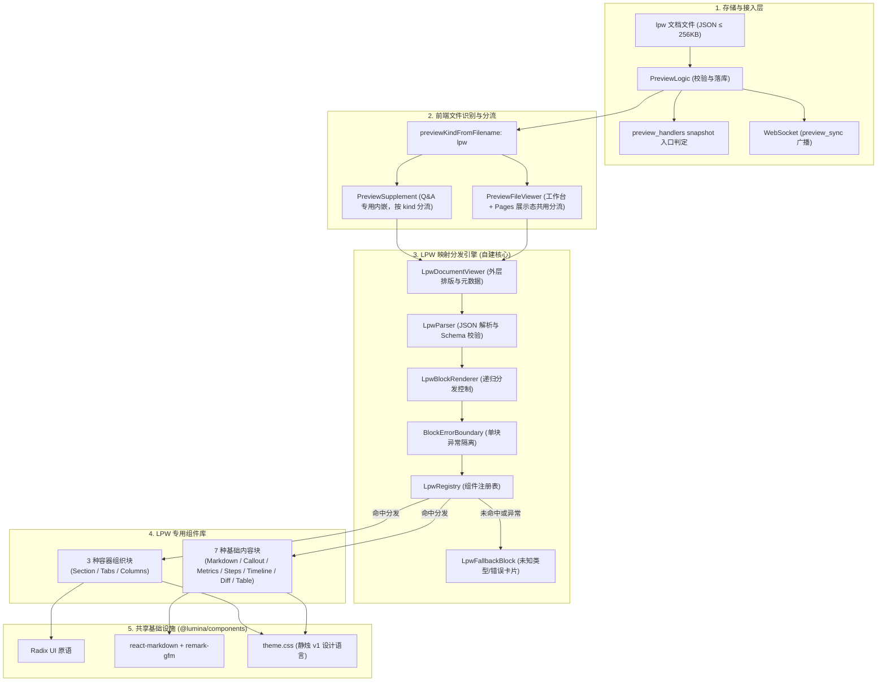
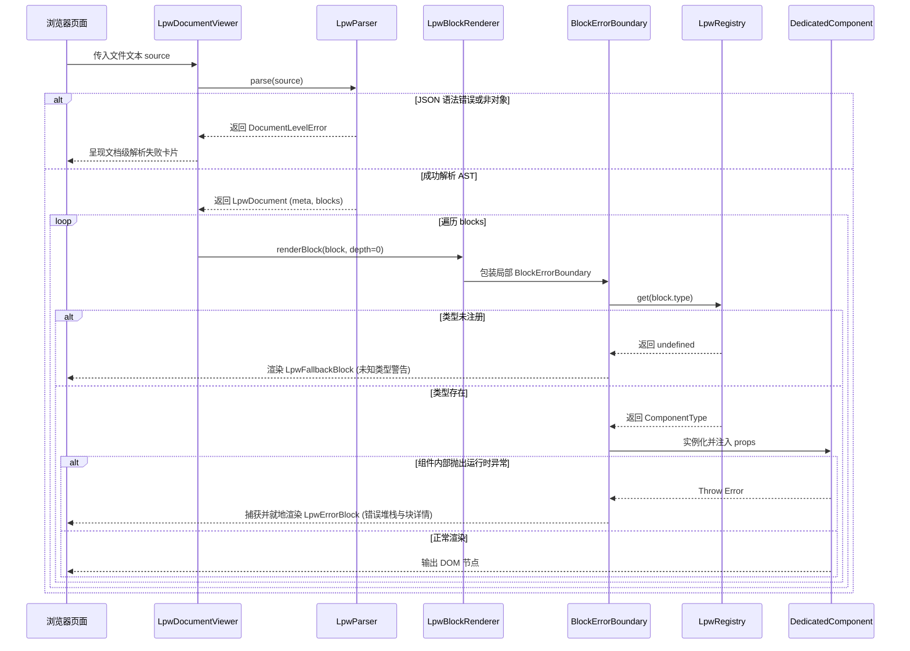

# LPW 预览文档渲染架构与专用组件设计

> 状态：draft · 承接 [调研 0002](../research/0002-preview-lpw-community.md) · [调研 0003](../research/0003-preview-mapping-stack.md) · 定稿 [ADR-0008](../adr/0008-preview-lpw-document-contract.md)

| 项 | 值 |
| --- | --- |
| 作者 | Lumina |
| 日期 | 2026-09-14（2026-09-20 修订：同步 master 后确立 React 直渲优先） |
| 状态 | Draft |
| 范围词 | 预览 / 文件预览 / `preview`（已登记于 `docs/scope-manage.md`） |

## Overview

Lumina Preview 当前支持 HTML、Markdown、SVG 与纯文本代码预览。对于复杂技术方案、排版文档与多维指标评审，纯 Markdown 表现力不足（缺乏分栏、指标卡片、Diff 对比与步骤条），而自由 HTML 存在 AI 生成成本高、排版难以统一、脚本安全风险大的问题。

本设计基于 [ADR-0008](../adr/0008-preview-lpw-document-contract.md) 与 [调研 0003](../research/0003-preview-mapping-stack.md) 的结论，定义 `.lpw`（Lumina Preview 文档）文件的端到端渲染架构。核心方案为：**自建极简类型映射分发引擎（`LpwRegistry` + `LpwBlockRenderer` + `BlockErrorBoundary`）**，结合版本化 JSON Schema 约束，驱动专用 React 组件库进行长文排版与本地安全交互。方案具备零外部框架依赖、天然对齐 React 19、块级错误严格可见（绝不静默吞块）的特征，并将 `json-render` 保留为未来跨端/流式场景的演进候选。

**运行环境首选 React 直渲管线（ADR-0008 第 8 条）**：LPW 与 Markdown 同级，经前端统一文件分发在 React 组件树内渲染，不转 HTML、不进沙盒 iframe；Preview 工作台与 Pages 展示态复用同一实现。master 合入的 Pages 架构（[ADR-0007](../adr/0007-preview-pages-separation.md)）已把 `.md` 直渲验证为可行路径，LPW 沿用该管线接入。

## Background & Motivation

在合并后实现（基线 `789812a`，2026-09-20 同步 master `ec7f904`，合并提交 `7ce1551`）中，Preview/Pages 存在以下既有约束与痛点：
1. **类型分流缺失**：`web/src/lib/preview-file.ts` 将 `.lpw` 误判为普通 `code` 文件，回退至 CodeMirror 代码高亮，无法渲染结构化文档；
2. **Q&A iframe 单通道**：`web/src/components/interact/primitives/preview-frame.tsx` 的 `PreviewSupplement` 解析文件详情后统一构造 `/preview/:session_hash/:filename?lumina_frame=1` 交给 iframe，若直接传入 `.lpw` 将导致浏览器下载或展示裸 JSON；
3. **MCP 入口感知盲区**：入口判定现位于 `internal/mcp/preview_handlers.go` 的 snapshot 构建与 `previewWriteWorkflow`，仅以 HTML 入口（`PreviewMimeHTML`）为可评审语义（`awaiting_html_entry` / `reviewable_unverified`），`.lpw` 无法独立作为会话的主展示入口；Pages 版本的 `EntryFilename` 同样默认 HTML；
4. **错误边界缺失**：调研 0003 证实社区库 `json-render` 内置的 `ElementErrorBoundary` 在捕获异常后直接返回 `null`，不满足 ADR-0008 要求的「渲染失败必须可见、可定位、绝不丢块」原则。

本设计旨在补齐上述技术缺口，给出可直接编码落地的完整工程实现方案。

## Goals & Non-Goals

### Goals

- **文件与入口闭环**：后端识别 `.lpw` 扩展名与专用 MIME，MCP snapshot 入口判定（`preview_handlers.go`）将 `.lpw` 纳为合法首屏入口；
- **版本化文档 Schema**：制定 LPW v1 规范，支持声明式元数据（`version`, `meta`）与顺序文档块（`blocks`）；
- **自建映射分发引擎**：在 `web/src/components/preview/lpw/` 下实现解析器、注册表、块级分发器与错误边界；
- **全量专用组件库（首期 10 种）**：交付 Markdown、Callout、Metrics、Steps、Timeline、Diff、Table 7 种内容块，以及 Section、Tabs、Columns 3 种容器块；
- **严格错误可见性**：单个块渲染崩溃时，就地展示包含块 ID、类型与错误原因的内嵌诊断卡片，不阻断整篇文档；
- **多端渲染一致性**：Preview 工作台（`/preview/:session_hash/:filename`，登录态）、Pages 展示态（`/pages/:project_name/:slug/:filename`，`.lpw` 随晋升进入不可变快照并纳入页面直切区）、Q&A 交互引用均经同一 React 直渲管线接入 LPW 渲染器。

### Non-Goals

- **非任意 React/JSX 序列化**：禁止文件传递自定义 React 组件源码或执行动态脚本；
- **无动态绑定与远程数据源**：禁止引入 `$state` 表达式计算、双向数据绑定或动态拉取外部 API；
- **无业务提交与表单回传**：交互严格限于本地（标签切换、表格排序、折叠展开、代码复制），不产生业务回调；
- **不上调文件体积上限**：沿用单文件 `256 * 1024` 字节（256 KiB）限制；
- **首版不引入 json-render**：按照调研 0003 结论保留为候选，v1 纯自建。

## Key Decisions

| # | 决定 | 理由 |
| --- | --- | --- |
| 1 | **文档数据模型采用顺序块数组 `blocks: LpwBlock[]`**，禁止使用平铺 ID 字典。 | 文档本质上是从上到下的阅读流，数组模型天然契约匹配，无额外转换开销。 |
| 2 | **映射分发层自建（`LpwRegistry` + `LpwBlockRenderer`）**，不引入外部框架。 | 核心逻辑仅约百行原生 TypeScript，零外部 npm 依赖，完全受控且适配 React 19.2。 |
| 3 | **块级错误边界独立包裹每个 Block**，遇到 Throw 必须就地渲染可见错误卡片。 | 严格落实 ADR-0008 第 6 条，避免整页白屏，杜绝 `json-render` 返回 `null` 的丢块漏洞。 |
| 4 | **容器块（Section/Tabs/Columns）递归深度硬上限设为 3**。 | 防范恶意或异常构造的深层递归导致浏览器调用栈溢出（Stack Overflow）。 |
| 5 | **专用组件样式与底层原语 100% 消费 `@lumina/components`**。 | 保证全站视觉语言严格符合「静烛 v1」（全平直角、`--sea-ink`、`--lagoon` 色盘）。 |
| 6 | **Q&A 预览引用根据文件类型动态分流**：HTML/SVG 走 iframe，LPW 走 React 原生渲染。 | 解决 Q&A 内嵌展示 LPW 时的格式错位问题。 |
| 7 | **单文件大小维持 256 KiB**，块数量软上限 500。 | 契合既有 Preview 基础设施配额，单文档足够承载中长篇方案。 |
| 8 | **React 直渲优先**：`.lpw` 与 Markdown 同级进入 `PreviewFileViewer` 的 React 直渲分支，禁止「转 HTML 进 iframe」作为主交付路径。 | 落实 ADR-0008 第 8 条；直渲管线已被 `.md` 验证，直接复用 `@lumina/components` 主题与排版，并保留组件级状态、错误边界与可测试性。 |

## System Architecture & Data Flow

### 整体渲染架构拓扑



### 渲染时序与错误隔离



## Document Specification & JSON Schema (v1)

### TypeScript 类型契约

文件定义在 `web/src/components/preview/lpw/types.ts`：

```typescript
export interface LpwMeta {
  title: string
  description?: string
  author?: string
  version?: string
  tags?: string[]
}

export interface LpwBlock<TProps = Record<string, unknown>> {
  id: string
  type: string
  props: TProps
  children?: LpwBlock[]
}

export interface LpwDocument {
  version: '1.0'
  meta: LpwMeta
  blocks: LpwBlock[]
}
```

### 结构约束与规则

1. **版本声明（`version`）**：根属性必须且仅支持 `"1.0"`。未知版本直接拒绝解析并呈现文档级错误；
2. **全局唯一 ID（`id`）**：每个块必须携带非空字符串 `id`（建议形如 `block-1`、`metric-latency`），用于 React key 及目录定位；
3. **属性隔离（`props`）**：所有业务参数统一放在 `props` 对象内，不得在块顶层污染属性；
4. **容器嵌套（`children`）**：仅容器类组件（`section`、`tabs`、`columns`）允许包含 `children` 数组，叶子组件忽略或拒绝 `children`；
5. **递归深度（`depth`）**：渲染器强制限制递归深度 `depth <= 3`。超过上限直接截断并渲染深度超限错误。

## Backend & MCP Changes

### 1. 常量与 MIME 定义

在 `internal/constant/preview.go` 新增：

```go
const (
    PreviewMimeLPW = "application/vnd.lumina.preview+json; charset=utf-8" // LPW 预览文档
)
```

### 2. 后端 MIME 推断与上传校验

在 `internal/logic/preview_logic.go` 的 `inferMimeType` 中扩展 `.lpw`：

```go
func inferMimeType(filename string) string {
    switch strings.ToLower(filepath.Ext(filename)) {
    case ".lpw":
        return bConst.PreviewMimeLPW
    // ... 其余不变
    }
}
```

在 `UploadPreviewFile` 中，针对 `.lpw` 扩展名增加基本 JSON 语法合规性检查（非标准 JSON 直接拒绝落库，防脏数据注入）。

### 3. MCP 入口判定增强

入口判定已随 master 迁移至 `internal/mcp/preview_handlers.go` 的 snapshot 构建（`snapshot.entry` / `entryFilename`），并由 `previewWriteWorkflow` 产出 `awaiting_html_entry` / `reviewable_unverified` 状态。扩展方式：

```go
// buildPreviewSessionSnapshot 内的入口选择（示意）：
// 1. 优先寻找 index.lpw 或首个 .lpw 文件
// 2. 回退寻找 HTML 入口（PreviewMimeHTML）
// 3. 均无 → snapshot.entry 为空，保持 awaiting_html_entry
```

配套调整：`previewWriteWorkflow` 的状态文案与指引需把「HTML 入口」泛化为「可评审入口」；Pages 侧 `pages_promote` 生成的 `PageVersion.EntryFilename` 同样允许 `.lpw`。`internal/mcp/preview_schemas.go` 中 `entry_file` 字段描述一并更新，禁止残留「仅 HTML」语义。

## Frontend Mapping Engine Design

前端所有引擎代码集中于 `web/src/components/preview/lpw/` 目录：

### 1. `lpw-parser.ts`

职责：将原始字符串解析为强类型 `LpwDocument`，并提供精准到行号/路径的错误提示。

```typescript
export interface ParseResult {
  success: boolean
  document?: LpwDocument
  error?: {
    message: string
    path?: string
  }
}

export function parseLpwSource(source: string): ParseResult {
  try {
    const raw = JSON.parse(source)
    if (!raw || typeof raw !== 'object' || Array.isArray(raw)) {
      return { success: false, error: { message: '根节点必须是 JSON 对象' } }
    }
    if (raw.version !== '1.0') {
      return { success: false, error: { message: `不支持的 LPW 版本: ${raw.version}，当前仅支持 1.0` } }
    }
    if (!Array.isArray(raw.blocks)) {
      return { success: false, error: { message: '缺少 blocks 块列表或格式不合法' } }
    }
    return { success: true, document: raw as LpwDocument }
  } catch (err) {
    return { success: false, error: { message: `JSON 语法解析失败: ${(err as Error).message}` } }
  }
}
```

### 2. `lpw-registry.ts`

职责：维护组件类型字符串到 React 组件的映射，注册组件元数据。

```typescript
export type LpwComponent<P = any> = React.ComponentType<P>

class LpwRegistryStore {
  private registry = new Map<string, LpwComponent>()

  register<P>(type: string, component: LpwComponent<P>) {
    this.registry.set(type, component)
  }

  get(type: string): LpwComponent | undefined {
    return this.registry.get(type)
  }

  has(type: string): boolean {
    return this.registry.has(type)
  }
}

export const lpwRegistry = new LpwRegistryStore()
```

### 3. `lpw-block-renderer.tsx`

职责：执行查表分发，传递上下文，管理递归深度。

```typescript
const MAX_CONTAINER_DEPTH = 3

export function LpwBlockRenderer({
  block,
  depth = 0,
}: {
  block: LpwBlock
  depth?: number
}) {
  if (depth > MAX_CONTAINER_DEPTH) {
    return <LpwFallbackBlock block={block} reason="容器嵌套深度超过最大限制 (3 层)" />
  }

  const Component = lpwRegistry.get(block.type)
  if (!Component) {
    return <LpwFallbackBlock block={block} reason={`未注册的组件类型: ${block.type}`} />
  }

  return (
    <BlockErrorBoundary block={block}>
      <Component {...block.props} childrenBlocks={block.children} currentDepth={depth} />
    </BlockErrorBoundary>
  )
}
```

### 4. `block-error-boundary.tsx`

职责：拦截单个组件的渲染崩溃，输出可见诊断卡片。

```typescript
interface State {
  hasError: boolean
  error: Error | null
}

export class BlockErrorBoundary extends React.Component<
  { block: LpwBlock; children: React.ReactNode },
  State
> {
  state: State = { hasError: false, error: null }

  static getDerivedStateFromError(error: Error): State {
    return { hasError: true, error }
  }

  render() {
    if (this.state.hasError) {
      return (
        <div className="border border-red-500/30 bg-red-500/5 p-3 rounded-none my-2 text-xs">
          <div className="font-semibold text-red-600 flex items-center gap-1.5">
            <span>块渲染失败</span>
            <span className="text-sea-ink-soft/60">[{this.props.block.type}#{this.props.block.id}]</span>
          </div>
          <p className="text-sea-ink-soft mt-1 font-mono">{this.state.error?.message}</p>
        </div>
      )
    }
    return this.props.children
  }
}
```

## Dedicated Component Library (v1 Specs)

首期交付的 10 种专用组件规范：

| 组件类型 (`type`) | 块分类 | 核心属性 (`props`) | 视觉与交互行为 |
| --- | --- | --- | --- |
| `markdown` | 内容 | `content: string` | 富文本正文，支持 GFM、LaTeX 数学公式与 Mermaid，消费 `@lumina/components/markdown` |
| `callout` | 内容 | `level: 'info' \| 'success' \| 'warning' \| 'error'`, `title?: string`, `content: string` | 强调提示卡片，边框与背景带对应语义色，支持内置图标 |
| `metrics` | 内容 | `items: Array<{ label: string, value: string \| number, unit?: string, trend?: 'up' \| 'down', change?: string, desc?: string }>` | 核心指标网格，大号字体展示指标值，支持涨跌趋势颜色标注 |
| `steps` | 内容 | `current?: number`, `items: Array<{ title: string, desc?: string, status?: 'wait' \| 'process' \| 'finish' \| 'error' }>` | 步骤条展示流程进展，支持节点状态指示 |
| `timeline` | 内容 | `items: Array<{ time: string, title: string, content?: string, tag?: string }>` | 竖向时间线，展示事件与演化历史 |
| `diff` | 内容 | `filename?: string`, `language?: string`, `oldCode: string`, `newCode: string`, `splitView?: boolean` | 代码差异对比视图，消费 `react-diff-viewer-continued`，支持并排/统一模式 |
| `table` | 内容 | `columns: Array<{ key: string, title: string, width?: string }>`, `data: Array<Record<string, any>>`, `sortable?: boolean` | 结构化数据表，支持本地客户端列排序与筛选 |
| `section` | 容器 | `title: string`, `collapsible?: boolean`, `defaultOpen?: boolean` | 章节外壳，带锚点与折叠开关，包裹 `children` 块 |
| `tabs` | 容器 | `items: Array<{ key: string, label: string }>`, `defaultKey?: string` | 多标签页切换容器，本地状态管理激活 Tab，按需渲染对应 `children` |
| `columns` | 容器 | `ratio?: '1:1' \| '1:2' \| '2:1' \| '1:1:1'` | 多列自适应网格，响应式排布不同列内的 `children` |

## Integration Points

### 1. `web/src/lib/preview-file.ts`

```typescript
export type PreviewKind = 'html' | 'markdown' | 'code' | 'svg' | 'lpw'

const LPW_EXT = new Set(['lpw'])

export function previewKindFromFilename(filename: string): PreviewKind {
  const ext = fileExtension(filename)
  if (LPW_EXT.has(ext)) return 'lpw'
  // ... 其余分支保持
}
```

### 2. `web/src/components/preview/file-viewer.tsx`

在 `PreviewFileViewer` 增加对 `'lpw'` 的拦截：

```typescript
if (kind === 'lpw') {
  return <PreviewLpwViewer src={src} filename={filename} />
}
```

`PreviewLpwViewer` 获取文本内容后交由 `LpwDocumentViewer` 驱动渲染。

### 3. `web/src/components/interact/primitives/preview-frame.tsx`

`PreviewSupplement` 现统一构造 `/preview/:session_hash/:filename?lumina_frame=1` 交给 iframe。Q&A 内嵌需在解析文件详情后按 kind 分流：

```typescript
if (previewKindFromFilename(detail.filename) === 'lpw') {
  return <PreviewLpwInlineViewer src={src} filename={detail.filename} />
}
return <PreviewFrame src={src} title={detail.filename} />
```

彻底杜绝将 `.lpw` 文件喂给 HTML iframe 的历史问题。

### 4. `web/src/components/pages/showcase-shell.tsx`

Pages 展示态与 Preview 工作台复用同一个 `PreviewFileViewer`，因此 LPW 分支天然双端生效。还需把直切区判定从 `html|htm|md` 扩展为 `html|htm|md|lpw`：

```typescript
function isRenderable(filename: string) {
  return /\.(html|htm|md|lpw)$/i.test(filename)
}
```

会话内 `.lpw` 随 `pages_promote` 全量深拷贝进入不可变快照，展示态直切区将其视为可渲染页面；源码检查仍走 CodeMirror 分支，不受影响。

## Security & Performance Boundaries

1. **XSS 防护**：
   - 绝不使用 `dangerouslySetInnerHTML`；
   - Markdown 渲染统一经由 `react-markdown` 进行 AST 安全转义，不开启未受信任的 HTML 标签解析；
2. **资源与计算上限**：
   - 单文件大小上限：256 KiB；
   - 文档块总数限制：500 块（解析阶段超出直接警告并截断）；
   - 容器嵌套层级：最大深度 3 层；
3. **本地状态无网络副作用**：
   - Tabs 切换、手风琴折叠等状态由 React `useState` 纯本地维护，不得向后端发起请求或写回文件。

## Implementation Roadmap & PR Plan

项目落地划分为 4 个连续 PR：


- **PR 1：映射引擎核心与路由分流**
  - 新增 `web/src/components/preview/lpw/` 核心：`types.ts`, `lpw-parser.ts`, `lpw-registry.ts`, `block-error-boundary.tsx`, `lpw-block-renderer.tsx`, `document-viewer.tsx`；
  - 调整 `web/src/lib/preview-file.ts` 与 `web/src/components/preview/file-viewer.tsx` 支持 `'lpw'`；
  - 交付基础空壳与 Fallback 占位。
- **PR 2：7 种基础内容专用组件**
  - 实现 Markdown, Callout, Metrics, Steps, Timeline, Diff, Table 组件；
  - 注册至 `lpwRegistry`，补齐单测与样例。
- **PR 3：3 种容器组件与本地交互**
  - 实现 Section, Tabs, Columns 容器块；
  - 支持 `depth` 递归限制与本地标签/折叠状态；
  - 交付典型 LPW 长文样例。
- **PR 4：后端校验、MCP 入口、Pages 直切与 Q&A 嵌入**
  - 修改 `internal/constant/preview.go` 与 `internal/logic/preview_logic.go`；
  - 扩展 `internal/mcp/preview_handlers.go` 的 snapshot 入口判定与 `previewWriteWorkflow` 文案，同步 `preview_schemas.go` 描述与 Pages `EntryFilename` 语义；
  - 调整 `web/src/components/pages/showcase-shell.tsx` 的 `isRenderable` 纳入 `.lpw`；
  - 调整 `web/src/components/interact/primitives/preview-frame.tsx` 支持 Q&A 内嵌。

## Verification & Testing Strategy

1. **单元测试**：
   - `lpw-parser.test.ts`：验证合法 JSON、畸形 JSON、不支持的版本（如 `2.0`）、缺少 `blocks` 等异常路径；
   - `lpw-registry.test.ts`：验证组件注册、重复注册覆盖、未注册类型查询；
   - `block-error-boundary.test.tsx`：模拟组件内部 `throw new Error()`，断言页面呈现错误卡片且文档其他块正常渲染。
2. **场景用例回归**：
   - 构造包含 10 种块的完整 `.lpw` 文档，在 Preview 工作台（`/preview/:session_hash/:filename`）与 Pages 展示态（晋升快照后的 `/pages/:project/:slug/:filename`）验证渲染一致性；
   - 在 Q&A 交互中推送包含 `.lpw` 引用的 supplement，验证原生内嵌展示正常；
   - 上传超限文档（>256KB 或深度 >3），验证错误提示明晰可见。
